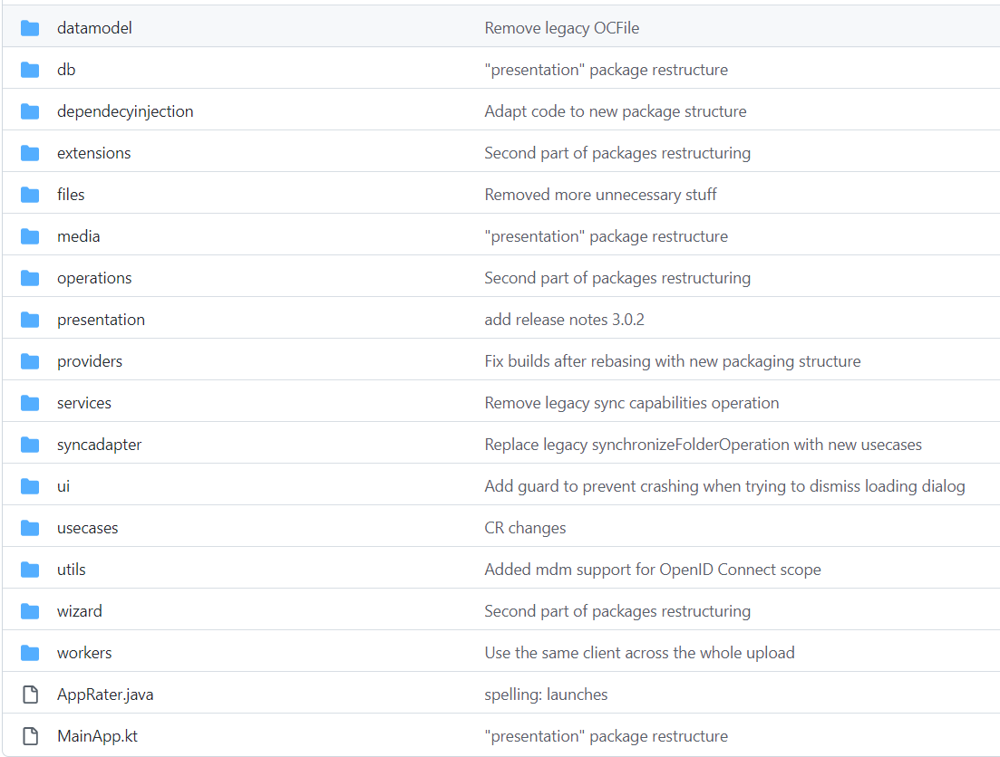

### 项目结构参考

#### OwnCloudApp

如题，本项目目录参考自 github 开源项目 `OwnCloudApp`

大家可以去为大佬点个 star：https://github.com/owncloud/android/tree/master/owncloudApp/src/main/java/com/owncloud/android

<br>

完整目录结构图



<br>

### 踩坑总览

#### AGP 版本不匹配

如果我们从官网下载某些成品模板，对 gradle 进行 sync 时，会出现 AGP 版本不匹配报错

直接来到 build.gradle(project:app) 文件内

修改以下两行后面的版本号为你当前所能支持的 AGP 版本就可以了

```
plugins {
    id 'com.android.application' version '7.3.0' apply false
    id 'com.android.library' version '7.3.0' apply false
    ...
}
```

<br>

### 依赖大全

#### 页面 UI

沉浸式状态栏依赖

```
implementation "com.google.accompanist:accompanist-insets:0.15.0"
implementation "com.google.accompanist:accompanist-insets-ui:0.15.0"
implementation "com.google.accompanist:accompanist-systemuicontroller:0.15.0"
```

<br>

Glide 依赖

```
implementation 'com.github.bumptech.glide:glide:4.11.0'
annotationProcessor 'com.github.bumptech.glide:compiler:4.11.0'
```

<br>

DataStore 依赖

```
implementation "androidx.datastore:datastore-preferences:1.0.0"
```

<br>
