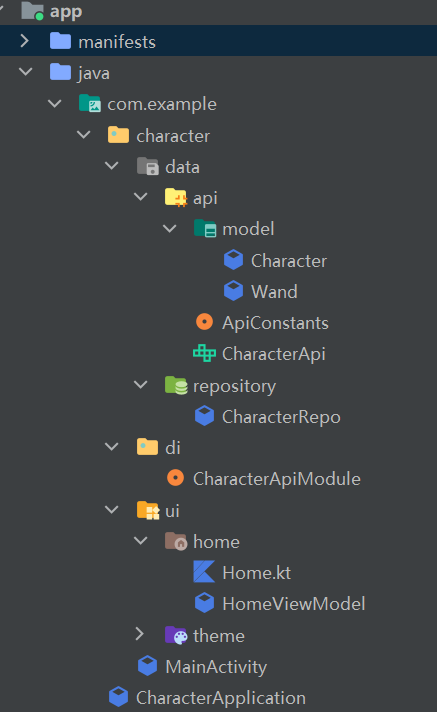

### 简介

本项目根据 youtube 对应教程实现而来

将会对对应代码以及依赖（如 Hilt、retrofit、coil）进行详细的分析与解读，同时缕清项目结构安排

如文章有叙述不清晰的，请直接查看原教程：https://www.youtube.com/watch?v=bLIWWOMVxts

<br>

### 使用技术

`Retrofit` 基于 OkHttp 的网络请求库  
`Coil` 图像处理库  
`Hilt` 依赖注入库

`Moshi` 基于 retrofit 的对象类型转换库

<br>

### 项目结构

项目完整结构图：

```
com
    └─example
        │  CharacterApplication.kt
        │
        └─character
            │  MainActivity.kt
            │
            ├─data
            │  ├─api
            │  │  │  ApiConstants.kt
            │  │  │  CharacterApi.kt
            │  │  │
            │  │  └─model
            │  │          Character.kt
            │  │          Wand.kt
            │  │
            │  └─repository
            │          CharacterRepo.kt
            │
            ├─di
            │      CharacterApiModule.kt
            │
            └─ui
                ├─home
                │      Home.kt
                │      HomeViewModel.kt
                │
                └─theme
                        Color.kt
                        Shape.kt
                        Theme.kt
                        Type.kt
```



<br>

### 完整代码调整

作者提供的 github 项目：https://github.com/Hoodlab/retrofit-mvvm-

请注意！由于接口地址变更，而作者目前没有对仓库进行更新，我们在导入项目后需要执行以下修改操作：

<br>

找到 ApiConstants.kt，修改 BASE_URL 的值为最新接口地址

```kotlin
object ApiConstants {
    const val BASE_URL = "https://hp-api.onrender.com/api/"
    const val END_POINTS = "characters"
}
```

<br>

找到 module/Wand.kt ，删除 length 一项

找到 module/Character.kt ，删除 dateOfBirth、yearOfBirth 两项

此时两个文件内容如下（可以直接复制粘贴）：

```kotlin
// Wand.kt
@JsonClass(generateAdapter = true)
data class Wand(
    @Json(name = "core")
    val core: String,
    @Json(name = "wood")
    val wood: String
)


// Character.kt
@JsonClass(generateAdapter = true)
data class Character(
    @Json(name = "actor")
    val actor: String,
    @Json(name = "alive")
    val alive: Boolean,
    @Json(name = "alternate_actors")
    val alternateActors: List<String>,
    @Json(name = "alternate_names")
    val alternateNames: List<String>,
    @Json(name = "ancestry")
    val ancestry: String,
    @Json(name = "eyeColour")
    val eyeColour: String,
    @Json(name = "gender")
    val gender: String,
    @Json(name = "hairColour")
    val hairColour: String,
    @Json(name = "hogwartsStaff")
    val hogwartsStaff: Boolean,
    @Json(name = "hogwartsStudent")
    val hogwartsStudent: Boolean,
    @Json(name = "house")
    val house: String,
    @Json(name = "id")
    val id: String,
    @Json(name = "image")
    val image: String,
    @Json(name = "name")
    val name: String,
    @Json(name = "patronus")
    val patronus: String,
    @Json(name = "species")
    val species: String,
    @Json(name = "wand")
    val wand: Wand,
    @Json(name = "wizard")
    val wizard: Boolean,
)
```

<br>

> 此时就可以直接构建了（不需要搭梯子即可访问后端接口）
