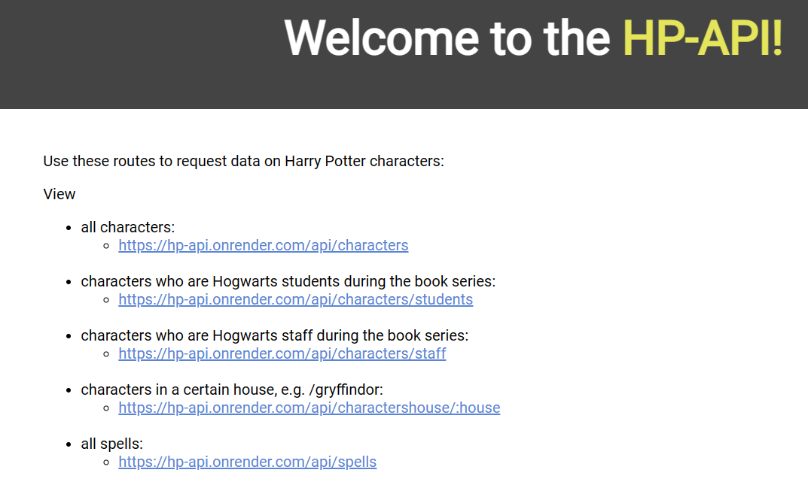
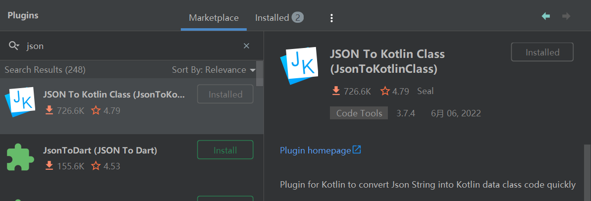
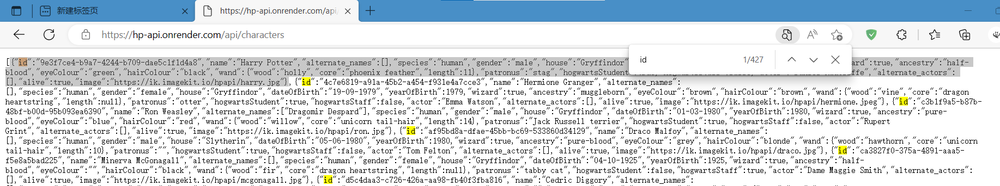

### 依赖处理

#### settings.gradle

首先在此指定使用 hilt 依赖时的版本

```groovy
pluginManagement {
    repositories {
        gradlePluginPortal()
        google()
        mavenCentral()
    }

    // 配置依赖使用策略
    resolutionStrategy{
        eachPlugin{
            if (requested.id.id == 'dagger.hilt.android.plugin'){
                useModule("com.google.dagger:hilt-android-gradle-plugin:2.38.1")
            }
        }
    }
}
```

<br>

#### build.gradle(project:app)

通过 ext 定义版本号，其余的基本无需修改

此项目原本默认使用的 AGP 版本为 7.1.0，不建议调整至更高版本

```groovy
buildscript {
    ext {
        compose_version = '1.0.1'
        lifecycleVersion = '2.3.1'
        kotlinVersion = '1.5.21'
        ktlintVersion = '0.41.0'
        coroutines = '1.5.0'
        moshi_version = '1.12.0'
    }
}

plugins {
    // 建议直接使用此项目的版本7.1.0
    id 'com.android.application' version '7.1.0-rc01' apply false
    id 'com.android.library' version '7.1.0-rc01' apply false
    id 'org.jetbrains.kotlin.android' version '1.5.21' apply false
}

task clean(type: Delete) {
    delete rootProject.buildDir
}
```

<br>

#### build.gradle(module:app)

大家可以直接复制使用

`plugins` 引入 hilt  
`apply plugin` 引入 kapt 插件  
`compileOptions` 与 `kotlinOptions` 定义适配 JDK8

```groovy
plugins {
    id 'com.android.application'
    id 'org.jetbrains.kotlin.android'
    id 'dagger.hilt.android.plugin'
}
apply plugin: 'kotlin-kapt'

android {
    compileSdk 32

    defaultConfig {
        applicationId "com.example.character"
        minSdk 21
        targetSdk 32
        versionCode 1
        versionName "1.0"

        testInstrumentationRunner "androidx.test.runner.AndroidJUnitRunner"
        vectorDrawables {
            useSupportLibrary true
        }
    }

    buildTypes {
        release {
            minifyEnabled false
            proguardFiles getDefaultProguardFile('proguard-android-optimize.txt'), 'proguard-rules.pro'
        }
    }
    compileOptions {
        sourceCompatibility JavaVersion.VERSION_1_8
        targetCompatibility JavaVersion.VERSION_1_8
    }
    kotlinOptions {
        jvmTarget = '1.8'
    }
    buildFeatures {
        compose true
    }
    composeOptions {
        kotlinCompilerExtensionVersion compose_version
    }
    packagingOptions {
        resources {
            excludes += '/META-INF/{AL2.0,LGPL2.1}'
        }
    }
}

dependencies {

    // 这些都是项目初始化自带的
    implementation 'androidx.core:core-ktx:1.7.0'
    implementation "androidx.compose.ui:ui:$compose_version"
    implementation "androidx.compose.material:material:$compose_version"
    implementation "androidx.compose.ui:ui-tooling-preview:$compose_version"
    implementation 'androidx.lifecycle:lifecycle-runtime-ktx:2.3.1'
    implementation 'androidx.activity:activity-compose:1.3.1'
    testImplementation 'junit:junit:4.13.2'
    androidTestImplementation 'androidx.test.ext:junit:1.1.3'
    androidTestImplementation 'androidx.test.espresso:espresso-core:3.4.0'
    androidTestImplementation "androidx.compose.ui:ui-test-junit4:$compose_version"
    debugImplementation "androidx.compose.ui:ui-tooling:$compose_version"

    // hilt依赖
    implementation "com.google.dagger:hilt-android:2.38.1"
    kapt "com.google.dagger:hilt-android-compiler:2.38.1"
    kapt "androidx.hilt:hilt-compiler:1.0.0"

    // lifecycle生命周期管理
    implementation "androidx.lifecycle:lifecycle-viewmodel-ktx:$lifecycleVersion"
    implementation "androidx.lifecycle:lifecycle-viewmodel-compose:2.4.0"
    implementation "androidx.lifecycle:lifecycle-livedata-ktx:$lifecycleVersion"
    implementation "androidx.lifecycle:lifecycle-common-java8:$lifecycleVersion"

    // kotlin协程库
    implementation "org.jetbrains.kotlin:kotlin-stdlib-jdk7:$kotlinVersion"
    implementation "org.jetbrains.kotlinx:kotlinx-coroutines-android:$coroutines"

    // retrofit以及okhttp、moshi转换器依赖
    implementation 'com.squareup.retrofit2:retrofit:2.9.0'
    implementation 'com.squareup.retrofit2:converter-moshi:2.9.0'
    implementation("com.squareup.okhttp3:okhttp:4.9.0")
    implementation("com.squareup.okhttp3:logging-interceptor:4.9.0")
    implementation "com.squareup.moshi:moshi-kotlin:$moshi_version"
    kapt "com.squareup.moshi:moshi-kotlin-codegen:$moshi_version"

    // coil图片处理库
    implementation("io.coil-kt:coil-compose:1.4.0")
}
```

<br>

### 准备工作

#### 接口

进入新版（截止 2023.2.15）接口网站：https://hp-api.onrender.com/

可见当前有五个接口可用，该项目使用第一个“all characters”接口



<br>

#### 安装 JSON 转 kotlin 插件

很简单，直接来到设置里面，选择 plugins，搜索指定插件然后安装即可  
甚至不需要重启就可以直接使用了！



<br>

#### 获取 JSON

刚刚安装的插件需要通过 JSON 中的一段来生成对应的 kotlin 文件，故我们直接点击进入“all characters”接口，看一下他的响应内容

我们仅需要截取其中的一段进行分析即可

按下 ctrl+f 搜索“id”，这样我们就可以快速定位一个区块内容了；  
按照下图所示，复制该区块内容；



<br>
