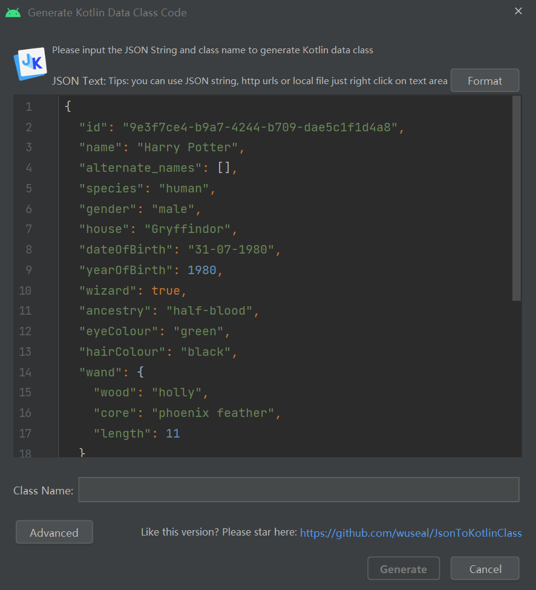
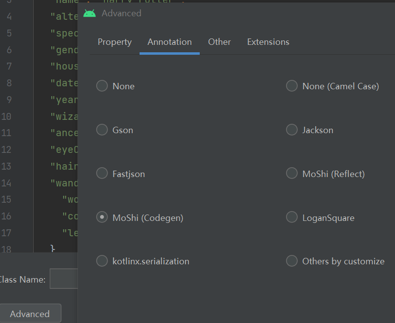

### ApiConstants

> 这一块存放 API 常量，即后端服务器 BASE_URL，以及对应的后缀 URL

代码清单：`data/api/ApiConstants.kt`

```kotlin
object ApiConstants {
    // 根URL
    const val BASE_URL = "https://hp-api.onrender.com/api/"
    // 欲接到根URL后面的URL
    // 因为我们需要请求的接口为https://hp-api.onrender.com/api/characters，故我们这里把它们拆开来写
    const val END_POINTS = "characters"
}
```

<br>

### 定义实体类

还记得我们上一章添加的 JSON 转 kotlin 插件吗？

右击 module 文件夹，在弹出菜单选择 `new->kotlin data class files from JSON`  
把上一节我们复制的 JSON 贴到编辑框里面



依次选择：advanced->annotation->moshi，然后点 OK



最后给 class name 填入咱们的实体类名字：Character，点击确定即可自动生成

> 此时我们会发现在 module 文件夹下生成了两个实体类 Character 和 Wand，实际上是因为 Character 类内有一个列表它包含了实体类 Wand，所以生成的时候自动变更了

<br>

现给出两个文件对应的最终代码：

`Character.kt`

```kotlin
// generateAdapter表示为数据类生成对应的适配器，便于moshi的类型转换！
@JsonClass(generateAdapter = true)
data class Character(
    // @Json注解可以定义响应体中的json属性名
    // 而变量名就是我们开发中使用的名称
    @Json(name = "actor")
    val actor: String,
    @Json(name = "alive")
    val alive: Boolean,
    @Json(name = "alternate_actors")
    val alternateActors: List<String>,
    @Json(name = "alternate_names")
    val alternateNames: List<String>,
    @Json(name = "ancestry")
    val ancestry: String,
    @Json(name = "eyeColour")
    val eyeColour: String,
    @Json(name = "gender")
    val gender: String,
    @Json(name = "hairColour")
    val hairColour: String,
    @Json(name = "hogwartsStaff")
    val hogwartsStaff: Boolean,
    @Json(name = "hogwartsStudent")
    val hogwartsStudent: Boolean,
    @Json(name = "house")
    val house: String,
    @Json(name = "id")
    val id: String,
    @Json(name = "image")
    val image: String,
    @Json(name = "name")
    val name: String,
    @Json(name = "patronus")
    val patronus: String,
    @Json(name = "species")
    val species: String,
    @Json(name = "wand")
    val wand: Wand,
    @Json(name = "wizard")
    val wizard: Boolean,
)
```

`Wand.kt`

```kotlin
@JsonClass(generateAdapter = true)
data class Wand(
    @Json(name = "core")
    val core: String,
    @Json(name = "wood")
    val wood: String
)
```

<br>

### 定义 API 接口

此即 retrofit 请求的 API 设置

api 接口类似于后端的 service 层

代码清单：`data/api/CharacterApi.kt`

```kotlin
interface CharacterApi {
    // @GET表示使用的请求方式
    // 由于设置好了BASE_URL，这里仅需附加后缀URL即可
    @GET(ApiConstants.END_POINTS)
    // 使用挂起函数，在协程作用域内调用，实现异步操作
    // 因为获取的是所有角色，故用List
    suspend fun getCharacter():List<Character>
}
```

<br>

### 定义 Repository

repository 类似于后端的 controller 层

代码清单：`data/repository/CharacterRepo.kt`

```kotlin
// @Inject constructor实现注入
class CharacterRepo @Inject constructor(
    private val characterApi: CharacterApi
) {
    // 直接调用API获取全部用户
    // 记得这个也是一个挂起函数
    suspend fun getCharacters(): List<Character> {
        return characterApi.getCharacter()
    }
}
```

<br>

### 定义 ApiModule

在 apimodule 中处理所有的依赖关系，实例化单例对象

部分注解介绍：

1. @Module 标注当前类为 apimodule
2. @InstallIn 标注类类型
3. @Provides 提供
4. @Singleton 表示为单例模式

代码清单：`di/CharacterApiModule.kt`

```kotlin
@Module
@InstallIn(SingletonComponent::class)
object CharacterApiModule {

    // 第一步：在这里使用扩展函数的方式定义Builder的基础信息并实例化
    // 这里定义了baseUrl以及转换器addConverterFactory
    @Provides
    @Singleton
    fun provideRetrofit(): Retrofit.Builder{
        return Retrofit.Builder()
            .baseUrl(ApiConstants.BASE_URL)
            .addConverterFactory(MoshiConverterFactory.create())
    }

    // 第二步：通过API构造对应retrofit实例
    // 确保其为单例，故添加@Singleton注解
    @Provides
    @Singleton
    fun provideApi(builder:Retrofit.Builder): CharacterApi{
        return builder
            .build()
            .create(CharacterApi::class.java)
    }
}
```

<br>

### 定义 Application

> 该文件被作者放到了根目录 com.example.character 之外了，这里建议大家选择合适的位置存放，不一定和作者的一致

代码清单：`CharacterApplication.kt`

```kotlin
@HiltAndroidApp
class CharacterApplication:Application() {
}
```

<br>

### 定义 ViewModel

由于 API 是挂起函数，故必须在协程作用域内执行  
直接使用 `viewmodel` 自带的 `viewModelScope` 处理协程操作，即可异步修改状态，而无需在主页面中进行异步处理

代码清单：`ui/home/HomeViewModel.kt`

```kotlin
// @HiltViewModel注解为hilt框架专属
@HiltViewModel
// 记得注入
class HomeViewModel @Inject constructor(
    private val characterRepo: CharacterRepo
) : ViewModel() {

    // MutableStateFlow使用流来管理操作
    // emptyList空列表存放获取到的Character数据
    // 标准的一个私有一个公有的变量定义处理，这里就不多说了
    private val _state = MutableStateFlow(emptyList<Character>())
    val state: StateFlow<List<Character>>
        get() = _state

    // init初始化代码块内启动协程作用域，获取用户数据
    init {
        viewModelScope.launch {
            val characters = characterRepo.getCharacters()
            _state.value = characters
        }
    }
}
```

<br>

> 下一章将介绍页面 UI 的绘制以及如何取用 viewmodel 中内容
