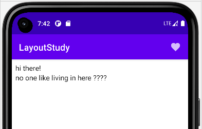

### topbar

可以理解为 scaffold 是具有 material design 风格的便捷框架；

它的完整结构分别由上层标题，中间内容，以及下层交互（一般作为导航）；

新建一个文件 LayoutStudy.kt，我们来实现一个简单的 scaffold 布局；

内容很简单，即标题栏定义一段标题 LayoutStudy，并且在标题的右边有一个图标按钮；

```java
@Composable
fun LayoutStudy(){
    Scaffold(
        topBar = {
            TopAppBar(
                title = {
                    Text(text = "LayoutStudy")
                },
                actions = {
                    IconButton(onClick = {}) {
                        Icon(imageVector = Icons.Filled.Favorite, contentDescription = "null")
                    }
                }
            )
        }
    ) {}
}
```

<br>

### innerPadding

scaffold 的大括号内紧跟一个 lambda，这里填写内容区组件；

innerPadding 可以理解为整个内容区框架；

我们将组件分离出来，并使用 Column 布局做出了简单的规划；

```java
@Composable
fun LayoutStudy(){
    Scaffold(
        ...
    ) {
        // 将innerPadding作为参数传入方法
        innerPadding ->
        BodyContent(Modifier.padding(innerPadding))
    }
}

// 分离组件
@Composable
fun BodyContent(modifier: Modifier = Modifier){
    Column(
        modifier = Modifier.padding(8.dp)
    ) {
        Text(text = "hi there!")
        Text(text = "no one like living in here ????")
    }
}
```

<br>

### 完成结果图


