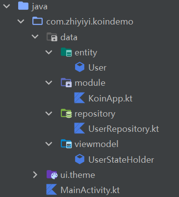
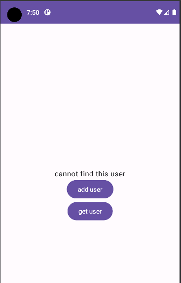

### 概念

> Koin 是一款轻量级的依赖注入框架，它无代理，无代码生成，无反射

大家可以自行查阅官方英文教程：https://insert-koin.io/docs/quickstart/android-compose

<br>

Koin 简单的来说可以包含以下四个模块：

| 名称        | 作用                                              |
| ----------- | ------------------------------------------------- |
| entity      | 实体类                                            |
| repository  | 接口，定义针对实体类的操作，可以理解为 service 层 |
| stateholder | 类，操作 repository，可以理解为 controller 层     |
| module      | 管理所有 repository 以及 stateholder 的文件       |

<br>

安装 koin 依赖：`implementation "io.insert-koin:koin-androidx-compose:3.3.0"`

<br>

### 快速上手

文件结构如下：



<br>

#### entity

为便于操作，我们定义仅有一个参数的实体 User 即可

代码清单：`User.kt`

```kotlin
data class User(
    val name:String
)
```

<br>

#### repository

同一文件下定义接口以及对应的实现类

代码清单：`UserRepository.kt`

```kotlin
// 定义了两个方法,分别是获取用户以及添加用户(均为单个!)
interface UserRepository {
    fun getUser(name: String): User?
    fun addUser(user:User)
}

// 实现接口UserRepository
class UserRepositoryImpl : UserRepository {
    private val _users = arrayListOf<User>()
    override fun getUser(name: String): User? {
        return _users.firstOrNull { it.name == name }
    }

    override fun addUser(user: User) {
        _users.add(user)
    }
}
```

<br>

#### stateholder

代码清单：`UserStateHolder.kt`

```kotlin
// 定义两个方法，调用UserRepository
class UserStateHolder(private val userRepository: UserRepository) {

    fun sayHello(name: String): String {
        val res = userRepository.getUser(name)
        return res?.let { "hello ${res.name}" }
            ?: "cannot find this user"
    }

    fun insertUser(name: String) = userRepository.addUser(User(name))
}
```

<br>

#### module

> 这里实际上还可以使用 viewmodel 实现单例，后面我们会有提到

声明变量 appModule，注册 repository 以及 stateholder

代码清单：`KoinApp.kt`

```kotlin
val appModule = module {
    // single生成单一对象
    single<UserRepository> { UserRepositoryImpl() }
    // factory每次都会生成新的对象
    factory { UserStateHolder(get()) }
}
```

<br>

#### 主文件

目前我们所有关于 koin 的配置都准备好啦，此时关键的一步就是在 onCreate 中开启 koin  
使用 lambda 函数 `startKoin`，依次填入下方代码的三个方法即可

最后在大家绘制组件 UI 时，形参直接初始化 stateholder 即可使用啦！

代码清单：`MainActivity.kt`

```java
class MainActivity : ComponentActivity() {
    override fun onCreate(savedInstanceState: Bundle?) {
        super.onCreate(savedInstanceState)

        // 第一步：开启koin
        // 三个方法为固定格式，androidContext选择当前上下文，modules选择我们刚刚配置好的
        startKoin {
            androidLogger()
            androidContext(this@MainActivity)
            modules(appModule)
        }

        setContent {
            KoinDemoTheme {
                Surface(
                    modifier = Modifier.fillMaxSize(),
                    color = MaterialTheme.colorScheme.background
                ) {
                    koinTest()
                }
            }
        }
    }
}

// 第二步：使用
// 组件形参直接构造stateholder来调用它！！！
@Composable
private fun koinTest(presenter:UserStateHolder = get()) {
    var title by remember {
        mutableStateOf("现在还没有任何内容")
    }

    Column(
        Modifier.fillMaxSize(),
        horizontalAlignment = Alignment.CenterHorizontally,
        verticalArrangement = Arrangement.Center
    ) {
        Text(text = title)
        Button(onClick = {
            // 插入用户
            presenter.insertUser("tom")
        }) {
            Text(text = "add user")
        }
        Button(onClick = {
            // 获取用户并更新状态
            title = presenter.sayHello("tom")
        }) {
            Text(text = "get user")
        }
    }
}
```

<br>

### 成品演示

直接点击“get user”



<br>

先点击“add user”再点击“get user”


<br>

> END，下一篇文章将会介绍 koin 以及 hilt 之间使用对比
