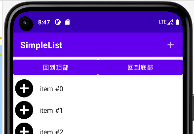

### 概况

顾名思义，懒人列表 LazyColumn，同理还有横向格式的 LazyRow，但是不常用；

LazyColumn 可以替代掉 Column，它解决了原生 android 中书写适配器的麻烦；

<br>

### 基本结构

lazycolumn 需要设置一个 state，即 `rememberLazyListState`；

items 括号内内容表示需要遍历的内容，这里写 100 则表示从 1-100 数字遍历；

SingleCard(index = it) 这是复用了一个组件，其中的 it 表示目前渲染到的内容；

```java
// 记录lazy状态
val lazyState = rememberLazyListState()

LazyColumn(state = lazyState) {
    items(100) {
        SingleCard(index = it)
    }
}
```

<br>

### 回到顶部与底部

> 下面代码渲染后如图



<br>

`rememberCoroutineScope` 设置一个协程状态，因为滚动到顶部或者底部执行动画必须要流畅且防抖，那么最好的办法就是使用一个协程来执行该动画；

`coroutineScope.launch` 启动协程

`lazyState.animateScrollToItem(0)` 设置从当前位置跳转到索引为 0 的列表位置（即回到顶部）；同理回到底部就把索引改一下就好了！

```java
@Composable
fun ScrollList() {
    val lazyState = rememberLazyListState()

    // 记录列表项总个数，便于取出索引值
    val listSize = 100
    // 记录协程状态
    val coroutineScope = rememberCoroutineScope()
    Column() {
        Row() {
            Button(
                modifier = Modifier.weight(1f),
                // 回到顶部事件触发点
                onClick = { coroutineScope.launch { lazyState.animateScrollToItem(0) } }) {
                Text(text = "回到顶部")
            }
            Button(
                modifier = Modifier.weight(1f),
                // 回到底部事件触发点
                onClick = { coroutineScope.launch { lazyState.animateScrollToItem(listSize - 1) } }) {
                Text(text = "回到底部")
            }
        }

        LazyColumn(state = lazyState) {
            items(100) {
                SingleCard(index = it)
            }
        }
    }
}
```
