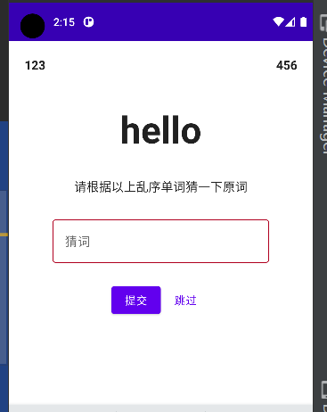

### 概念与文档

> 官方教程使用原生实现，下面将介绍如何在 compose 中实现：https://developer.android.com/codelabs/basic-android-kotlin-training-viewmodel?hl=zh_cn#1

<br>

#### activity 与 fragment

activity 和 fragment 负责将视图和数据绘制到屏幕上并响应用户事件

应该通过模型驱动界面（最好是持久性模型）.模型是负责处理应用数据的组件

不应将任何应用数据或状态存储到界面控制器（如 activity 或者 fragment）中，而应将有关数据的决策逻辑添加到 ViewModel 中

<br>

#### viewmodel

`ViewModel` 是视图中显示的应用数据的模型。模型是负责处理应用数据的组件，能够让应用遵循架构原则，通过模型驱动界面

`ViewModel` 存储应用相关的数据，这些数据不会在 Android 框架销毁并重新创建 activity 或 fragment 时销毁

`ViewModel` 负责存储和处理界面需要的所有数据。它绝不应访问视图层次结构

<br>

#### 依赖

前面文章有提到，安装 viewmodel-compose 依赖  
`implementation 'androidx.lifecycle:lifecycle-viewmodel-compose:2.5.1'`

<br>

### 页面配置

#### MainActivity.kt

由于 compose 特性，不需要额外写 fragment，我们所有页面代码都统一写在 MainActivity.kt 里面

该代码为原始页面代码，没有做任何状态管理，就是一个单纯的模板

```kotlin
@Composable
fun compRenderer() {

    var content by remember {
        mutableStateOf("")
    }

    Column(
        modifier = Modifier.fillMaxSize(),
        horizontalAlignment = Alignment.CenterHorizontally
    ) {
        Row(
            modifier = Modifier
                .padding(20.dp)
                .fillMaxWidth(),
            horizontalArrangement = Arrangement.SpaceBetween,
            verticalAlignment = Alignment.CenterVertically
        ) {
            // 当前答对题目数
            Text(text = "123", fontWeight = FontWeight.Bold)
            // 当前得分
            Text(text = "456", fontWeight = FontWeight.Bold)
        }

        // 当前猜词
        Text(modifier = Modifier.padding(20.dp),text = "hello", fontWeight = FontWeight.Bold, fontSize = 48.sp)

        // 提示文本段
        Text(modifier = Modifier.padding(12.dp),text = "请根据以上乱序单词猜一下原词", fontSize = 16.sp)

        // 猜词输入框
        OutlinedTextField(value = content, onValueChange = {content=it},
            label = { Text(text = "猜词")},
            placeholder = { Text(text = "请输入您要猜的单词")},
            singleLine = true,
            modifier = Modifier.padding(12.dp)
            )

        // 提交与跳过按钮
        Row(
            Modifier.padding(12.dp),
            horizontalArrangement = Arrangement.SpaceBetween
        ) {
            Button(onClick = { /*TODO*/ }) {
                Text(text = "提交")
            }
            TextButton(onClick = { /*TODO*/ }) {
                Text(text = "跳过")
            }
        }

    }
}
```

将该 compose 引入 oncreate 方法里面进行渲染后的成果图：



<br>

#### viewmodel

新建文件 `viewmodel/CounterVM.kt`

所有属性介绍：  
allWordsList 单词表  
wordsList 现有单词表，用于去重  
currentWord 当前没打乱的单词
currentScrambledWord 当前打乱后的单词  
currentScore 当前分数  
currentWordCount 当前已经作答的单词数目

<br>

全部需要实现的功能：

1. 提供一个单词表，每次都从这个单词表里面抽出一个单词
2. 提供一个临时单词表，装载本轮抽取的每一个单词，避免单词重复
3. viewmodel 初始化时自动抽取一次单词，显示在主页面上
4. 抽取单词必须保证不重复、不和原单词一致
5. 注意当前已答题数量、得分的数值运算
6. 答完所有题后弹窗提示结算页面，并可以基于玩家重玩机会

<br>

```kotlin
val allWordsList = listOf(
    // 在这里填入所有你想要显示的单词，最好大于10个，不然会出现重复的！
)

class CounterVM : ViewModel() {
    private lateinit var currentWord: String

    // 所有私有属性都必须使用mutableStateOf进行动态绑定
    private var _currentScrambledWord = mutableStateOf("")
    private var wordsList: MutableList<String> = mutableListOf()
    private var _currentWordCount = mutableStateOf(0)
    private var _currentScore = mutableStateOf(0)

    // 公有属性记得设置好state
    val currentScrambledWord: State<String> get() = _currentScrambledWord
    val currentWordCount: State<Int> get() = _currentWordCount
    val currentScore: State<Int> get() = _currentScore

    // 因为打乱单词的方法只需要在viewmodel中执行，外部不用管，所以私有
    private fun getRandomWord() {
        // 从单词表中随机抽出一个单词
        currentWord = allWordsList.random()
        // 变成字符数组后存起来
        val tempWord = currentWord.toCharArray()
        // 打乱临时字符数组
        tempWord.shuffle()
        // 如果打乱后单词和原单词顺序一致，就一直打乱直到不一致为止
        while (String(tempWord).equals(currentWord, false)) {
            tempWord.shuffle()
        }

        // 如果抽到的单词在现有单词表内，则表示单词重复，重新选取单词
        if (wordsList.contains(currentWord)) {
            getRandomWord()
        } else {
            // 设置打乱后的单词、增加一次作答次数、把当前单词加到现有单词表里面
            _currentScrambledWord.value = String(tempWord)
            ++_currentWordCount.value
            wordsList.add(currentWord)
        }
    }

    // 点击提交按钮后：校验字符串
    fun validateWord(word: String) {
        if (currentWord.equals(word,true)){
            _currentScore.value += 10
        }else{
            _currentScore.value -= 10
        }
        getRandomWord()
    }

    // 点击跳过按钮后：跳过单词，重新抽取
    fun skipWord(){
        getRandomWord()
    }

    init {
        Log.d("CounterVM", "viewmodel已经启动")
        // 初始化viewmodel时自动抽取乱序单词显示出来
        getRandomWord()
    }
}
```

<br>

此时的 mainactivity.kt 把提交和跳过按钮的逻辑写一下

```kotlin
Button(onClick = {
    if(content!="") {
        vm.validateWord(content)
        content=""
    }
}) {
    Text(text = "提交")
}
TextButton(onClick = {
    content=""
    vm.skipWord()
}) {
    Text(text = "跳过")
}
```

<br>

#### 后记

官方案例中的功能：到达最大答题次数后自动弹出结算对话框，并提供一个重玩按钮

大家可以自行实现，配合 `AlertDialog` 并判断 `currentWordCount` 即可！
