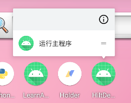

### 简述

> 以下代码均基于 compose 编写

Android7.1 开始加入了长按应用弹出快捷菜单

可以通过 shortcut 自定义该弹出菜单，比如我们接下来要实现的功能如下图所示（运行于纯正的 android10 系统上）



<br>

弹出菜单可以目前存在两种可选定义形式：

1. 静态定义：直接写死在 xml 文件，只有 APP 更新重装才可以更新弹出菜单
2. 动态定义：顾名思义

<br>

### 静态定义

#### shortcuts.xml

新建文件 `res/xml/shortcuts.xml`

shortcuts 表示当前快捷菜单，里面有多少个 shortcut 标签，就存在多少个快捷按钮  
而事实上，一次性在快捷菜单内最多只能显示四个按钮！

这是一些相关属性定义的解释：

1. `android:enabled` 是否激活
2. `android:icon` 快捷按钮左侧对应图标
3. `android:shortcutId` 该按钮的 ID
4. `android:shortcutShortLabel` 快捷按钮文本

```xml
<?xml version ="1.0" encoding="utf-8"?>
<shortcuts xmlns:android="http://schemas.android.com/apk/res/android">

    <!-- 定义一个快捷按钮 -->
    <shortcut
        android:enabled="true"
        android:icon="@mipmap/ic_launcher"
        android:shortcutId="sc1"
        android:shortcutShortLabel="@string/shortcut_title"
        android:shortcutLongLabel="@string/shortcut_long_msg"
        android:shortcutDisabledMessage="@string/shortcut_disable_msg"
        >

        <!-- action表示点击按钮后执行的动作 -->
        <!-- targetClass为目标activity的类文件（直接指向compose默认唯一的activity） -->
        <!-- targetPackage目标类文件所在包 -->
        <intent
            android:action="android.intent.action.VIEW"
            android:targetClass="com.zhiyiyi.hiltdemo.MainActivity"
            android:targetPackage="com.zhiyiyi.hiltdemo"/>
        <categories android:name="android.shortcut.conversation" />
        <capability-binding android:key="actions.intent.CREATE_MESSAGE" />
    </shortcut>
</shortcuts>
```

> 若你没有定义 intent 标签，则弹出菜单将不会显示，但是可以正常编译执行，这一点要注意！

<br>

#### strings.xml

这是 `values/strings.xml` 文件内容，如果你懒得创建就可以直接复制以下内容

```xml
<resources>
    <string name="shortcut_title">运行主程序</string>
    <string name="shortcut_long_msg">这是一段介绍</string>
    <string name="shortcut_disable_msg">关闭提示</string>
</resources>
```

<br>

#### androidmanifest.xml

最后在 manifest 中注册 shortcuts

```xml
<manifest xmlns:android="http://schemas.android.com/apk/res/android"
          package="com.example.myapplication">
  <application ... >
    <activity android:name="Main">
      <intent-filter>
        <action android:name="android.intent.action.MAIN" />
        <category android:name="android.intent.category.LAUNCHER" />
      </intent-filter>

        <!-- 注册shortcuts.xml -->
        <!-- 必须写在主activity里面！！！ -->
      <meta-data android:name="android.app.shortcuts"
                 android:resource="@xml/shortcuts" />
    </activity>
  </application>
</manifest>
```

<br>

### 动态注册

> 仅介绍 kotlin 实现

根据官网给出的教学代码，请按照以下步骤使用：

项目根目录新建文件 `initialization/ShortCutInit.kt`

填入以下代码（这里仅定义了一个 shortcut，如果你要定义多个，建议创建一个数据类+列表存储，然后使用 foreach 构造多个 shortcut 实例，然后一一使用 `ShortcutManagerCompat` 插进去即可）

```kotlin
// 构造函数接收上下文，直接获取MainActivity的context
class ShortCutInit(
    context: Context
) {
    // 初始化代码块
    init {

        // 定义一个shortcut
        val cut1 = ShortcutInfoCompat.Builder(context, "sc1")
            .setShortLabel("打开网页")
            .setLongLabel("现在执行百度搜索")
            .setIcon(IconCompat.createWithResource(context, R.drawable.ic_home))
            .setIntent(
                Intent(
                    Intent.ACTION_VIEW,
                    Uri.parse("https://www.baidu.com/")
                )
            )
            .build()

        // 使用android提供的集成库，把shortcut插进去
        ShortcutManagerCompat.pushDynamicShortcut(context,cut1)
    }
}
```

<br>

之后就可以直接在 MainActivity 中传入 context，直接初始化即可

```kotlin
class MainActivity : ComponentActivity() {
    override fun onCreate(savedInstanceState: Bundle?) {
        super.onCreate(savedInstanceState)

        // 在onCreate方法内初始化shortcuts
        ShortCutInit(this)

        setContent {
            ...
        }
    }
}
```

<br>

### 添加快捷方式到桌面

#### 添加快捷方式源码

添加快捷方式是依据目前已经存在的 shortcut 基础上构建的，所以这里的代码必须在 shortcut 动态注册之后使用！

```kotlin
// 添加快捷方式的方法，它是公开的
// 参数一为上下文
// 参数二为欲添加快捷方式的shortcut的ID名
fun PinShortcut(context: Context,shortcutId:String){

    // 根据上下文获取ShortcutManager
    val manager = getSystemService(context,ShortcutManager::class.java)
    // 如果当前版本支持快捷方式
    if(manager!!.isRequestPinShortcutSupported){
        // 根据ID获取已注册的shortcut
        val pinShortcutInfo = ShortcutInfo.Builder(context, shortcutId).build()
        // 定义一个请求
        val pinnedShortcutCallbackIntent = manager.createShortcutResultIntent(pinShortcutInfo)
        // 定义请求接收器，分析用户点击了“确认”还是“取消”
        val successCallback = PendingIntent.getBroadcast(context, /* request code */ 0,
            pinnedShortcutCallbackIntent, /* flags */ 0)

        // 发出添加快捷方式请求
        manager.requestPinShortcut(pinShortcutInfo,
            successCallback.intentSender)
    }
}
```

<br>

#### 点击按钮添加

请看代码：

```kotlin
class MainActivity : ComponentActivity() {
    override fun onCreate(savedInstanceState: Bundle?) {
        super.onCreate(savedInstanceState)

        // 第一步要先注册所有shortcuts
        ShortCutInit(this)

        setContent {
            ShortcutDemoTheme {
                // A surface container using the 'background' color from the theme
                Surface(
                    modifier = Modifier.fillMaxSize(),
                    color = MaterialTheme.colorScheme.background
                ) {
                    // 第二步才使用添加快捷方式的代码
                    shortcutDemo(this)
                }
            }
        }
    }
}

// 点按钮添加快捷方式
@Composable
private fun shortcutDemo(context: Context){
    Column(
        Modifier.fillMaxSize(),
        verticalArrangement = Arrangement.Center,
        horizontalAlignment = Alignment.CenterHorizontally
    ) {
        Button(onClick = { PinShortcut(context,"sc1") }) {
            Text(text = "创建快捷方式")
        }
    }
}
```

<br>
