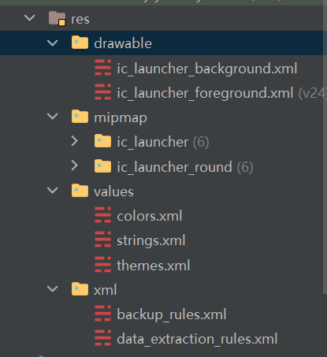

### 结构介绍

原生开发&Compose 均使用以下 res 资源文件夹结构

drawable：存放大多数图标以及图片文件

mipmap：官方建议仅存放应用图标

values：数值文件夹，包含颜色、字符串、主题三大部分设置

xml：其余需要通过 xml 定义的文件



<br>

> 对于 JetpackCompose，还会在主包下存在一个 `ui.theme` 文件夹，这是专门定义 Compose 主题的 UI 文件夹，我们可以使用其中的 `Color.kt` 用来定义颜色而不用 `values/colors.xml`

<br>

### 文件路径最全整理

<br>

### compose 获取资源文件的几种方式

文本： stringResource(R.string.hello_world)  
颜色： colorResource(R.color.black)  
尺寸： dimensionResource(R.dimen.padding)  
图片： painterResource(R.drawable.head_icon)

<br>

### Icon 组件

icon 组件可以接受三种类型的图片，分别为：bitmap、imagevector、painter

imagevector 一般直接使用 compose 内置的图标

内置图标有两种：

1. 镂空的 Icons.Default.xxx
2. 实心的 Icons.Filled.xxx

`Icon(imageVector = Icons.Default.Add, contentDescription = "demo")`

<br>

而对于 painter，直接可以使用 res 的 drawable 文件夹下我们存储的 xml 后缀图标文件

注意这里需要使用 painterResource 通过 ID 获取到指定图标文件

`Icon(painter = painterResource(id = R.drawable.ic_pwd), contentDescription = "good")`

<br>

### Compose 常用资源预备

> 一般的，我们新建 compose 项目会自动创建 ui.theme 文件夹，除去某些特殊值比如 strings 需要在 res 的 strings.xml 中设置外，颜色、字体样式等都可以在 ui.theme 下设置

现在依据 google 给出的官方标准，提供四个标准文件的预备模板文件，可以随时取用！

<br>

#### Type.kt

除去代码外，还需要将对应字体文件添加到 `res/font` 文件夹下！

```kotlin
// 定义字体组
// res/font文件夹下应当存在文件：kulim_park_regular.ttf与kulim_park_light.ttf
private val fontFamilyKulim = FontFamily(
    listOf(
        Font(
            resId = R.font.kulim_park_regular
        ),
        Font(
            resId = R.font.kulim_park_light,
            weight = FontWeight.Light
        )
    )
)

private val fontFamilyLato = FontFamily(
    listOf(
        Font(
            resId = R.font.lato_regular
        ),
        Font(
            resId = R.font.lato_bold,
            weight = FontWeight.Bold
        )
    )
)

// 定义类型文件
// 给出了三个常用标准h1 h2 h3
val typography = Typography(
    defaultFontFamily = fontFamilyLato,
    h1 = TextStyle(
        fontFamily = fontFamilyKulim,
        fontWeight = FontWeight.Light,
        fontSize = 28.sp,
        letterSpacing = (1.15).sp
    ),
    h2 = TextStyle(
        fontFamily = fontFamilyKulim,
        fontSize = 15.sp,
        letterSpacing = (1.15).sp
    ),
    h3 = TextStyle(
        fontWeight = FontWeight.Bold,
        fontSize = 14.sp,
        letterSpacing = 0.sp
    ),
    body1 = TextStyle(
        fontSize = 14.sp,
        letterSpacing = 0.sp
    ),
    button = TextStyle(
        fontWeight = FontWeight.Bold,
        fontSize = 14.sp,
        letterSpacing = (1.15).sp
    ),
    caption = TextStyle(
        fontFamily = fontFamilyKulim,
        fontSize = 12.sp,
        letterSpacing = (1.15).sp
    ),
)
```

<br>

#### Shape.kt

```kotlin
val shapes = Shapes(
    small = RoundedCornerShape(4.dp),
    medium = RoundedCornerShape(16.dp)
)
```
