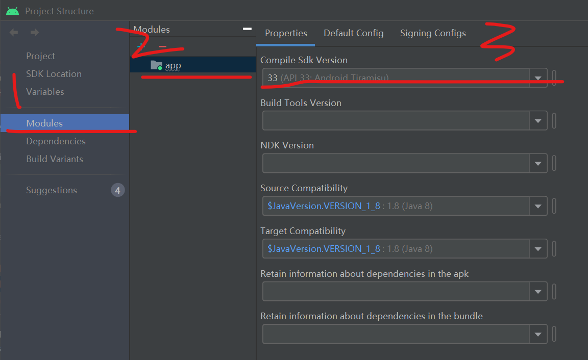
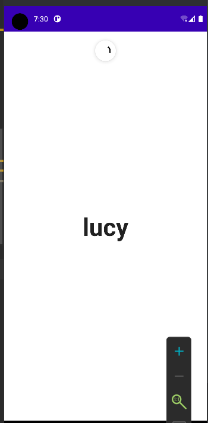

### Compose 自带下拉刷新

#### 依赖

建议使用最新稳定版 compose1.3.1

默认生成项目时使用的 material 版本为 1.1.1，我们手动将其修改为稳定版 1.3.1，才可以使用 pullrefresh！！！  
`implementation 'androidx.compose.material:material:1.3.1'`

然后点击顶部菜单栏的 file->project structure->modules  
选择 App，修改编译 SDK 版本为 33（不用担心，这只是编译版本，并不是指你的手机或者模拟器必须是 SDK33 的才可以运行！）



<br>

#### 快速上手

现在我们需要完成一个小案例，准备一个单词表，并在页面正中央显示当前单词，实现下拉刷新单词

代码逻辑已经在下方写好，请根据对应的步骤来一一理解

<br>

```kotlin
@OptIn(ExperimentalMaterialApi::class)
@Composable
fun compRenderer() {

    // 第一步：提供单词表
    // 单词表必须使用mutableListOf，后续我们会通过洗牌shuffle打乱他抽取乱序单词
    val wordsList = mutableListOf<String>(
        "jack", "tom", "lucy", "lily", "sam", "michael", "channel"
    )

    // 第二步：记住当前显示的单词
    // 初始化我们就选择单词表里面的第四个单词
    var currentWord by remember {
        mutableStateOf(wordsList.component4())
    }

    // 第三步：记住下拉状态
    // 下拉状态的true或者false是用来显示加载条与否的
    var refreshState by remember {
        mutableStateOf(false)
    }

    // 第四步：使用协程模拟延迟
    val scope = rememberCoroutineScope()

    // 第五步：记住下拉刷新状态，他接受两个参数
    // 参数一：当前刷新状态
    // 参数二：刷新时执行的回调函数
    val pull = rememberPullRefreshState(
        refreshing = refreshState,
        onRefresh = {
            // 刷新函数我们定义一个协程作用域
            // 刚开始设定refreshState为true表示正在加载
            // 之后延迟1s，对单词表洗牌，然后抽取第三个单词
            // 最后设定refreshState为false关闭加载状态
            scope.launch {
                refreshState = true
                delay(1000)
                wordsList.shuffle()
                currentWord = wordsList[2]
                refreshState = false
            }
        }
    )

    // 第六步：整体UI
    // 需要定义一个容器，在modifier中设置pullRefresh对应的状态
    // 此时下拉刷新的动作将只会出现在当前容器下
    Box(
        Modifier
            .fillMaxSize()
            .pullRefresh(pull),
        contentAlignment = Alignment.Center
    ) {
        // 仅有LazyColumn或者LazyVerticleGrid才能正常触发下拉刷新动作
        // 这里调节modifier，使其充满整个容器并且让文本垂直水平居中
        LazyColumn(
            modifier = Modifier.fillMaxSize(),
            verticalArrangement = Arrangement.Center,
            horizontalAlignment = Alignment.CenterHorizontally,
            content = {
                item {
                    Text(text = currentWord, fontSize = 48.sp, fontWeight = FontWeight.Bold)
                }
            })

        // 注册下拉刷新加载条
        // 对应参数不介绍了，大家看一看就可了解了
        PullRefreshIndicator(
            refreshing = refreshState,
            state = pull,
            Modifier.align(Alignment.TopCenter)
        )
    }
}
```

<br>

实现效果如下：



<br>
