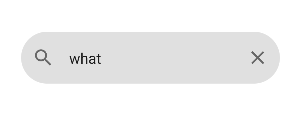

### 搜索框



```kotlin
@Composable
fun SearchTextField(
    modifier: Modifier = Modifier,
    text: MutableState<String>,
    placeholder: String = "",
    backgroundColor: Color = MaterialTheme.colors.onSurface.copy(alpha = TextFieldDefaults.BackgroundOpacity)
) {
    TextField(
        modifier = modifier.clip(RoundedCornerShape(50)),
        value = text.value,
        onValueChange = {
            text.value = it
        },
        isError = false,
        placeholder = { Text(text = placeholder) },
        leadingIcon = { Icon(Icons.Default.Search, "") },
        trailingIcon = {
            AnimatedVisibility(visible = text.value.isNotEmpty()) {
                Icon(Icons.Default.Close, "", modifier = Modifier.pointerInput(Unit) {
                    detectTapGestures(onTap = { text.value = "" })
                })
            }
        },
        singleLine = true,

        // 将所有下划线都设置透明
        colors = TextFieldDefaults.textFieldColors(
            focusedIndicatorColor = Color.Transparent,
            unfocusedIndicatorColor = Color.Transparent,
            errorIndicatorColor = Color.Transparent,
            disabledIndicatorColor = Color.Transparent,
            backgroundColor = backgroundColor
        )
    )
}
```

调用

```kotlin
val text = remember {
        mutableStateOf("what")
    }

    Column(
        Modifier.fillMaxSize(),
        horizontalAlignment = Alignment.CenterHorizontally,
        verticalArrangement = Arrangement.Center
    ) {
        Text(text = text.value)
        SearchTextField(text = text)
    }
```

<br>

### 用户名输入框

```kotlin
@Composable
fun CommonTextField(
    modifier: Modifier = Modifier,
    text: MutableState<String>,
    label: String,
    placeholder: String,
    backgroundColor: Color = Color.Transparent,
    leadingIcon: @Composable () -> Unit = {
        Icon(Icons.Default.Person, "")
    }
) {
    TextField(
        modifier = modifier,
        value = text.value,
        onValueChange = { text.value = it },
        isError = false,
        label = { Text(text = label) },
        placeholder = { Text(text = placeholder) },
        leadingIcon = leadingIcon,
        trailingIcon = {
            AnimatedVisibility(visible = text.value.isNotEmpty()) {
                Icon(Icons.Default.Close, "", modifier = Modifier.pointerInput(Unit) {
                    detectTapGestures(onTap = { text.value = "" })
                })
            }
        },
        singleLine = true,
        colors = TextFieldDefaults.textFieldColors(
            backgroundColor = backgroundColor
        )
    )
}
```

<br>

### 密码输入框

```kotlin
@Composable
fun PasswordTextField(
    modifier: Modifier = Modifier,
    text: MutableState<String>,
    label: String,
    placeholder: String = "******",
    backgroundColor: Color = Color.Transparent,
) {
    var isShow by remember {
        mutableStateOf(false)
    }

    TextField(
        modifier = modifier,
        value = text.value,
        onValueChange = { text.value = it },
        isError = false,
        label = { Text(text = label) },
        placeholder = { Text(text = placeholder) },
        leadingIcon = { Icon(Icons.Default.Lock, "") },
        trailingIcon = {
            AnimatedVisibility(visible = text.value.isNotEmpty()) {
                Icon(Icons.Default.Face, "", modifier = Modifier.pointerInput(Unit) {
                    detectTapGestures(onTap = { isShow = !isShow })
                })
            }
        },
        visualTransformation = if (!isShow) PasswordVisualTransformation()
        else VisualTransformation.None,
        singleLine = true,
        colors = TextFieldDefaults.textFieldColors(
            backgroundColor = backgroundColor
        )
    )
}
```

<br>
