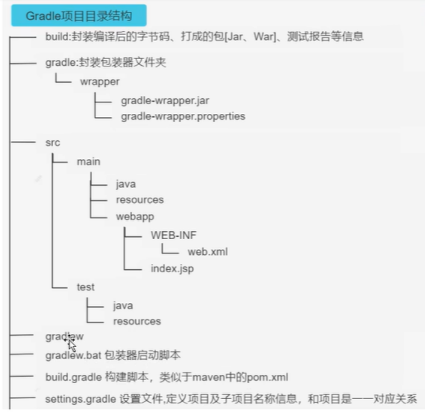

### Gradle

> 参考文献：[CSDN](https://blog.csdn.net/qq_42055933/article/details/125923776?ops_request_misc=%257B%2522request%255Fid%2522%253A%2522167642888916800215067410%2522%252C%2522scm%2522%253A%252220140713.130102334..%2522%257D&request_id=167642888916800215067410&biz_id=0&utm_medium=distribute.pc_search_result.none-task-blog-2~all~top_positive~default-1-125923776-null-null.142^v73^insert_down1,201^v4^add_ask,239^v1^control&utm_term=gradle)

<br>

#### 解决 gradle 下载龟速问题

直接打开 `build.gradle(project:app)`  
添加以下库

```groovy
buildscript {
    ...

    repositories {
        maven { url 'https://maven.aliyun.com/repository/central' }
        maven { url 'https://maven.aliyun.com/repository/google' }
        maven { url 'https://maven.aliyun.com/repository/gradle-plugin' }
        maven { url 'https://maven.aliyun.com/repository/jcenter' }
        maven { url 'https://maven.aliyun.com/repository/public' }
        maven { url 'https://jitpack.io' }
    }
}
```

#### 项目结构

这是一个标准的 gradle 项目结构



<br>

#### settings.gradle

存放于项目根目录下，此设置文件会定义项目级代码库设置，并告知 Gradle 在构建应用时应将哪些模块包含在内

接下来将以一个简单的 `settings.gradle` 文件，详细讲述对应常见配置项及其作用

```groovy
// 依赖管理
// 定义远程或者本地仓库位置，gradle将会从这些仓库搜索并下载对应依赖以及相关内容
pluginManagement {

    // 定义仓库
    repositories {
        gradlePluginPortal()
        google()                // google官方仓库
        mavenCentral()          // maven中心仓库，替代老版本的JCenter
    }

    // 定义解决方案，即对所下载的依赖做出的处理
    resolutionStrategy{
        eachPlugin{
            if (requested.id.id == 'dagger.hilt.android.plugin'){
                useModule("com.google.dagger:hilt-android-gradle-plugin:2.38.1")
            }
        }
    }
}

// 定义所有模块的仓库位置
// 这是一项全局配置，对于单个模块仍然需要定义自己的build.gradle来设置！
dependencyResolutionManagement {
    repositoriesMode.set(RepositoriesMode.FAIL_ON_PROJECT_REPOS)
    repositories {
        google()
        mavenCentral()
    }
}

// 根工程名称（即你创建该android项目时的名字）
rootProject.name = "Character"
// 定义模块目录所在位置
include ':app'
```

<br>

#### build.gradle(project:app)

文件存在于于根目录下，是整个项目的顶层 build.gradle

该 gradle 一般用来定义全局变量、依赖地址以及相关的清理操作

```groovy
// 构建脚本
buildscript {

    // 定义全局变量，常用于版本管理
    // 变量在子模块的build.gradle中直接以： $NAME 的形式调用
    ext {
        compose_version = '1.0.1'
        lifecycleVersion = '2.3.1'
        kotlinVersion = '1.5.21'
        ktlintVersion = '0.41.0'
        coroutines = '1.5.0'
        moshi_version = '1.12.0'
    }
}

// 依赖URL
// 之前于settings.gradle定义的是整体的仓库位置，而这里可以视为定义具体的依赖位置
// plugins定义项目中所有模块共用的 Gradle 依赖项
// apply false 不可以用于子模块的build.gradle
plugins {
    id 'com.android.application' version '7.1.0-rc01' apply false
    id 'com.android.library' version '7.1.0-rc01' apply false
    id 'org.jetbrains.kotlin.android' version '1.5.21' apply false
}

// 定义清理build目录的对应方法
task clean(type: Delete) {
    delete rootProject.buildDir
}
```

<br>

#### build.gradle(module:app)

存在于 app 文件夹下（即模块专属 gradle）

这里选用了油管上一个 MVVM 练手项目的 build.gradle 文件，可以前往[github](https://github.com/Hoodlab/retrofit-mvvm-)查看该项目

```groovy
// 子模块的plugins
// 请注意！这里就不可以定义apply false了
plugins {
    id 'com.android.application'
    id 'org.jetbrains.kotlin.android'
    id 'dagger.hilt.android.plugin'
}

// 应用插件 Kapt
// 这是一款kotlin专用的依赖管理插件，推荐每个项目都添加！
apply plugin: 'kotlin-kapt'

// android
// 定义所有模块构建设置
android {

    // 定义编译SDK
    // 表示你的项目可以使用低于（或等于）该版本的所有API
    compileSdk 32

    // 定义默认配置
    defaultConfig {
        // 工件ID
        applicationId "com.example.character"
        // 最低可接受SDK版本
        minSdk 21
        // 最高可接受SDK版本
        targetSdk 32
        // 给开发者看的项目版本
        versionCode 1
        // 给客户看的项目版本
        versionName "1.0"


        testInstrumentationRunner "androidx.test.runner.AndroidJUnitRunner"
        vectorDrawables {
            useSupportLibrary true
        }
    }

    // 定义构建类型
    // 默认的构建类型有两种：debug(构建时会默认打上debug签名) release(构建时默认不打任何签名)
    buildTypes {
        release {
            minifyEnabled false
            proguardFiles getDefaultProguardFile('proguard-android-optimize.txt'), 'proguard-rules.pro'
        }
    }

    // 如果你用的是JDK8，那么请添加这个两个配置以提供支持
    compileOptions {
        sourceCompatibility JavaVersion.VERSION_1_8
        targetCompatibility JavaVersion.VERSION_1_8
    }
    kotlinOptions {
        jvmTarget = '1.8'
    }

    // 构建特性
    buildFeatures {
        compose true
    }
    // compose设置
    composeOptions {
        kotlinCompilerExtensionVersion compose_version
    }
    // 资源文件配置
    packagingOptions {
        resources {
            excludes += '/META-INF/{AL2.0,LGPL2.1}'
        }
    }
}

// 在这里直接把你需要添加的依赖贴进去就好了
// 贴完后点sync即可
dependencies {

    implementation 'androidx.core:core-ktx:1.7.0'
    implementation "androidx.compose.ui:ui:$compose_version"
    implementation "androidx.compose.material:material:$compose_version"
    implementation "androidx.compose.ui:ui-tooling-preview:$compose_version"
    implementation 'androidx.lifecycle:lifecycle-runtime-ktx:2.3.1'
    implementation 'androidx.activity:activity-compose:1.3.1'
    testImplementation 'junit:junit:4.13.2'
    androidTestImplementation 'androidx.test.ext:junit:1.1.3'
    androidTestImplementation 'androidx.test.espresso:espresso-core:3.4.0'
    androidTestImplementation "androidx.compose.ui:ui-test-junit4:$compose_version"
    debugImplementation "androidx.compose.ui:ui-tooling:$compose_version"
    // dagger -hilt
    implementation "com.google.dagger:hilt-android:2.38.1"
    kapt "com.google.dagger:hilt-android-compiler:2.38.1"
    kapt "androidx.hilt:hilt-compiler:1.0.0"

    // Lifecycle components
    implementation "androidx.lifecycle:lifecycle-viewmodel-ktx:$lifecycleVersion"
    implementation "androidx.lifecycle:lifecycle-viewmodel-compose:2.4.0"
    implementation "androidx.lifecycle:lifecycle-livedata-ktx:$lifecycleVersion"
    implementation "androidx.lifecycle:lifecycle-common-java8:$lifecycleVersion"

    // Kotlin components
    implementation "org.jetbrains.kotlin:kotlin-stdlib-jdk7:$kotlinVersion"
    implementation "org.jetbrains.kotlinx:kotlinx-coroutines-android:$coroutines"

    // networking
    implementation 'com.squareup.retrofit2:retrofit:2.9.0'
    implementation 'com.squareup.retrofit2:converter-moshi:2.9.0'
    implementation("com.squareup.okhttp3:okhttp:4.9.0")
    implementation("com.squareup.okhttp3:logging-interceptor:4.9.0")
    implementation "com.squareup.moshi:moshi-kotlin:$moshi_version"
    kapt "com.squareup.moshi:moshi-kotlin-codegen:$moshi_version"
    // coil
    implementation("io.coil-kt:coil-compose:1.4.0")
}
```

> 三大主要文件全部讲完了，后续将提供打包过程以及对应签名等内容

<br>
