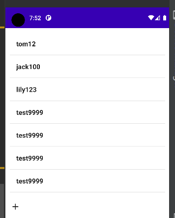

### 基于 Compose 的 LiveData

#### 简介

编写本文章时 livedata 最新版本为 1.3.0，如有需要请前往对应 maven 仓库：https://maven.google.com/web/index.html?q=live#androidx.compose.runtime:runtime-livedata:1.3.0

目前不推荐使用太高版本，因为需要高版本 android 才可以支持，故在此处我们使用 1.1.0，功能没有太大差别

`implementation "androidx.compose.runtime:runtime-livedata:1.1.0"`

<br>

livedata 一般配合 viewmodel 使用，因为 viewmodel 为 compose 自带依赖，所以不需要我们导入

<br>

#### 目标与文件结构

使用 livedata 渲染列表，并在主页面添加一个按钮，实现点击一下就自动添加一个列表项并更新 UI

文件结构：  
`Book.kt` 标准模型文件，表示 Book 类  
`BookListModel.kt` 注册 viewmodel 以及使用 livedata 的文件  
`MainActivity.kt` 主入口

<br>

#### 模型文件 Book

非常简单，我们只需要定义这本书的作者和价格就完事了

```kotlin
package com.zhiyiyi.aidt.model

class Book(author:String, price:Int){
    val author = author
    val price = price
}
```

<br>

#### 注册 viewmodel

注册一个 livedata 变量标准方法是：

1. 编写一个私有的变量，使用 MutableLiveData 将其归为 livedata 管理
2. 编写一个公有变量，指向前一个私有变量
3. 对变量的任何操作都应该针对私有变量！不能操作公有变量！

<br>

代码清单 `BookListModel.kt`

```kotlin
package com.zhiyiyi.aidt.datamodel

import android.content.ContentValues.TAG
import android.util.Log
import androidx.lifecycle.LiveData
import androidx.lifecycle.MutableLiveData
import androidx.lifecycle.ViewModel
import com.zhiyiyi.aidt.model.Book

class BookListModel : ViewModel() {

    // 第一步：定义一个私有变量并将其注册为livedata类型的
    // 注册一个使用LiveData管理的数据
    // 特别特别要注意列表必须是可变的mutable！！！！
    // 这一步是初始化三条数据
    private val _bookList = MutableLiveData<MutableList<Book>>(
        mutableListOf<Book>(
        Book("tom",12),
        Book("jack",100),
        Book("lily",123)
    ))

    // 第二步：定义一个同名公有变量指向前一个私有变量
    val bookList:LiveData<MutableList<Book>> = _bookList

    // 第三步：改动数据必须要针对私有变量！
    // 这是插入一本新书（即添加一个新Book对象）的方法
    // 注意，mutablelist插入新数据的方法是add
    fun add(author:String, price:Int){
        _bookList.value?.add(Book(author,price))
    }
}
```

<br>

名词解释

`MutableLiveData` 表示该变量归属 livedata 管辖，且是可变的  
`LiveData<>` livedata 泛型，表示该变量的类型，该变量需要使用 .value 取出数据

> 这里的变量都使用 val 来修饰，但实际上他们是一直可变的，这样写只是固定规则而已，目前还不用深究

<br>

#### 调用 livedata

整体思路：获取我们编写的 viewmodel，从中获取公有变量 bookList 即所有书本；再创建一个新的状态来记忆当前总书本数目；每次点击按钮添加新书本时自动更新书本数目，从而导致 UI 自动重绘！

说了这么多，具体请直接看代码注释

代码清单 `MainActivity.kt`

```kotlin
// 主方法
class MainActivity : ComponentActivity() {
    override fun onCreate(savedInstanceState: Bundle?) {
        super.onCreate(savedInstanceState)
        setContent {
            AidtTheme {
                Surface(
                    modifier = Modifier.fillMaxSize(),
                    color = MaterialTheme.colors.background
                ) {
                    // 指定组件拿出来渲染
                    BookScreen(BookListModel())
                }
            }
        }
    }
}


@Composable
fun BookScreen(
    // viewmodel指定为我们刚刚写的那一个
    viewModel: BookListModel
){

    // 从viewmodel中取出公有变量，并使用observeAsState实现响应式
    // 如果你学过vue，那么observeAsState的作用就类似于给变量套了个ref
    var books  = viewModel.bookList.observeAsState()

    // 新增状态记录，动态获取当前书本数目
    // 获取书本数目的方法即获取列表的size
    var bookCount by remember {
        mutableStateOf(books.value!!.size)
    }

    Column {
        LazyColumn(Modifier.padding(10.dp)){
            // 使用书本数目来渲染items
            items(bookCount){
                Text(
                    // 获取每本书的作者和价格
                    text = books.value!![it].author + books.value!![it].price,
                    modifier = Modifier
                        .padding(16.dp)
                        .fillMaxWidth(),
                    fontWeight = FontWeight.Bold,
                )
                Divider()
            }
        }

        // 点击按钮新增一本书
        IconButton(onClick = {
            // 调用viewmodel中的方法插入新书
            viewModel.add("test",9999)
            // 注意注意！！！这里对书本数目进行更新，否则无法实现UI重绘！！！
            bookCount = books.value!!.size
        }) {
            Icon(imageVector = Icons.Default.Add, contentDescription = "add")
        }
    }
}
```

> 提示：这里面的变量可就要用 var 了，不然就算 livedata 可以动态更新，我们这个组件依然无法接收到数据，因为数据值无法改变

<br>

#### 运行结果



<br>
