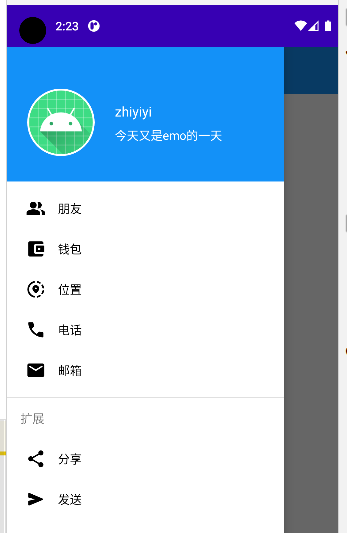
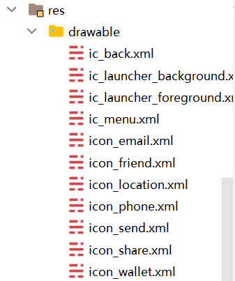

### 快速抽屉布局构建

> navigationview 可以加快抽屉布局的开发，当然如果你习惯的话也可以直接使用 drawerablelayout



<br>

#### 导入依赖

material design 依赖包，默认我们创建项目是自带的，所以大可以不管  
` implementation 'com.google.android.material:material:1.5.0'`

<br>

#### 添加图标文件

图标可以使用 vectorassets 自动生成，具体移步我的其他博客或者网上搜索其用法

android 官方的图标库已经足够我们构建简单的页面了

依次创建如下图所示的以 icon 开头的 xml 图标



<br>

#### NavigationView 主布局文件

最外层使用 DrawerLayout 标签，而内部分为两个标签：主页面布局以及抽屉布局；

和单纯使用 DrawerLayout 不同的是，抽屉布局我们使用封装好的 NavigationView 标签！

<br>

NavigationView 其中有两个重要属性：

1. app:headerLayout 头部布局，传入一个布局文件，一般用来显示个人头像以及个性签名啥的
2. app:menu 可选菜单布局，这里传入的市 menu 类型的 xml 文件，用于可选项构建

```xml
<?xml version="1.0" encoding="utf-8"?>
<androidx.drawerlayout.widget.DrawerLayout xmlns:android="http://schemas.android.com/apk/res/android"
    xmlns:app="http://schemas.android.com/apk/res-auto"
    xmlns:tools="http://schemas.android.com/tools"
    android:id="@+id/drawer_layout"
    android:layout_width="match_parent"
    android:layout_height="match_parent"
    tools:context=".MainActivity">

    <!--主页面布局-->
    <LinearLayout
        android:layout_width="match_parent"
        android:layout_height="match_parent"
        android:fitsSystemWindows="true">

        <androidx.appcompat.widget.Toolbar
            android:id="@+id/toolbar"
            android:layout_width="match_parent"
            android:layout_height="?attr/actionBarSize"
            android:background="#1391F8"
            app:navigationIcon="@drawable/ic_menu" />

    </LinearLayout>

    <!--NavigationView-->
    <com.google.android.material.navigation.NavigationView
        android:id="@+id/nav_view"
        android:layout_width="match_parent"
        android:layout_height="match_parent"
        android:layout_gravity="start"
        app:headerLayout="@layout/nav_header"
        app:menu="@menu/nav_menu" />

</androidx.drawerlayout.widget.DrawerLayout>

```

<br>

#### nav_menu.xml 目录文件

新建文件 `res/menu/nav_menu.xml` （默认没有 menu 文件夹，请自己新建一个！）

注意嵌套关系，最外层只能有一个根节点 menu  
内部一个 group 标签表示一个选项组  
下属 item 定义具体的标签

可见在代码的最下层我们定义了一个特殊结构，这是为了与上部分选项使用分割线隔开，并在分割线下方渲染新的选项

```xml
<?xml version="1.0" encoding="utf-8"?>
<menu xmlns:android="http://schemas.android.com/apk/res/android">
    <group android:checkableBehavior="single">
        <item
            android:id="@+id/item_friend"
            android:icon="@drawable/icon_friend"
            android:title="朋友" />
        <item
            android:id="@+id/item_wallet"
            android:icon="@drawable/icon_wallet"
            android:title="钱包" />
        <item
            android:id="@+id/item_location"
            android:icon="@drawable/icon_location"
            android:title="位置" />
        <item
            android:id="@+id/item_phone"
            android:icon="@drawable/icon_phone"
            android:title="电话" />
        <item
            android:id="@+id/item_email"
            android:icon="@drawable/icon_email"
            android:title="邮箱" />

        <!--使用分割线隔开，建立一个新菜单-->
        <item android:title="扩展">
            <menu>
                <item
                    android:id="@+id/item_share"
                    android:icon="@drawable/icon_share"
                    android:title="分享" />
                <item
                    android:id="@+id/item_send"
                    android:icon="@drawable/icon_send"
                    android:title="发送" />
            </menu>
        </item>
    </group>
</menu>
```

<br>

#### nav_header.xml 头部布局

由于内容过多，具体写在注释里面

```xml
<?xml version="1.0" encoding="utf-8"?>

<!-- background设置header的背景颜色，这里传入了一个浅蓝色 -->
<!-- fitsSystemWindows请设置为true，以避免手机型号不同而导致的显示卡顿&错误行为 -->
<RelativeLayout xmlns:android="http://schemas.android.com/apk/res/android"
    xmlns:app="http://schemas.android.com/apk/res-auto"
    android:layout_width="match_parent"
    android:layout_height="160dp"
    android:background="#1391F8"
    android:fitsSystemWindows="true"
    android:orientation="vertical">

    <!--头像-->
    <!-- ShapeableImageView定义一个圆形带白色边框的头像 -->
    <!-- shapeAppearanceOverlay 设置圆角样式 -->
    <com.google.android.material.imageview.ShapeableImageView
        android:id="@+id/iv_avatar"
        android:layout_width="80dp"
        android:layout_height="80dp"
        android:layout_alignParentBottom="true"
        android:layout_marginStart="24dp"
        android:layout_marginBottom="30dp"
        android:padding="1dp"
        android:layout_marginEnd="24dp"
        android:src="@mipmap/ic_launcher"
        app:shapeAppearanceOverlay="@style/circleImageStyle"
        app:strokeColor="#FFF"
        app:strokeWidth="2dp" />

    <!--用户名-->
    <TextView
        android:layout_marginTop="16dp"
        android:layout_alignTop="@+id/iv_avatar"
        android:id="@+id/tv_name"
        android:textSize="16sp"
        android:textColor="#FFF"
        android:layout_width="wrap_content"
        android:layout_height="wrap_content"
        android:layout_toEndOf="@+id/iv_avatar"
        android:text="zhiyiyi" />

    <!--个性签名-->
    <TextView
        android:layout_marginTop="8dp"
        android:id="@+id/tv_tip"
        android:textSize="14sp"
        android:layout_below="@+id/tv_name"
        android:textColor="#FFF"
        android:layout_width="wrap_content"
        android:layout_height="wrap_content"
        android:layout_toEndOf="@+id/iv_avatar"
        android:text="今天又是emo的一天" />

</RelativeLayout>

```

<br>

> 此时头部文件和菜单文件全部构建完毕，直接塞入 navigationview 的两个对应标签即可（上文有讲）

<br>

#### 定义主 activity 显示抽屉

```kotlin
package com.zhiyiyi.login

import android.os.Bundle
import android.widget.Toast
import androidx.appcompat.app.AppCompatActivity
import androidx.appcompat.widget.Toolbar
import androidx.core.view.GravityCompat
import androidx.drawerlayout.widget.DrawerLayout
import com.google.android.material.imageview.ShapeableImageView
import com.google.android.material.navigation.NavigationView


class DrawerActivity : AppCompatActivity() {

    // 定义延后初始化全局变量，可以避免使用判空运算
    private lateinit var navigationView: NavigationView
    private lateinit var drawer: DrawerLayout


    override fun onCreate(savedInstanceState: Bundle?) {
        super.onCreate(savedInstanceState)
        setContentView(R.layout.activity_drawer)

        navigationView = findViewById(R.id.nav_view)
        drawer = findViewById(R.id.drawer_layout)

        val toolbar = findViewById<Toolbar>(R.id.toolbar)

        // 经典的点击按钮打开抽屉
        toolbar.setNavigationOnClickListener {
            drawer.openDrawer(GravityCompat.START)
        }

        // 抽屉控制封装方法
        drawerController()

    }

    private fun drawerController() {
        // 获取nav_header，并对其中组件进行操作
        val header = navigationView.getHeaderView(0)
        header.findViewById<ShapeableImageView>(R.id.iv_avatar).setOnClickListener {
            showMsg("你点击了头像")
        }

        // 检测菜单中每一个项目被点击后的响应事件
        navigationView.setNavigationItemSelectedListener {
            // 使用when（类似java的switch）进行快速判断
            when (it.itemId) {
                R.id.item_friend -> showMsg(it.toString())
                R.id.item_wallet -> showMsg(it.toString())
                R.id.item_location -> showMsg(it.toString())
                R.id.item_phone -> showMsg(it.toString())
                R.id.item_email -> showMsg(it.toString())
                else -> showMsg("你点错了")
            }
            // 点完了立刻执行并合上抽屉
            drawer.closeDrawer(GravityCompat.START)
            // 最后必须return true，不然报错
            true
        }
    }

    // 弹出toast的快捷封装方法
    private fun showMsg(msg: String) {
        Toast.makeText(this, msg, Toast.LENGTH_SHORT).show()
    }

}
```

<br>

### 进阶使用
