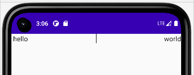

### spacer

verticalAlignment 设置垂直方向的对齐；

imageVector 另一种图片类型，可以通过 Icons.Filled 取出 android 自带的小图标；

Spacer 可以理解为一个间隔组件，用来隔开相邻组件的；  
隔开方式就是为其设置 modifier 的 padding 或者 size；

```java
@Composable
fun SingleCard(index: Int) {
    Row(verticalAlignment = Alignment.CenterVertically) {
        Image(
            imageVector = Icons.Filled.AddCircle,
            contentDescription = "null",
            modifier = Modifier.size(50.dp)
        )
        Spacer(modifier = Modifier.size(10.dp))
        Text(text = "item #$index", style = MaterialTheme.typography.subtitle1)
    }
}
```

<br>

### divider

分割线，作用效果和 spacer 一致，只不过它是一条线（废话）

这里展示一下 `divider+intrinsics` 的使用

fillMaxHeight 表示直接以最大高度填充；

IntrinsicSize.Min 表示依照子元素中同属性最小值来设置（类似木桶效应）

> 依照以下代码，设置了 IntrinsicSize.Min，整个 Row 的高度就会伸缩到 Text 组件的高度  
> 那么同理，divider 的因为是填充满高度，此时就可以和 text 一样高，而不是占满整个屏幕了



```cs
@Composable
fun TwoRow(modifier: Modifier = Modifier) {
    Row(modifier = modifier.height(IntrinsicSize.Min)) {
        // 左侧文本
        Text(
            text = "hello",
            modifier = Modifier
                .weight(1f)
                .padding(start = 4.dp)
                // 左侧对齐
                .wrapContentWidth(Alignment.Start)
        )

        // 中央分割线
        Divider(
            color = Color.Black,
            modifier = Modifier.fillMaxHeight().width(1.dp)
        )

        // 右侧文本
        Text(
            text = "world",
            modifier = Modifier
                .weight(1f)
                .padding(start = 4.dp)
                // 右侧对齐
                .wrapContentWidth(Alignment.End)
        )
    }
}
```
