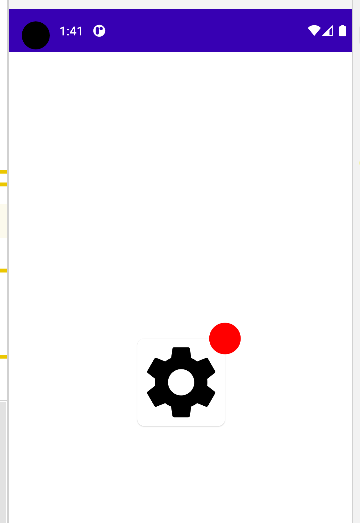

### draw 层次

我们可以使用 modifier 内置的绘图方法，按照层次来绘制图形；  
下面展示了在一个卡片的右上方绘制小红点的案例；

`drawWithContent` 先绘制内容，再绘制图形，这时卡片就会压在红点下面

```kotlin
@OptIn(ExperimentalMaterialApi::class)
@Composable
fun RedDot() {
    Box(
        modifier = Modifier.fillMaxSize(),
        contentAlignment = Alignment.Center
    ) {
        Card(
            shape = RoundedCornerShape(8.dp),
            modifier = Modifier
                .size(100.dp)

                // 绘图方法，先绘制组件本身，再绘制图形
                .drawWithContent {
                    // 先绘制内容，这个方法必须先调用
                    drawContent()
                    // 再绘制图像
                    drawCircle(
                        color = Color.Red,
                        18.dp.toPx(),
                        center = Offset(drawContext.size.width, 0f)
                    )
                },

            onClick = { Log.d(TAG, "RedDot: fuck") }
        ) {
            // 卡片上的图片
            Image(
                painter = painterResource(id = R.drawable.setting_dark),
                contentDescription = "fuck"
            )
        }
    }
}
```



<br>

当然你也可以选择先绘制图形再绘制组件本身，这时红点被组件压在下面

这个时候就不需要调用 `drawContent` 方法绘制内容了，系统会自动处理

```kotlin
.drawBehind {
    drawCircle(
        color = Color.Red,
        18.dp.toPx(),
        center = Offset(drawContext.size.width, 0f)
    )
},
```

<br>
