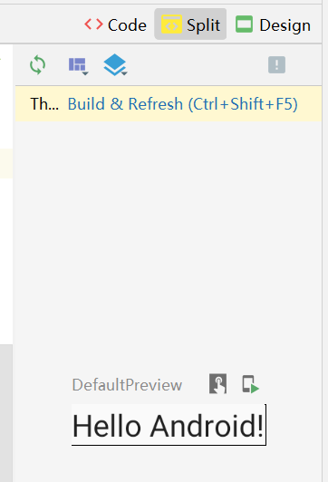

## Compose 快速但是入门

### 概况

compose 摒弃了原生开发模式中的 xml，代码结构类似于 flutter

compose 仅支持 kotlin，虽然这玩意语法糖多但是也不难学

compose 可以通过极短的代码行数构建完善页面

<br>

### 开启新工程

首先请去 android 官网下载 android studio；  
官网下载速度是正常的，别担心；

之后根据提示安装 android sdk 以及 ndk，如果必须的话你还可以装一个模拟器；

把手机直接连接到电脑上就可以进行真机调试了（记得把手机的调试模式打开）；

> 一切就绪，打开 android studio，点击 file->new->new project->empty compose activity  
> 稍等一会，工程很快构建完毕

<br>

### 文件结构

> 创建新工程后，默认会打开 `MainActivity.kt` 文件，这是我们的主页面

<br>

#### 根结构

```java
class MainActivity2 : ComponentActivity() {
    override fun onCreate(savedInstanceState: Bundle?) {
        super.onCreate(savedInstanceState)
        setContent {
            ComposeDemoTheme {
                // A surface container using the 'background' color from the theme
                Surface(
                    modifier = Modifier.fillMaxSize(),
                    color = MaterialTheme.colors.background
                ) {
                    Greeting("Android")
                }
            }
        }
    }
}
```

setContent 在这里写入页面内容，通过一个个组件逐步构造

ComposeDemoTheme 表示根据默认主题包中的内容进行设置（默认主题包就在和 mainactivity 同级别的 themes 文件夹）

Surface 构建页面表面的一个组件

<br>

#### 拆分方法

为了避免组件过度嵌套导致产生”死亡三角”，务必记得把必要的组件拆出来作为一个单独的方法写！

方法写在本 activity 的 class 内部，那么同文件夹内的其他 kotlin 文件的方法都不会冲突；  
若写在 class 外（默认），则不同文件夹将可能会发生名称重复的冲突；

<br>

```java
@Composable
fun Greeting(name: String) {
    Text(text = "Hello $name!")
}
```

加了 `@Composable` 注解的方法，表示这是一个组件，该注解必须添加！  
该组件方法内使用了 text

<br>

```java
@Preview(showBackground = true)
@Composable
fun DefaultPreview() {
    ComposeDemoTheme {
        Greeting("Android")
    }
}
```

compose 内置了一个临时预览机制，即 preview；

加了@Preview 注解的代码表示该代码将作为临时预览而展示；

临时预览的方法不会对最终编译生成的结果产生任何影响！！！

> 点击代码框右上角的 split，即可拆分为 `代码+预览` 布局  
> 一切就绪后点击 build，即可渲染预览页面



<br>

### 官方四节课教程细节剖析

> 官方教程地址：https://developer.android.google.cn/jetpack/compose/tutorial

<br>

#### data class

`data class` 类似于 typescript 的 interface，可以理解为定义了一个对象；

`msg: Message` 直接将 Message 作为一个类型来使用；

之后直接在 setContent 里面调用组件即可！

```java
class MainActivity : ComponentActivity() {
    override fun onCreate(savedInstanceState: Bundle?) {
        super.onCreate(savedInstanceState)
        setContent {
            MessageCard(Message("Android", "Jetpack Compose"))
        }
    }
}

data class Message(val author: String, val body: String)

@Composable
fun MessageCard(msg: Message) {
    Text(text = msg.author)
    Text(text = msg.body)
}
```

<br>

#### 组件代码翻译

```java
@Composable
fun MessageCard(msg: Message) {
    // 使用padding内部撑开，all表示四周撑开
    Row(modifier = Modifier.padding(all = 8.dp)) {
        Image(
            painter = painterResource(R.drawable.profile_picture),
            contentDescription = "Contact profile picture",
            modifier = Modifier
                // 设置该组件的大小为40dp
                .size(40.dp)
                // 把图片变成圆形的
                .clip(CircleShape)
        )

        // 在image和column之间添加一个水平空格！
        Spacer(modifier = Modifier.width(8.dp))

        Column {
            Text(text = msg.author)
            // 这里添加的是一个垂直空格！
            Spacer(modifier = Modifier.height(4.dp))
            Text(text = msg.body)
        }
    }
}
```

<br>

#### 单例类

教程中我们用到了 `SampleData`，然而由于外网无法访问，数据集自然下载不了，但是我们可以简单的模拟一个数据集：

object 创建单例类；

listOf 模拟列表！

```java
object SampleData {
    val conversationData = listOf(
        Message(
            "jack",
            "test name"
        ),
        Message(
            "fakeman",
            "idaofihoeqh iodhoe hfqow " +
                    "ehfsdla hfioeh fowh fldsah lfhoqei hfo" +
                    " hod hsafohewqgjlfjdsnvc,mxbg kjwfhw" +
                    " hoe hfsdhf kwejashd has jhdqwo oiadhf oiha " +
                    "oi dosi awqi jiojagakfjk ladfi jslkf h" +
                    "lwkeh flkadsh flah fioewhfoadshlfhsa"
        ),
    )
}
```

<br>

#### 适配器的替代品

```java
// by表示使用委托，设置一个针对于本compose的全局状态
// 可以理解为isExpanded是一个全局变量！
var isExpanded by remember { mutableStateOf(false) }

// clickable设置column中项目是否可以点击，以及点击后执行的代码
// 代码和vue类似，点一下就反转一下，达到开启和收回的效果
Column(modifier = Modifier.clickable { isExpanded = !isExpanded }) {
    ...

    Surface(
        shape = MaterialTheme.shapes.medium,
        elevation = 1.dp,
    ) {
        Text(
            text = msg.body,
            modifier = Modifier.padding(all = 4.dp),
            // 判断全局状态isExpanded值
            // 如果isExpanded为true，那么显示所有行（即展开）
            // 如果isExpanded为false，那么仅显示一行（即收缩）
            maxLines = if (isExpanded) Int.MAX_VALUE else 1,
            style = MaterialTheme.typography.body2
        )
    }
}
```

<br>

#### 简单小动画？

```java
// 同样的委托，注册全局动画状态
// 由于内容过于庞杂，后续将会详细介绍动画状态是个什么东西！
val surfaceColor by animateColorAsState(
    if (isExpanded) MaterialTheme.colors.primary else MaterialTheme.colors.surface,
)
```

<br>

### END

发文不易，求求大家多多支持呜呜呜 😭😭😭
