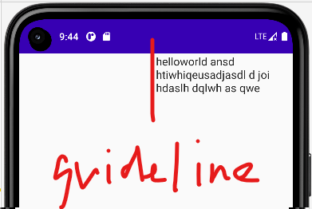
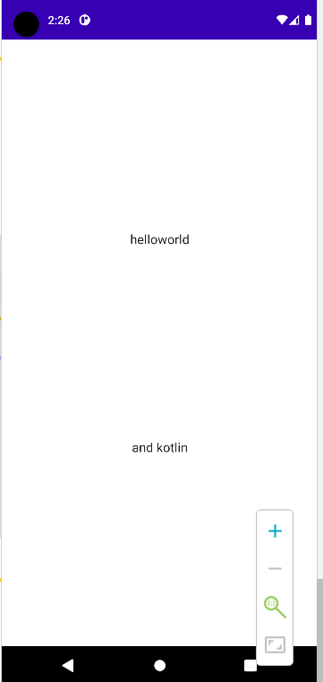

### 基本结构

> 约束结构原理：将一个组件与约束布局关联后，通过 modifier 来指定组件位置

#### 导入 compose 约束布局包

打开 `build.gradle(:app)` 文件

在依赖中添加以下这一行，之后点击顶部的 `sync now` 进行 gradle 配置  
`androidx.constraintlayout:constraintlayout-compose:1.0.1`

<br>

#### 约束布局使用步骤？

1. ConstraintLayout 定义一个约束布局
2. val (button, text) = createRefs() 所有需要和约束布局相关联的组件都必须要在这里进行注册！  
   如果仅注册一个组件，那就用 createRef，多个组件就用上面那样子  
   （这一段代码使用了 kotlin 的解构赋值）
3. Modifier.constrainAs(button) 在组件的 modifier 中将自身与约束布局相关联！
4. top.linkTo 最后用这办法在约束布局里面定位组件

```java
@Composable
fun ConstraintLayoutContent() {
    ConstraintLayout() {
        val (button, text) = createRefs()
        Button(
            onClick = { /*TODO*/ },
            modifier = Modifier.constrainAs(button) {
                top.linkTo(parent.top, margin = 16.dp)
            }
        ) {
            Text(text = "btn")
        }
    }
}
```

<br>

#### 继续约束？

紧接着上面的代码，我们指定一个 text 跟在 button 的下面

```java
@Composable
fun ConstraintLayoutContent() {
    ConstraintLayout() {
        ...

        Text(text = "nullclear", modifier = Modifier.constrainAs(text) {
            // 直接拿button作为参照点进行布局
            top.linkTo(button.bottom, margin = 16.dp)
            // 水平约束对齐父类
            centerHorizontallyTo(parent)
        })
    }
}
```

<br>

### 参考线

> 渲染结果



`createGuidelineFromStart` 从最左侧开始一定距离后构造一个垂直参考线  
`fraction = 0.5f` 距离（左侧的）长度，0.5f 恰好是屏幕的一半长

`linkTo` 在这里面设置约束的左侧（start）和右侧（end）

`Dimension.preferredWrapContent` 让文本自动换行，不破坏结构

> 如果我们不加上 width 这一行的话，文本会冲破 guideline 的左侧限制而超出！

```java
@Composable
fun ConstraintLayoutContent2() {
    ConstraintLayout {
        val text = createRef()
        val guideline = createGuidelineFromStart(fraction = 0.5f)
        Text(text = "helloworld ansd htiwhiqeusadjasdl d joi hdaslh dqlwh as qwe", modifier = Modifier.constrainAs(text) {
            linkTo(start = guideline, end = parent.end)
            width = Dimension.preferredWrapContent
        })
    }
}
```

<br>

### 约束解耦

> 直接拿上面写好的代码解耦了

<br>

#### 约束集合

ConstraintSet 设置一个约束集合，在里面提前设置好各个组件的约束条件！

下方代码分别设置了两个组件 button 和 text 的约束条件；

```cs
private fun decoupleConstraints(margin: Dp): ConstraintSet {
    return ConstraintSet {
        val button = createRefFor("button")
        val text = createRefFor("text")
        constrain(button) {
            top.linkTo(parent.top, margin)
        }
        constrain(text) {
            top.linkTo(button.bottom, margin)
        }
    }
}
```

<br>

#### 解耦调用

按照原版的写法，我们需要在 `constraintlayout` 中写明约束条件，但由于我们把约束条件写在了外部，那么直接调用即可

`Modifier.layoutId` 直接根据于约束集合中定义的名称来应用指定的约束条件；

```cs
@Composable
fun DecoupleConstraintsLayout() {
    BoxWithConstraints {
        // 响应式布局
        val constraints = if (maxWidth < maxHeight) {
            decoupleConstraints(16.dp)
        } else {
            decoupleConstraints(160.dp)
        }

        // 把响应式布局的if判断作为参数传入，约束布局即可按照对应法则布置组件
        ConstraintLayout(constraints) {
            // layoutId对应我们在约束集合中配置的名称！
            Button(onClick = { /*TODO*/ }, modifier = Modifier.layoutId("button")) {
                Text(text = "button")
            }
            Text(text = "text", modifier = Modifier.layoutId("text"))
        }
    }
}
```

<br>

### 链接约束

使用链接约束可以快速的设置指定组件的布局规则：

`createVerticalChain` 用来对指定组件设置对应的布局规则

`chainStyle = ChainStyle.Spread` 表示设置布局约束为平均分布

```kotlin
@Composable
fun card() {
    ConstraintLayout {
        // 创建两个组件的引用
        val (headerRef, bottomRef) = createRefs()
        // 使用链接约束
        // chainStyle = ChainStyle.Spread 设置指定组件的布局规则为平均分布
        createVerticalChain(headerRef, bottomRef, chainStyle = ChainStyle.Spread)
        Text(text = "helloworld",
            modifier = Modifier
                .wrapContentSize()
                .constrainAs(headerRef) {
                    linkTo(start = parent.start, end = parent.end)
                })
        Text(text = "and kotlin",
            modifier = Modifier
                .wrapContentSize()
                .constrainAs(bottomRef) {
                    linkTo(start = parent.start, end = parent.end)
                })
    }
}

```

成果图：


