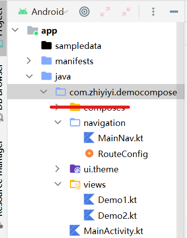

### Navigation 快速上手

> 下面案例简要展示使用 Compose 版本的 Navigation 库来实现两个页面之间的跳转

这是完整的结构（忽略掉红线划过的那个包）



<br>

安装适用于 kotlin 的 navigation 依赖

```kotlin
dependencies {
    implementation("androidx.navigation:navigation-compose:2.4.1")
}
```

<br>

#### 编写欲跳转的两个页面

编写 Demo1 页面

子页面使用多个 `composable` 组件相组合的方法一一装配起来

`Demo1main` 渲染整个页面，他接受一个 `NavController` 对象，用于操纵导航相关的方法

> 可以注意到 Button 里面的点击事件还没写，后续我们写好路由后再回来编写跳转逻辑

```kotlin
@Composable
fun Demo1main(navController: NavController) {
    body(navController)
}

@Composable
private fun body(navController: NavController) {
    Column(
        modifier = Modifier
            .fillMaxSize()
    ) {
        Button(onClick = {
            // 跳转逻辑
        }) {
            Text(
                text = "前往demo2",
                modifier = Modifier.fillMaxWidth(),
                textAlign = TextAlign.Center
            )
        }
    }
}
```

<br>

编写 Demo2 页面

依葫芦画瓢

```kotlin
@Composable
fun Demo2main(navController: NavController) {
    body(navController)
}

@Composable
private fun body(navController: NavController) {
    Column(
        modifier = Modifier
            .fillMaxSize()
    ) {
        Button(onClick = {
            // 这里也写跳转逻辑！
        }) {
            Text(
                text = "前往demo1",
                modifier = Modifier.fillMaxWidth(),
                textAlign = TextAlign.Center
            )
        }
    }
}
```

<br>

#### 路由表配置

编写单例类 RouteConfig 用来存储路由名称（等同于 vue-router 中我们设置的 path）

后续为便于理解，统称为 path

```kotlin
object RouteConfig {
    // 主页面
    const val ROUTE_MAIN = "main"

    // 两个跳转页面
    const val ROUTE_DEMO1 = "demo1"
    const val ROUTE_DEMO2 = "demo2"
}
```

<br>

#### 总路由

创建文件 MainNav 并在里面实现路由导航的总逻辑

由于我们刚刚入门，路由表可以很简单，按照以下结构即可

1. rememberNavController 存储所有 navcontroller 状态
2. NavHost 一个容器，便于内部页面的切换，在里面注册所有页面

```kotlin
@Composable
fun AppNav() {
    // 存储navigation状态
    val navController = rememberNavController()

    // navhost容器
    // startDestination表示起始页的path，这里我们指定demo1作为起始页
    NavHost(navController = navController, startDestination = RouteConfig.ROUTE_DEMO1) {
        // 依次传入path并注册三个页面
        composable(RouteConfig.ROUTE_MAIN) {
            MainActivity()
        }
        composable(RouteConfig.ROUTE_DEMO1) {
            Demo1main(navController)
        }
        composable(RouteConfig.ROUTE_DEMO2) {
            Demo2main(navController)
        }
    }
}
```

<br>

#### 主页面调用总路由

对于 kotlin 而言，非常简单，直接调用定义好的总路由方法即可

因为总路由默认起始页为 demo1，故渲染 mainactivity 后就会立即载入 demo1 页面！

```kotlin
class MainActivity() : ComponentActivity() {
    override fun onCreate(savedInstanceState: Bundle?) {
        super.onCreate(savedInstanceState)
        setContent {
            DemoComposeTheme {
                // A surface container using the 'background' color from the theme
                Surface(
                    modifier = Modifier.fillMaxSize(),
                    color = MaterialTheme.colors.background
                ) {

                    // 一键调用，方便快捷
                    AppNav()
                }
            }
        }
    }
}
```

<br>

#### 跳转逻辑完善

嘿！还记得我们之前置空的按钮跳转逻辑吗？

我们已经配置完了所有路由，为此，仅需将以下代码添加到按钮点击事件即可跳转到指定页面了！

```kotlin
// 写于demo1页面，点击按钮后跳转到demo2页面
navController.navigate(RouteConfig.ROUTE_DEMO2)
```

<br>

为便于大家理解，现给出 demo1.kt 目前的完整代码

```kotlin
@Composable
fun Demo1main(navController: NavController) {
    body(navController)
}

@Composable
private fun body(navController: NavController) {
    Column(
        modifier = Modifier
            .fillMaxSize()
    ) {
        Button(onClick = {
            navController.navigate(RouteConfig.ROUTE_DEMO2)
        }) {
            Text(
                text = "前往demo2",
                modifier = Modifier.fillMaxWidth(),
                textAlign = TextAlign.Center
            )
        }
    }
}
```

> demo2 的跳转逻辑只需要修改对应的 path 即可

> 目前仅学到了最简单的 navigate 跳转，后续还有带参跳转，请关注进阶版本！

<br>

### 带参传递

> 目前 compose 还不支持传入对象作为参数！

<br>

#### 简单双参数

根目录下新建文件夹 entity，新建单例类 ContentType 作为数据类存储位置

新增数据类 DemoContent，这表示我们需要传入的两个参数，后面带问号判空

```kotlin
object ContentType {
    data class DemoContent(
        val id: Int?,
        val content: String?
    )
}
```

<br>

本案例承接上一节案例；

修改 demo1，将其改写成类的形式，body 方法内容保持不变

```kotlin
class Demo1(
    var navController: NavController,
    // 接收数据类
    var content: ContentType.DemoContent
) {
    @Composable
    fun init() {
        body()
    }

    @Composable
    private fun body() {
        ...
    }
}
```

<br>

修改 mainnav 中的 demo1 路由

定义参数的三个步骤：

1. 路由路径内使用花括号包裹参数名称（类似于 springboot）
2. 必须为所有参数给予一个 NavType！！！
3. 将参数传递给指定 composable 组件

```kotlin
composable(
    // path中指定了两个参数，前者为int类型，后者为string类型
    "${RouteConfig.ROUTE_DEMO1}/{id}/{content}",
    // 使用列表注册所有的参数并且添加对应类型
    arguments = listOf(
        navArgument("id") { type = NavType.IntType },
        navArgument("content") { type = NavType.StringType }
    )
) { navBackStackEntry ->

    // navBackStackEntry保存传入的参数，我们通过其获取值并传递
    Demo1(
        navController, ContentType.DemoContent(
            navBackStackEntry.arguments?.getInt("id"),
            navBackStackEntry.arguments?.getString("content")
        )
    ).init()
}
```

<br>

demo2 启动参数修改

非常简单，仅需要使用 ${} 的形式填充入 path 即可传递值

```kotlin
Button(onClick = {
    navController.navigate("${RouteConfig.ROUTE_DEMO1}/${1}/${"damn"}")
}) {
    ...
}
```

<br>

#### 默认参数

给路由配置 defaultValue 默认值，可以提升效率

```kotlin
composable(
    "${RouteConfig.ROUTE_DEMO1}/{id}?content={content}",
    arguments = listOf(
        navArgument("id") { type = NavType.IntType },

        // 设置默认值
        navArgument("content") {
            type = NavType.StringType
            defaultValue = "nullptr"
        }
    )
) { navBackStackEntry ->
    ...
}
```

<br>

### Deeplinks 深度链接

#### 快速上手

对于大型应用，会使用一个 App 作为根页面管理下属所有的子页面，每个子页面再用 navgraph 进行路由跳转，此方法可以充分解耦！

deeplinks 可以理解为隐式跨进程调用页面的方式，而使用 routerid 调用的方式可以称为直接调用

故首先应当在 manifest 里面给根页面（我这里是 MainActivity.kt）添加指定过滤器

```xml
<activity
    android:name=".MainActivity"
    android:exported="true"
    android:label="@string/app_name"
    android:theme="@style/Theme.DemoCompose">
    ...

    <intent-filter>
        <!-- 这三行固定格式别动 -->
        <action android:name="android.intent.action.VIEW" />
        <category android:name="android.intent.category.DEFAULT" />
        <category android:name="android.intent.category.BROWSABLE" />

        <!-- 这一行需要写你注册的URI -->
        <!-- 按下述格式注册结果为： zhiyiyi://demo -->
        <data android:scheme="zhiyiyi" android:host="demo" />
    </intent-filter>

    ...
</activity>
```

<br>

在 navhost 的 composable 注册路由时，附加一个 deeplinks 参数即可注册深度链接

```kotlin
composable(
    "${RouteConfig.ROUTE_DEMO1}/{id}?content={content}",
    arguments = listOf(
        navArgument("id") { type = NavType.IntType },
        navArgument("content") {
            type = NavType.StringType
            defaultValue = "nullptr"
        }
    ),

    // 注册deeplinks
    deepLinks = listOf(
        navDeepLink {
            // 这个链接就按照我们在manifest中注册的来写即可，格式照抄
            uriPattern = "zhiyiyi://demo/{id}?content={content}"
        }
    )
) { navBackStackEntry ->
    ...
}
```

<br>

调用也很简单，使用 NavDeepLinkRequest 发起调用请求

```kotlin
Button(onClick = {
    val request = NavDeepLinkRequest.Builder
        .fromUri("zhiyiyi://demo/1?content=${"fuck"}".toUri())
        .build()
    navController.navigate(request)
})
```

<br>

### Scaffold 导航案例

> 这里仅仅展示 scaffold 以及 navhost 的主要编写，至于定义页面啥的可以看前面的快速上手部分

<br>

实现目标：使用 scaffold 定义底部导航，写三个子页面，每点击一个导航按钮就自动切换到对应的子页面

<br>

代码清单：`MainNav.kt`

这里把 `NavHostController` 从原本的 `navhost` 主方法中抽离出来，并配合延后初始化，这样子就可以直接通过 setter 方法修改导航！！！

```kotlin
// 把NavHostController延迟初始化并定义其为私有局部的
// 注解是intellij自己加的，我也不知道有什么用
@SuppressLint("StaticFieldLeak")
private lateinit var navControllerObject: NavHostController

// navhost主体，不解释！
@Composable
fun NavHostMain() {
    // 在这里对NavHostController进行初始化
    navControllerObject = rememberNavController()
    NavHost(navController = navControllerObject, startDestination = RouteConfig.R_INDEX) {
        composable(RouteConfig.R_INDEX) {
            IndexViewInit(navControllerObject)
        }
        composable(RouteConfig.R_INFO) {
            InfoViewInit(navControllerObject)
        }
        composable(RouteConfig.R_SETTING) {
            SettingViewInit(navControllerObject)
        }
    }
}

// setter方法，设置当前路由！
fun navChangePath(path: String) {
    navControllerObject.navigate(path)
}
```

<br>

代码清单 `MainActivity.kt`

先在 scaffold 布局的 body 塞入 navhost 主体方法，`类似于 vue 的 routerview`，即在这里显示路由内容！

之后在底部按钮点击事件中运行 setter 方法，修改 path，实现路由跳转即可

```kotlin
class MainActivity : ComponentActivity() {
    override fun onCreate(savedInstanceState: Bundle?) {
        super.onCreate(savedInstanceState)
        setContent {
            AidtTheme {
                Surface(
                    modifier = Modifier.fillMaxSize(),
                    color = MaterialTheme.colors.background
                ) {
                    // 在这里调用scaffold
                    mainBody()
                }
            }
        }

    }
}

data class Item(val name: String, val icon: Int, val route: String)

@Composable
private fun mainBody() {
    var selectedItem by remember {
        mutableStateOf(0)
    }
    val items = listOf(
        Item("主页", R.drawable.ic_home, RouteConfig.R_INDEX),
        Item("列表", R.drawable.ic_user, RouteConfig.R_INFO),
        Item("设置", R.drawable.ic_pwd, RouteConfig.R_SETTING)
    )

    Scaffold(
        bottomBar = {
            BottomNavigation {
                items.forEachIndexed { index, item ->
                    BottomNavigationItem(
                        selected = selectedItem == index,

                        // 每次点击一次导航按钮，就使用setter方法修改path
                        // 从而实现路由切换
                        onClick = {
                            selectedItem = index
                            navChangePath(item.route)
                        },
                        icon = { Icon(painterResource(item.icon), null) },
                        alwaysShowLabel = false,
                        label = { Text(item.name) }
                    )
                }
            }
        }
    ) {
        Box(
            modifier = Modifier.fillMaxSize(),
            contentAlignment = Alignment.Center
        ) {
            NavHostMain()   // 调用navhost主方法，在这里显示路由内容
        }
    }
}
```

<br>
