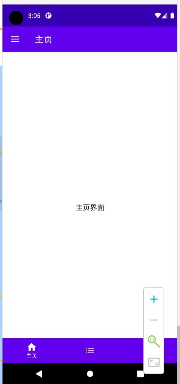

### 搭设基本 Scaffold 页面

> scaffold 组件遵循 Material Design，可以协助开发者迅速构建对应框架页面

<br>

#### 准备工作

首先在 drawable 文件夹内，添加几张 vector images，用作我们的底部导航栏图标


<br>

在主页面中声明数据类，表示单个图标以及其解释文本

```kotlin
data class Item(
    val name: String,
    val icon: Int
)
```

<br>

新增组件 mainBody，逐一添加三个底部按钮的图标

```kotlin
@Composable
fun mainBody() {
    // 存储当前选中的底部按钮的状态
    var selectedItem by remember {
        mutableStateOf(0)
    }

    // 三个底部按钮
    val items = listOf(
        Item("主页", R.drawable.home),
        Item("列表", R.drawable.list),
        Item("设置", R.drawable.setting)
    )

    ...
}
```

<br>

#### 主体编写

首先是设置 topBar，即顶部导航栏对应按钮

代码很简单，但要注意使用的括号类型以及对应嵌套关系！

```kotlin
Scaffold(
    topBar = {
        TopAppBar(
            title = { Text("主页") },
            navigationIcon = {
                IconButton(onClick = { /*TODO*/ }) {
                    Icon(Icons.Filled.Menu, null)
                }
            }
        )
    },

    ...
){}
```

<br>

紧接着在 `topBar` 属性后面写底部导航栏属性 `bottomBar`

`items.forEachIndexed` 按照索引渲染，vue 的 `v-for` 懂吧，就这个原理！  
依次渲染 `BottomNavigationItem` 即可；

```kotlin
bottomBar = {
    BottomNavigation {
        items.forEachIndexed { index, item ->
            BottomNavigationItem(
                // selectedItem 是内置属性，表示当前选中的Item
                // onClick即切换当前激活的Item
                selected = selectedItem == index,
                onClick = { selectedItem = index },

                // 这几个属性看看英文就懂了，不解释
                icon = { Icon(painterResource(item.icon), null) },
                alwaysShowLabel = false,
                label = { Text(item.name) }
            )
        }
    }
}
```

<br>

这是总体的代码：

```kotlin
@Composable
fun mainBody() {
    var selectedItem by remember {
        mutableStateOf(0)
    }
    val items = listOf(
        Item("主页", R.drawable.home),
        Item("列表", R.drawable.list),
        Item("设置", R.drawable.setting)
    )

    Scaffold(
        topBar = {
            TopAppBar(
                title = { Text("主页") },
                navigationIcon = {
                    IconButton(onClick = { /*TODO*/ }) {
                        Icon(Icons.Filled.Menu, null)
                    }
                }
            )
        },
        bottomBar = {
            BottomNavigation {
                items.forEachIndexed { index, item ->
                    BottomNavigationItem(
                        selected = selectedItem == index,
                        onClick = { selectedItem = index },
                        icon = { Icon(painterResource(item.icon), null) },
                        alwaysShowLabel = false,
                        label = { Text(item.name) }
                    )
                }
            }
        }
    ) {
        // 在scaffold里面塞一个box，糊弄一下
        Box(
            modifier = Modifier.fillMaxSize(),
            contentAlignment = Alignment.Center
        ) {
            Text(text = "主页界面")
        }
    }
}

```



<br>

### 侧边抽屉 drawer

#### 监听抽屉布局返回事件

一般的，我们打开左侧抽屉后，单击返回键就会关闭抽屉而非退出 app

这里需要记录 scaffold 的抽屉状态并利用 backhandler 组件监听返回事件

`scaffoldState` 记录 scaffold 状态  
`scope` 协程作用域，处理挂起的函数

`BackHandler` 这是专门处理 compose 返回操作的监听组件，我们在这里处理关闭抽屉的方法

```kotlin
@Composable
fun drawerDemo() {
    // 记录对应的状态
    val scaffoldState = rememberScaffoldState()
    val scope = rememberCoroutineScope()

    Scaffold(
        // 创建一个简单的抽屉
        drawerContent = {
            Text(text = "抽屉")
        },
        // 这里将scaffold的状态存储起来
        scaffoldState = scaffoldState
    ) {
    }

    // 返回键监听
    BackHandler(
        // 监听开始的条件是：抽屉被打开
        enabled = scaffoldState.drawerState.isOpen
    ) {
        // 此时若点击了返回键，则使用协程scope关掉高抽屉
        scope.launch {
            scaffoldState.drawerState.close()
        }
    }
}
```

<br>
