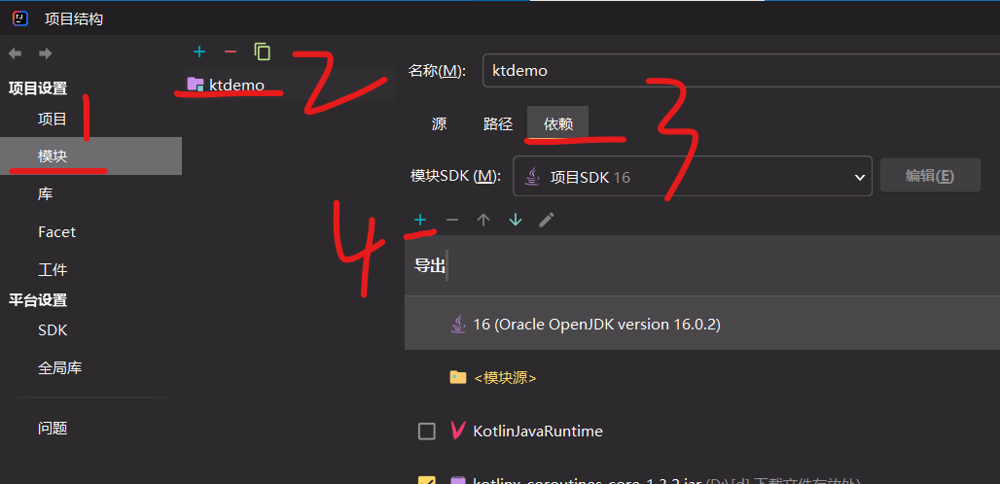

### 协程基础

#### launch

runBlocking 是一个协程生成器，它连接了协程与非协程世界

launch 也是一个协程生成器，它用于开启一个协程

delay 可以挂起协程，直到计时结束才继续运行该协程

```kotlin
// 该协程实现效果：先输出hello，延迟1s后再输出world
fun main() = runBlocking {
    launch {
        (1000L)
        println("world")
    }
    println("hello ")
}
```

<br>

#### suspend

为任意函数添加 suspend 修饰可以将其变成挂起函数

挂起函数可以充当一个协程，并且其内部依然可以使用其他暂停函数（比如 delay）

挂起函数内可以添加携程作用域

```kotlin
fun main() = runBlocking {
    launch {
        demo()
    }
    println("hello ")
}

suspend fun demo(){
    delay(1000L)
    println("world")
}
```

<br>

#### coroutineScope

`coroutineScope` 定义一个协程作用域

`coroutineScope` 是挂起而不干扰当前线程其余代码执行，runBlocking 直接阻塞整个线程

挂起函数可以直接使用协程作用域

> 下方代码中，可见一个协程作用域内可以有多个 launch 实现多协程并发执行  
> 注意到 runBlocking 的阻塞作用，故主线程 main 必须先执行协程 doWorld 完毕后才能打印 println

```kotlin
fun main() = runBlocking {
    doWorld()
    println("Done")
}

suspend fun doWorld() = coroutineScope {
    launch {
        delay(2000L)
        println("World 2")
    }
    launch {
        delay(1000L)
        println("World 1")
    }
    println("Hello")
}

// 运行结果
// Hello
// World 1
// World 2
// Done
```

<br>

#### join

launch 开启协程返回一个 join 对象，将其传入一个变量并使用 join()方法来启动该协程！

对 job 对象使用 cancel()方法来取消掉协程执行

```kotlin
fun main() = runBlocking {
    val coroutine = launch {
        delay(1000L)
        println(1+1)
    }
    coroutine.join()
    println("协程执行完毕！")
}
```

<br>

#### 终结动作

finally 代码块内容会在协程被取消后立即执行

```kotlin
fun main() = runBlocking {
//sampleStart
    val job = launch {
        try {
            repeat(1000) { i ->
                println("job: I'm sleeping $i ...")
                delay(500L)
            }
        } finally {
            println("job: I'm running finally")
        }
    }
    delay(1300L) // 延迟一段时间
    println("main: I'm tired of waiting!")
    job.cancelAndJoin() // 取消该作业并且等待它结束
    println("main: Now I can quit.")
//sampleEnd
}

// 运行结果
// job: I'm sleeping 0 ...
// job: I'm sleeping 1 ...
// job: I'm sleeping 2 ...
// main: I'm tired of waiting!
// job: I'm running finally
// main: Now I can quit.
```

<br>

#### 超时

使用 withTimeout 定义带超时范围的协程作用域，超时后立即报错

```kotlin
fun main() = runBlocking {
    withTimeout(1100L){
        repeat(1000){
            println("hey!")
            delay(500L)
        }
    }
}
```

<br>

#### 组合式协程

普通顺序调用

定义两个挂起函数，并直接在协程作用域内按顺序调用他们，即可实现组合两个协程

> 为协程添加 async 可以使其变成异步的

```kotlin
fun main() = runBlocking {
    val res = measureTimeMillis {
        val d1 = demo1()
        val d2 = demo2()
        println("${d1+d2}")
    }
    println("完成啦")
}

suspend fun demo1():Int{
    delay(1000L)
    return 1
}
suspend fun demo2():Int{
    delay(1000L)
    return 100
}
```

<br>

#### async

这里的异步很类似于 js 中的异步函数，只不过 async 和 await 表达的意思以及使用的场景不太一致而已

```kotlin
fun main() = runBlocking<Unit> {
    val time = measureTimeMillis {
        println("${sum()}")
    }
    println("所有事都做完了")
}

// 将所有挂起函数组合在一个总挂起函数中
// 使用协程作用域coroutineScope
suspend fun sum():Int = coroutineScope {
    // 每个挂起函数都必须使用async修饰，表示其为异步的
    val d1 = async { demo1() }
    val d2 = async { demo2() }
    // await执行异步函数
    d1.await()+d2.await()
}

suspend fun demo1():Int{
    delay(1000L)
    return 1
}
suspend fun demo2():Int{
    delay(1000L)
    return 100
}
```

<br>

### Flow

#### intellij 配置

对于 intellij idea 2002 版本及以上的 IDE，都已捆绑 kotlin 插件，无需我们自主安装

但如果我们想要使用 kotlin flow 数据流操作的语法支持的话，依旧需要下载 `coroutines-core` 依赖

<br>

首先去 maven 仓库下载对应 jar 包：[下载 1.3.2 版本的 coroutines-core](https://mvnrepository.com/artifact/org.jetbrains.kotlinx/kotlinx-coroutines-core/1.3.2)

新建一个项目，项目管理方式 maven 或者 idea 都可以无所谓

依次点击文件->项目结构->模块，选择你要添加依赖的模块  
点击绿色加号，选择第一项，导入我们刚刚下载好的 jar 包，然后勾选即可



<br>

#### 基础

`flow{}` 创建新的流  
`flowOf()` 根据已有数据创建流

`emit` 为流插入一个元素  
`collect` 对流做出的操作（一般均位于结尾被调用）

```kotlin
fun main() = runBlocking {
    flow {
        emit(1)
        emit(2)
    }.collect {
        println(it)
    }
}
```

<br>

`asFlow` 把已有数据集转换为流  
`filter` 过滤器  
`take` 取出当前链上结果的前 N 个数据

```kotlin
fun main() = runBlocking {
    (1..10).asFlow()        // 将已有数据转换为流
        .map { it*100 }
        .filter { it>500 }
        .take(2)
        .collect { println(it) } // 600 700
}
```

<br>

`onStart` 流开始前执行  
`onCompletion` 流完成后执行

```kotlin
fun main() = runBlocking {
    (1..10).asFlow()
        .onStart { println("我准备好了") }
        .onCompletion { println("我的活干完了") }
        .collect { println(it) }
}
```

<br>

#### flowOn

flowOn() 指定协程上游执行所在池

如下代码可知，上游协程执行 map，被显式规定在了 IO 池中，而下游的 collect 部分则依旧在 MAIN 池中

```kotlin
fun main() = runBlocking {
    (1..2).asFlow()
        .map { println(it) }
        .flowOn(Dispatchers.IO)
        .collect { println("collect") }
}

// 输出结果
// 1
// 2
// collect
// collect
```

<br>

`launchIn` 即针对下游协程需要用到的 Dispatcher

```kotlin
val customDispatcher:ExecutorCoroutineDispatcher = Executors.newSingleThreadExecutor{
    Thread(it,"null").apply { isDaemon=true }
}.asCoroutineDispatcher()

fun main() = runBlocking {
    val scope = CoroutineScope(customDispatcher)
    (1..2).asFlow()
        .map { println(it) }
        .flowOn(Dispatchers.IO)
        .onEach { println("每次执行弹出") }
        .launchIn(scope)
    delay(100)
}
```

<br>
