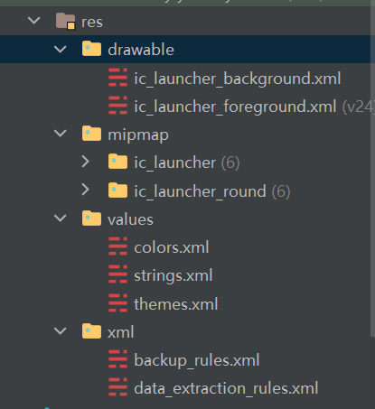

### 结构介绍

原生开发&Compose 均使用以下 res 资源文件夹结构

drawable：存放大多数图标以及图片文件

mipmap：官方建议仅存放应用图标

values：数值文件夹，包含颜色、字符串、主题三大部分设置

xml：其余需要通过 xml 定义的文件

 

> 对于 JetpackCompose，还会在主包下存在一个 `ui.theme` 文件夹，这是专门定义 Compose 主题的 UI 文件夹，我们可以使用其中的 `Color.kt` 用来定义颜色而不用 `values/colors.xml`

 

### 文件路径最全整理

 

### Drawable

> 应用图标一般放在 mipmap 文件夹下  
> 其余图标一律放在 drawable 文件夹下

 

### compose 获取资源文件的几种方式

文本： stringResource(R.string.hello_world)  
颜色： colorResource(R.color.black)  
尺寸： dimensionResource(R.dimen.padding)  
图片： painterResource(R.drawable.head_icon)

 

### Icon 组件

icon 组件可以接受三种类型的图片，分别为：bitmap、imagevector、painter

imagevector 一般直接使用 compose 内置的图标

内置图标有两种：

1. 镂空的 Icons.Default.xxx
2. 实心的 Icons.Filled.xxx

`Icon(imageVector = Icons.Default.Add, contentDescription = "demo")`

 

而对于 painter，直接可以使用 res 的 drawable 文件夹下我们存储的 xml 后缀图标文件

注意这里需要使用 painterResource 通过 ID 获取到指定图标文件

`Icon(painter = painterResource(id = R.drawable.ic_pwd), contentDescription = "good")`

 
