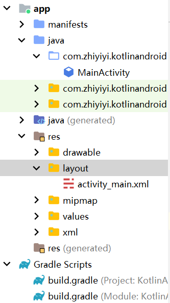
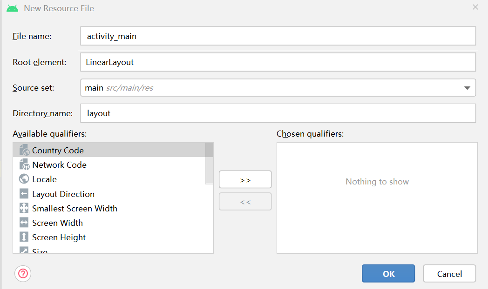

### 配置环境

球球了大爷们，能不能自己动手上网查查呀，这边地方太小实在写不下去了！！！

说白了就一堆 SDK Android Studio 这些玩意的配置，没多大难度；

<br>

### 第一个 APP

#### 新工程

file -> new -> new project

选择 `empty activity` 作为模板，然后设置一下项目名字，开发语言选择 kotlin，之后确认无误点击 finshi 就好啦！

<br>

#### 文件视图

默认使用 android 视图，建议不要改了，这是官方推荐的最适合工程操作的视图!

目前打基础只需要关注以下四个文件：

1. 第一个 java 文件夹：存放所有 activity 和一些工具类
2. layout 文件夹：布局文件 xml 存放位置
3. drawable 文件夹：icon 小图标存放位置
4. build.gradle：gradle 配置文件，安装依赖啥的就靠他了



<br>

#### 装插件

打开 build.gradle，如果你发现页面和下方的不同，换一个同名文件打开（因为每个 android 项目中都有俩 build.gradle 文件，但只有一个在根目录下的才是配置依赖的最常用的那个！！！）

plugins 闭包：配置插件头；

dependencies 闭包：设置依赖；

好的，我们在 plugins 闭包里面安装有一个 kotlin 扩展插件（代码中已被注释标出），该插件能极大地加快开发效率

> 只要你动过 gradle 哪怕是加一个空格，都必须要点击上方的 sync（同步）按钮，才可以运行 app！！！

> 同步过程会自动下载依赖，默认存放地址是 C 盘，如果需要配置另一个磁盘请自己查。。。

```json
plugins {
    id 'com.android.application'
    id 'org.jetbrains.kotlin.android'
    id 'kotlin-android-extensions'  // 这个插件默认没有，请添加，后面有大用
}

...

dependencies {
    implementation 'androidx.core:core-ktx:1.7.0'
    implementation 'androidx.appcompat:appcompat:1.4.1'
    implementation 'com.google.android.material:material:1.5.0'
    implementation 'androidx.constraintlayout:constraintlayout:2.1.3'
    testImplementation 'junit:junit:4.13.2'
    androidTestImplementation 'androidx.test.ext:junit:1.1.3'
    androidTestImplementation 'androidx.test.espresso:espresso-core:3.4.0'
}
```

<br>

#### 构建 apk

非常好，目前虽然看起来啥都没写，但是咱可以直接编译出 apk 装个 13 了；

依次点击：`build -> build bundle -> build apk(s)`

稍等片刻，编译完成的 apk 文件放在 `工程根目录` 下的 `app\build\outputs\apk\debug` 文件夹内

<br>

### Helloworld 工程

> 学习目标：基本入门 xml 布局，使用 toast 弹出消息气泡，获取组件的两种方式

<br>

#### 设置布局

因为我们新建工程后自动为 activity 构建了一个布局文件 `activity_main.xml`

但它默认是约束布局，暂时用不到，删掉它（布局文件都在 layout 文件夹下）

右键点击新建 `layout resource file`，按照如图所示配置，注意 `root element` 务必手写输入 `linerlayout`（即线性布局）



<br>

真棒！你已经完美的新建了一个线性布局文件，现在我们要做的是就是在这空白的画布上添加一个按钮了！

xml 布局文件的编写形式类似于 html，使用一个个标签新建组件、添加对应属性、或者执行组件布局间嵌套；

`android:layout_width` 设置组件适配宽度  
`android:layout_height` 设置组件适配高度  
`android:id` 组件 ID，用来获取组件  
`android:text` 组件显示的文字

```xml
<?xml version="1.0" encoding="utf-8"?>
<LinearLayout xmlns:android="http://schemas.android.com/apk/res/android"
    android:orientation="vertical"
    android:layout_width="match_parent"
    android:layout_height="match_parent">

    <!-- 新建一个按钮组件 -->
    <Button
        android:layout_width="match_parent"
        android:layout_height="wrap_content"
        android:id="@+id/btn"
        android:text="btn get it"
        />
</LinearLayout>
```

#### 第一行代码

布局写好了，回到 MainActivity.kt 文件；

写下如下代码

```js
class MainActivity : AppCompatActivity() {
    override fun onCreate(savedInstanceState: Bundle?) {
        super.onCreate(savedInstanceState)
        setContentView(R.layout.activity_main)

        // 根据我们在布局文件设置的ID，找到按钮，并添加点击监听事件
        btn.setOnClickListener {
            // Toast方法可以弹出一个底部气泡消息
            // 参数一：本activity的上下文content
            // 参数二：气泡中文本
            // 参数三：Toast显示时长
            // 一切参数配置完毕，使用show()把气泡展示出来即可
            Toast.makeText(this, "button clicked!", Toast.LENGTH_SHORT).show()
        }
    }
}
```

> END
