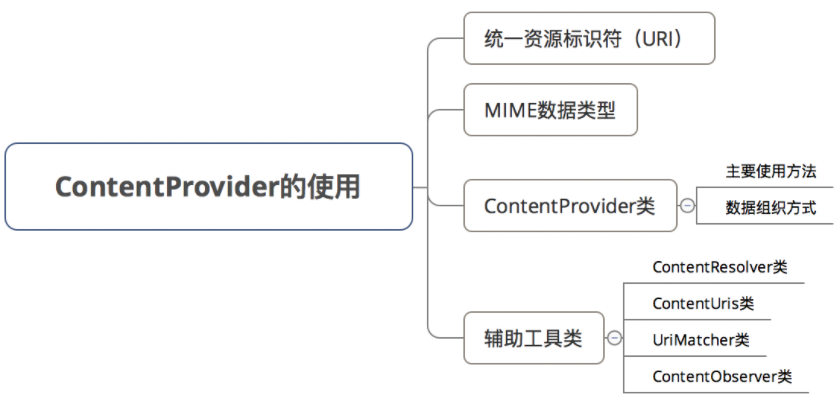
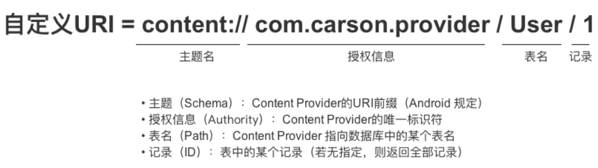

### 基础入门 ContentProvider

#### 作用？

`ContentProvider` 相当于一个桥梁，便于进程外或者进程内的数据通信；

ContentProvider 的底层是采用 Android 中的 `Binder` 机制



<br>

#### Uri

外界进程通过 URI 找到对应的 ContentProvider 与其中的数据，再进行数据操作

URI 有 `系统内置` 和 `用户自定义` 两大类



<br>

URI 模式存在匹配通配符 `\*` 和 `＃`

1. `\*`：匹配任意长度的任何有效字符的字符串
2. `＃`：匹配任意长度的数字字符的字符串

<br>

#### MIME 类型

Android 强制规定任何一个 contentprovider 都必须具有 MIME 类型；

MIME 类型组成结构：`主类型/子类型`

1. 单条记录时，主类型固定格式：vnd.android.cursor.item
2. 多条记录时，主类型固定格式：vnd.android.cursor.dir
3. 子类型固定格式： vnd.<你的 provider 路径>.<表名>

完整格式：  
因为我们欲提取表 table1 中所有行，所以主类型末尾后缀使用 dir  
`vnd.android.cursor.dir/vnd.com.example.app.provider.table1`

<br>

#### ContentUris

工具类，用来处理 URI 前后缀获取与增删

```java
// withAppendedId（）作用：向URI追加一个id
Uri uri = Uri.parse("content://cn.scu.myprovider/user")
Uri resultUri = ContentUris.withAppendedId(uri, 7);
// 最终生成后的Uri为：content://cn.scu.myprovider/user/7

// parseId（）作用：从URL中获取ID
Uri uri = Uri.parse("content://cn.scu.myprovider/user/7")
long personid = ContentUris.parseId(uri);
//获取的结果为:7
```

<br>

#### UriMatcher

用于在 ContentProvider 中注册 URI，以及匹配对应数据表

```java
// 步骤1：初始化UriMatcher对象
//常量UriMatcher.NO_MATCH  = 不匹配任何路径的返回码
UriMatcher matcher = new UriMatcher(UriMatcher.NO_MATCH);


// 步骤2：在ContentProvider 中注册URI（addURI（））
// 下方表示两个注册码
int URI_CODE_a = 1；
int URI_CODE_b = 2；
// 若URI资源路径 = content://cn.scu.myprovider/user1 ，则返回注册码URI_CODE_a
// 若URI资源路径 = content://cn.scu.myprovider/user2 ，则返回注册码URI_CODE_b
matcher.addURI("cn.scu.myprovider", "user1", URI_CODE_a);
matcher.addURI("cn.scu.myprovider", "user2", URI_CODE_b);
```

<br>

#### UriMatcher.match()

使用 match 方法进行 URI 匹配是根据对应原则来的！

譬如我们注册 URI（使用 addURI 方法）时，指定 item/#的响应代码为变量 itemItem  
那么在 match 到的 URI 为 `content://com.demo.provider/item/#` 时，就会返回响应代码 itemItem

```kotlin
// 设置响应代码
private val itemItem = 1
private val itemDir = 0

// 初始化UriMatcher
private val uriMatcher = UriMatcher(UriMatcher.NO_MATCH)

// 在kotlin的初始化代码块中注册URI
init {
    // item/# 表示注册单行数据
    uriMatcher.addURI("com.demo.provider", "item/#", itemItem)
    // item 表示注册多行数据
    uriMatcher.addURI("com.demo.provider", "item", itemDir)
}

// 查询内容，查询结果返回一个Cursor类型
override fun query(
    uri: Uri, projection: Array<String>?, selection: String?,
    selectionArgs: Array<String>?, sortOrder: String?
): Cursor? {
    // 使用UriMatcher进行匹配，匹配到指定代码后就执行对应方法
    when (uriMatcher.match(uri)) {
        itemItem -> {}
        itemDir -> {}
    }
    return null
}
```

<br>

### 第一个自定义 Provider

#### 注册 provider

可以通过右键点击文件包 -> other -> content provider 快速创建自定义 provider

如果我们是手动创建的，务必在 manifest 中进行 provider 注册！

```xml
<provider
    android:name=".MyProvider"
    android:authorities="table"
    android:enabled="true"
    android:exported="true" />
```

<br>

#### 编写 provider

这里仅对 query 查询和 gettype 两个方法进行编写；

其余的方法即便我们用不上，也不需要被实现！

```kotlin
class SecondProvider : ContentProvider() {

    // 设置响应代码
    private val itemItem = 1
    private val itemDir = 0

    // 初始化UriMatcher
    private val uriMatcher = UriMatcher(UriMatcher.NO_MATCH)

    // 在kotlin的初始化代码块中注册URI
    init {
        // item/# 表示注册单行数据
        uriMatcher.addURI("com.demo.provider", "item/#", itemItem)
        // item 表示注册多行数据
        uriMatcher.addURI("com.demo.provider", "item", itemDir)
    }

    // 查询内容，查询结果返回一个Cursor类型
    override fun query(
        uri: Uri, projection: Array<String>?, selection: String?,
        selectionArgs: Array<String>?, sortOrder: String?
    ): Cursor? {
        // 使用UriMatcher进行匹配，匹配到指定代码后就执行对应方法
        when (uriMatcher.match(uri)) {
            itemItem -> {}
            itemDir -> {}
        }
        return null
    }

    // 获取MIME类型
    // 这里注册MIME必不可少，且格式必须正确！
    override fun getType(uri: Uri) = when (uriMatcher.match(uri)) {
        // 获取单个数据，主类型后缀item
        itemItem -> "vnd.android.cursor.item/vnd.com.demo.provider.item"
        // 获取多行数据，主类型后缀dir
        itemDir -> "vnd.android.cursor.dir/vnd.com.demo.provider.item"
        // 啥都没取到，直接返回null
        else -> null
    }


    override fun delete(uri: Uri, selection: String?, selectionArgs: Array<String>?): Int {
        TODO("Implement this to handle requests to delete one or more rows")
    }

    override fun insert(uri: Uri, values: ContentValues?): Uri? {
        TODO("Implement this to handle requests to insert a new row.")
    }

    override fun onCreate(): Boolean {
        TODO("Implement this to initialize your content provider on startup.")
    }


    override fun update(
        uri: Uri, values: ContentValues?, selection: String?,
        selectionArgs: Array<String>?
    ): Int {
        TODO("Implement this to handle requests to update one or more rows.")
    }
}
```

<br>
