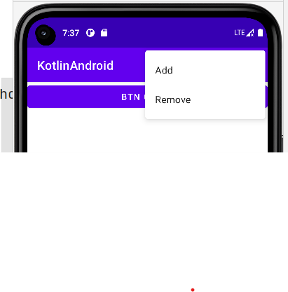

### 纯文本菜单

#### 定义菜单文件

在 res 文件夹下新建 menu 文件夹；

menu -> new menu resource file

为此，添加两个菜单项：

```xml
<?xml version="1.0" encoding="utf-8"?>
<menu xmlns:android="http://schemas.android.com/apk/res/android">
    <item
        android:id="@+id/add_item"
        android:title="Add" />
    <item
        android:id="@+id/remove_item"
        android:title="Remove" />
</menu>
```

<br>

#### 注册菜单

在 activity 里面进行注册

```java
// 根据我们新建的menu资源文件注册menu
override fun onCreateOptionsMenu(menu: Menu?): Boolean {
    menuInflater.inflate(R.menu.main, menu)
    return true
}

// 当选中菜单项中的某一个后，执行的方法
override fun onOptionsItemSelected(item: MenuItem?): Boolean {
    when (item?.itemId) {
        R.id.add_item -> Toast.makeText(this, "You clicked Add", Toast.LENGTH_SHORT).show()
        R.id.remove_item -> Toast.makeText(this, "You clicked Remove", Toast.LENGTH_SHORT).show()
    }
    return true
}
```


