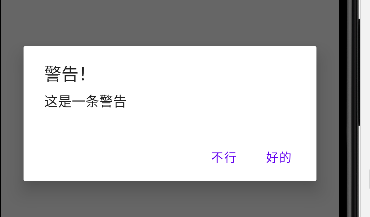

### EditText

常用属性：

`android:hint` 类似于 placeholder，编辑框默认显示的提示文字

<br>

### ProgressBar 进度条

`style` 设置样式，如 `?android:attr/progressBarStyleHorizontal` 表示水平进度条样式

`android:max` 设置进度条最大值

`android:progress` 设置当前进度

<br>

### AlertDialog 警告对话框

该对话框使用代码创建，而非 xml 布局中使用标签创建；

Builder 中接收一个欲弹窗的上下文，这里写 this 表示就在本 activity 的基础上弹窗！

`setPositiveButton` `设置确认按钮，setNegativeButton` 设置否认按钮

确认和否定按钮都可以跟随一个 lambda，用来设置点击后响应

```kotlin
AlertDialog.Builder(this).apply {
    setTitle("警告！")
    setMessage("这是一条警告")
    setCancelable(true)
    setPositiveButton("好的") { dialog, which ->
    }
    setNegativeButton("不行") { dialog, which ->
    }
}.show()
```



<br>

###
