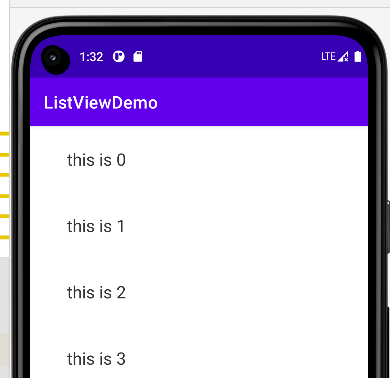

### 基本案例

#### 添加 recycler 依赖

前往 build.gradle 下，添加以下依赖：

`implementation 'androidx.recyclerview:recyclerview:1.2.1'`

<br>

#### 设置单个列表项布局

众所周知，一个完整的列表是由多个列表项组成的，而列表项可以使用布局文件进行定义；

我们简单的使用线性布局+一个 tv 组件定义列表项；

> 下方为布局文件 items.xml

```xml
<?xml version="1.0" encoding="utf-8"?>
<LinearLayout xmlns:android="http://schemas.android.com/apk/res/android"
    xmlns:app="http://schemas.android.com/apk/res-auto"
    android:layout_width="match_parent"
    android:layout_height="wrap_content"
    android:paddingTop="10dp"
    android:paddingBottom="10dp"
    android:paddingRight="20dp"
    android:paddingLeft="20dp">


    <TextView
        android:id="@+id/item_text"
        android:layout_width="match_parent"
        android:layout_height="wrap_content"
        android:layout_marginStart="8dp"
        android:layout_marginEnd="8dp"
        android:padding="15dp"
        android:text="tools"
        android:textColor="#353434"
        android:textSize="20sp"/>

</LinearLayout>
```

<br>

#### 主布局中添加 recyclerview

添加方式和 listview 基本一致，很简单：

```xml
<?xml version="1.0" encoding="utf-8"?>
<LinearLayout xmlns:android="http://schemas.android.com/apk/res/android"
    android:layout_width="match_parent"
    android:layout_height="match_parent">

    <androidx.recyclerview.widget.RecyclerView
        android:id="@+id/recyclerView"
        android:layout_width="match_parent"
        android:layout_height="match_parent" />

</LinearLayout>
```

<br>

#### RecyclerAdapter

我们同样需要编写一个适配器来配置其对象关系；

新建适配器文件 `RecyclerAdapter.kt`

基本原理以及完善过程：

1. 首先让主类继承 `RecyclerView.Adapter` ，泛型使用本类中的我们自建的 viewholder 方法
2. 我们自创的 viewholder 方法需要继承 `RecyclerView.ViewHolder`
3. 我们在 `MyViewHolder` 中直接获取列表项中的 `TextView` 组件
4. 与此同时，我们还需要实现三个方法

`onCreateViewHolder`：选择使用哪一个 layout 作为 viewholder，并放回该 layout 组成的 viewholder

`onBindViewHolder`：针对 viewholder 内部组件的一些赋值与处理操作

`getItemCount`：列表项需要渲染几个？

```kotlin
class RecyclerAdapter(val context: Context) : RecyclerView.Adapter<RecyclerAdapter.MyViewHolder>() {

    inner class MyViewHolder(view: View) : RecyclerView.ViewHolder(view) {
        val textView: TextView = view.findViewById(R.id.item_text)
    }

    override fun onCreateViewHolder(parent: ViewGroup, viewType: Int): MyViewHolder {
        val itemView = LayoutInflater.from(context).inflate(R.layout.items, parent, false)
        return MyViewHolder(itemView)
    }

    override fun onBindViewHolder(holder: MyViewHolder, position: Int) {
        holder.textView.text = "this is $position"
    }

    override fun getItemCount(): Int {
        return 40
    }
}
```

<br>

#### 主 activity 注册

初始化 recyclerview 的方式和 listview 差不多，只不过这里多设置了一个 layoutManager

依葫芦画瓢即可！

```kotlin
class MainActivity : AppCompatActivity() {

    override fun onCreate(savedInstanceState: Bundle?) {
        super.onCreate(savedInstanceState)
        setContentView(R.layout.activity_main)

        initRecycler()
    }

    fun initRecycler() {
        val adapter = RecyclerAdapter(this)
        val recyclerView = findViewById<RecyclerView>(R.id.recyclerView)
        recyclerView.adapter = adapter

        val layoutManager = LinearLayoutManager(this)
        layoutManager.orientation = RecyclerView.VERTICAL
        recyclerView.layoutManager = layoutManager
    }
}
```

<br>

#### 成果图



<br>

### 进阶使用

#### 瀑布流

请先修改列表项布局文件中的线性布局头；

因为瀑布流中的每一个列表项高度需要适配文本，而宽度固定，且每个项目之间都需要一定的间隔；

所以需要按照如下设置：

```xml
<LinearLayout xmlns:android="http://schemas.android.com/apk/res/android"
    xmlns:app="http://schemas.android.com/apk/res-auto"
    android:layout_width="match_parent"
    android:layout_height="wrap_content"
    android:layout_margin="5dp">
```

<br>

之后来到 activity 文件下，将 layoutmanager 更改为瀑布流专属类 `StaggeredGridLayoutManager`

如下代码表示瀑布分为两列，且瀑布垂直排列

```kotlin
val layoutManager = StaggeredGridLayoutManager(2,StaggeredGridLayoutManager.VERTICAL)
        recyclerView.layoutManager = layoutManager
```

<br>

#### 注册点击事件

一般的，listview 会直接把整个列表项作为一个按钮并注册其点击事件，这使得我们很难操作列表项内其他元素的点击事件；

recyclerview 不一样，他没有默认点击事件，我们有权利针对列表项中的任意一个组件注册点击事件！

```kotlin
override fun onCreateViewHolder(parent: ViewGroup, viewType: Int): MyViewHolder {
    val itemView = LayoutInflater.from(context).inflate(R.layout.items, parent, false)
    val viewHolder = MyViewHolder(itemView)
    viewHolder.textView.setOnClickListener{
        Toast.makeText(parent.context,"helloworld",Toast.LENGTH_SHORT).show()
    }
    return MyViewHolder(itemView)
}
```

<br>
