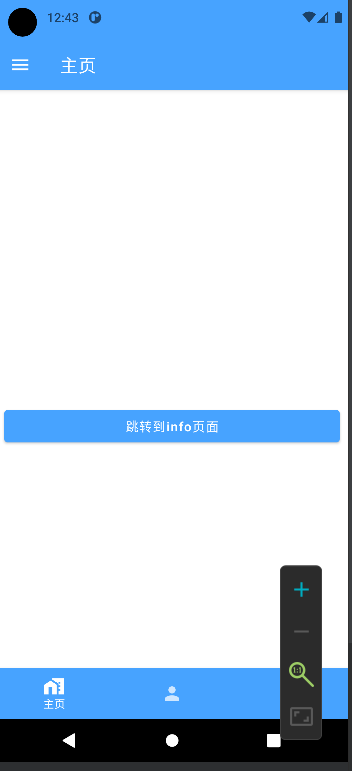

### 基于 compose

#### 安装依赖

```
implementation "com.google.accompanist:accompanist-insets:0.15.0"
implementation "com.google.accompanist:accompanist-insets-ui:0.15.0"
implementation "com.google.accompanist:accompanist-systemuicontroller:0.15.0"
```

成果图



<br>

#### MainActivity.kt

首先在 oncreate 方法里面按照注释中的三步依次添加代码

```kotlin
class MainActivity : ComponentActivity() {

    @RequiresApi(Build.VERSION_CODES.R)
    override fun onCreate(savedInstanceState: Bundle?) {

        // 第一步
        WindowCompat.setDecorFitsSystemWindows(window,false)

        super.onCreate(savedInstanceState)
        setContent {
            AidtTheme {

                // 第二步，强制设置状态栏的颜色
                rememberSystemUiController().setStatusBarColor(
                    Blue500,
                    darkIcons = MaterialTheme.colors.isLight
                )

                // 第三步，ProvideWindowInsets嵌套主体
                ProvideWindowInsets {
                    Surface(
                        modifier = Modifier.fillMaxSize(),
                        color = MaterialTheme.colors.background
                    ) {
                        mainBody()
                    }
                }
            }
        }

    }
}
```

<br>
 
mainBody 主体代码实现

主要方法就是让 scaffold 原理顶部一个状态栏的高度，然后底部导航条也这么做就 OK 了

```kotlin
@Composable
private fun mainBody() {
    ...

    // 第一步：获取顶部状态栏的高度
    val statusBarHeight = with(LocalDensity.current){
        LocalWindowInsets.current.statusBars.top.toDp()
    }

    Scaffold(
        topBar = {
            TopAppBar(

                // 第二步：使用padding让scaffold与顶部隔开一个状态栏的高度
                modifier = Modifier.padding(top = statusBarHeight),

                title = { Text("主页") },
                navigationIcon = {
                    IconButton(onClick = { scope.launch { scaffoldState.drawerState.open() } }) {
                        Icon(Icons.Filled.Menu, null)
                    }
                }
            )
        },
        bottomBar = {
            BottomNavigation(
                // 第三步：使底部导航条在底部控制条的上方
                modifier = Modifier.navigationBarsPadding()
            ) {
                items.forEachIndexed { index, item ->
                    BottomNavigationItem(
                        selected = selectedItem == index,
                        onClick = {
                            selectedItem = index
                            navChangePath(item.route)
                        },
                        icon = { Icon(painterResource(item.icon), null) },
                        alwaysShowLabel = false,
                        label = { Text(item.name) }
                    )
                }
            }
        },
    ) {
        ...
    }
}
```

<br>
