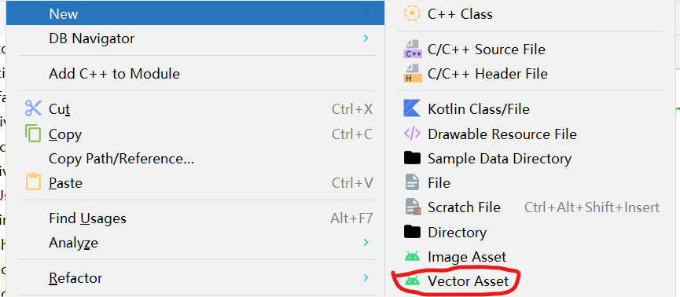
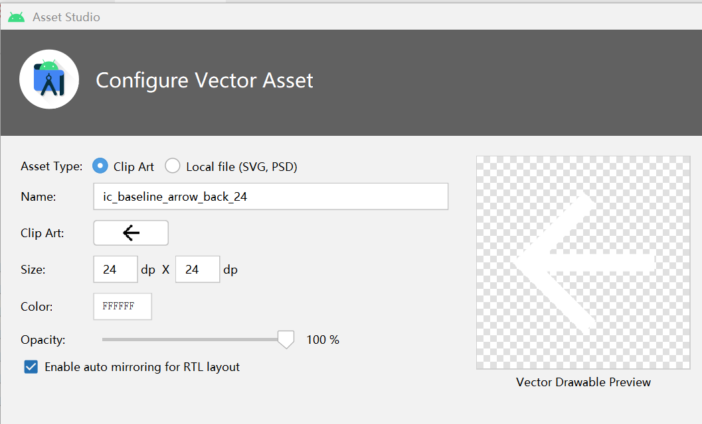

### 快速使用 vectorassets

请保证所有的 xml 图标文件都放在了 `res/drawable` 文件夹内

右键点击 drawable 文件夹，选择新建一个 vectorassets 文件



<br>

开启 vectorassets 生成器页面

1. assetstype 文件类型，我们可以自己使用 ps 设计 PSD 文稿然后在此生成 xml 文件
2. clip art 点开后会呈现 android 自带的图标库，内容很全可以直接拿来即用
3. enable auto mirroring for RTL layout 这个可点可不点，但建议勾选

一切设置完后点击 finish，即自动生成可以引用的 xml 图标文件了！



<br>

### 原理解释

下面是我们自动生成的一个返回图标源文件

`vector` 标签定义画布大小

`path` 标签和前端的 svg 绘图完全一致，pathdata 内使用绘图语法按照坐标点的位置一一绘制即可得到完整的图标结果

```xml
<?xml version="1.0" encoding="UTF-8" standalone="no"?>
<vector xmlns:android="http://schemas.android.com/apk/res/android"
    android:width="24dp"
    android:height="24dp"
    android:autoMirrored="true"
    android:tint="@color/white"
    android:viewportWidth="24.0"
    android:viewportHeight="24.0">

    <path
        android:fillColor="@android:color/white"
        android:pathData="M19,11H7.83l4.88,-4.88c0.39,-0.39 0.39,-1.03 0,-1.42l0,0c-0.39,-0.39 -1.02,-0.39 -1.41,0l-6.59,6.59c-0.39,0.39 -0.39,1.02 0,1.41l6.59,6.59c0.39,0.39 1.02,0.39 1.41,0l0,0c0.39,-0.39 0.39,-1.02 0,-1.41L7.83,13H19c0.55,0 1,-0.45 1,-1l0,0C20,11.45 19.55,11 19,11z" />

</vector>
```

<br>

### 相关规范

命名规范：  
一般都以 `ic_` 开头，后面紧跟图标的简短名称，譬如 `ic_menu.xml`

<br>

尺寸规范：  
画布尺寸推荐使用官方的 24x24dp ，可以适配绝大多数手机环境（因为 dp 是根据手机 DPI 动态成比例分配大小，故使用此单位）

<br>
