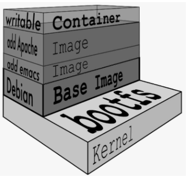

## 鸟瞰容器生态系统

<br>

### 容器生态系统

容器生态系统包含核心技术、平台技术和支持技术

1. 核心技术是指能够让 Container 在 host 上运行起来的那些技术
2. 平台技术能够让容器作为集群在分布式环境中运行
3. 支持技术用于支持基于容器的基础设施

<br>

### 安装

可以直接安装 `docker-desktop` 上手使用桌面版

<br>

## 容器核心知识

<br>

### 容器组成

容器由两部分组成：（1）应用程序本身；（2）依赖  
所有的容器共享同一个 Host OS，这使得容器在体积上要比虚拟机小很多

Docker 提供了一个基于容器的标准化运输系统。  
Docker 可以将任何应用及其依赖打包成一个轻量级、可移植、自包含的容器。

<br>

### 容器如何工作

Docker 核心部件包括

- Docker 客户端：Client
- Docker 服务器：Docker daemon
- Docker 镜像：Image
- Registry
- Docker 容器：Container

Docker 采用的是 `Client/Server` 架构。客户端向服务器发送请求，服务器负责构建、运行和分发容器。  
客户端和服务器可以运行在同一个 Host 上，客户端也可以通过 socket 或 REST API 与远程的服务器通信。

<br>

`Docker daemon` 是服务器组件，以 Linux 后台服务的方式运行  
Docker daemon 运行在 `Docker host` 上，负责创建、运行、监控容器，构建、存储镜像

<br>

`Docker 容器` 就是 Docker 镜像的运行实例

`Registry` 是存放 Docker 镜像的仓库，Registry 分私有和公有两种。

<br>

## Docker 镜像

<br>

### 镜像内部结构

#### base 镜像

base 镜像有两层含义：

1. 不依赖其他镜像，从 scratch 构建；
2. 其他镜像可以以之为基础进行扩展。

<br>

Linux 操作系统由内核空间和用户空间组成  
内核空间是 `kernel`, Linux 刚启动时会加载 bootfs 文件系统  
用户空间的文件系统是 `rootfs` ，比如目录 `/bin`

base 镜像仅使用底层 kernel，由用户提供 rootfs，所以镜像文件体积特别小

众多 linux 发行版的差别就在 rootfs 上，他们的 kernel 基本是相同的，所以 docker 可以直接使用一个通用的 kernel，配合不同的 rootfs 来虚拟出不同 linux 发行版

> 所有容器都共用 host 的 kernel，在容器中没办法对 kernel 升级

<br>

#### 镜像分层

编写我们的第一个 dockerfile，他使用 debian 作为起始镜像，之后附加了一些小软件，比如 apache2

```
FROM debian
RUN apt-get install apache2
CMD ["/bin/bash"]
```

新镜像是从 base 镜像一层一层叠加生成的。每安装一个软件，就在现有镜像的基础上增加一层，这么做可以共享资源

<br>

容器启动后，会加载一个可写层到镜像顶部；  
这一层通常被称作“容器层”，在他下面的都叫“镜像层”

对容器的所有改动只会发生在容器层！！！



<br>

### 构建镜像

> 不推荐使用 docker commit 指令构建新镜像，这种方式偏手工化，易出错；

下面简析使用 dockerfile 创建新镜像的步骤：

1. 编写 dockerfile 文件并保存到指定目录
2. 进入目录
3. 执行`docker build -t asd .`（-t asd 表示新建镜像名称为 asd，而代码末尾的小圆点表示当前文件夹）
4. build context 中文件发送给 docker daemon
5. 执行 FROM，设置系统镜像
6. 执行 RUN
7. 启动临时容器，安装 RUN 中指定的插件，安装完毕后把容器保存为一个镜像
8. 删去临时镜像
9. 保留的镜像即为最终构建所得

<br>

Docker 会缓存已有镜像的镜像层，构建新镜像时，如果某镜像层已经存在，就直接使用，无须重新创建。  
（在 docker build 命令中加上--no-cache 参数，可以阻止缓存）

Docker 下载镜像是也会用到缓存

<br>

Dockerfile 常见指令

FROM 指定 base 镜像  
MAINTAINER 指定镜像作者  
COPY 将文件从 build context 复制到镜像  
ADD 作用和 COPY 一致  
ENV 配置环境变量  
EXPOSE 指定容器中的进程会监听某个端口  
VOLUME 将文件或目录声明为 volume  
RUN 容器中运行指定的命令  
CMD 容器启动时运行指定的命令

<br>

这是一个用到几乎所有关键指令的 Dockerfile 文件

```
FROM busybox
MAINTAINER cloudman@example.net
WORKDIR /testdir
RUN touch tmpfile
COPY ["tmpfile2","."]
ADD ["bunch.tar.gz","."]
ENV WELCOME "hw"
```

<br>

### RUN vs CMD vs ENTRYPOINT

三个容易混淆的语句

- RUN：执行命令并创建新的镜像层，RUN 经常用于安装软件包。
- CMD：设置容器启动后默认执行的命令及其参数，但 CMD 能够被 docker run 后面跟的命令行参数替换。
- ENTRYPOINT：配置容器启动时运行的命令。

<br>

### 分发镜像

分发镜像第一步需要取名字

名字格式：`repo:tag`

可在构建时直接指定 repo 和 tag：`docker build -t ubuntu-with-vi:v1.9.1`

TIPS：当你不指定 tag 时，默认 latest，实际上你无需纠结是否要设置 tag

<br>

之后把镜像发布到 Docker Hub

首先注册账号，然后命令行登入：`docker login -u xxx`

上传镜像时，需要在镜像文件名前加上用户名：`docker push xxx/xxx:v1.9.1`

<br>

你也可以选择使用本地 repository，这样就避免访问 docker hub

<br>

## Docker 容器

<br>

### 运行容器

可以让容器执行一个死循环函数，让他一直保持运行状态

`docker ps`指令可以查看容器状态，各个容器拥有各自的短 ID 和长 ID

<br>

进入处于后台的容器

- `docker attach [长ID或者短ID]`
- `docker exec -it [短ID或者长ID] bash`

attach 直接进入容器启动命令的终端，不会启动新的进程  
exec 则是在容器中打开新的终端，并且可以启动新的进程

<br>

容器分为工具类容器和服务类容器

工具类容器使用 `exec -it` 进入  
服务类容器一般使用 `docker run -it [容器名称]`启动

<br>

### 资源限制

容器可以使用的内存包括：物理内存与 swap

- `--memory`：设置内存的使用限额
- `--memory-swap`：设置内存+swap 的使用限额

<br>

所有容器默认情况平等使用 CPU 资源  
必要情况可以使用 ` --cpu-shares` 来设置容器权重，以获得更高的 CPU 使用权

<br>

`Block IO` 是另一种可以限制容器使用的资源。Block IO 指的是磁盘的读写，docker 可通过设置权重、限制 bps 和 iops 的方式控制容器读写磁盘的带宽

<br>

### 实现容器的底层技术

`cgroup` 全称 `Control Group`。Linux 操作系统通过 cgroup 可以设置进程使用 CPU、内存和 IO 资源的限额。

`namespace` 管理着 host 中全局唯一的资源，并可以让每个容器都觉得只有自己在使用它。  
换句话说，namespace 实现了容器间资源的隔离。

<br>

## Docker 网络


