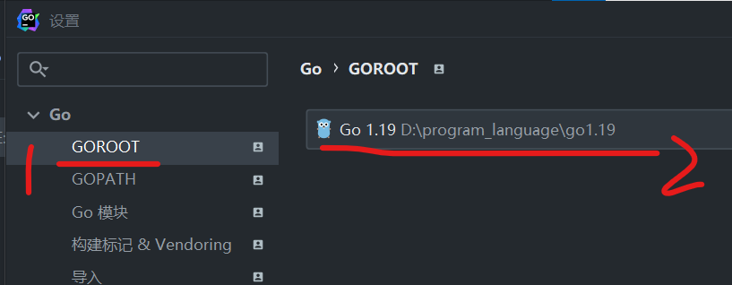

### 环境与 go 本体

#### 下载并安装 go

可以直接在 goland 的设置里面的 GOROOT 选项内直接选择对应版本下载

或者前往此处下载 msi 安装包：https://studygolang.com/dl

一定要安装 1.18+版本的，否则 gin 框架运行总是出错，我这里安装最新的 1.19

<br>

#### 本地环境变量

添加两个 `用户变量`

1. GOROOT（根目录）：选择 go 根目录下的 bin 文件夹
2. GOPATH（工作目录）：随便选一个文件夹，go get 下载的内容都会存在里面，故外部模块都从这个文件夹调用；决定不要和 GOROOT 路径一致

<br>

再添加一个 `系统变量`

我们一般会看见系统变量默认有一个 path，如果没有就新建一个

在 path 变量底部追加一个值，该值和 GOROOT 值完全一致！

<br>

#### 配置代理

由于外网会墙掉，没法直接使用 go get 下载模块，所以打开命令行直接丢这两行进去运行即可配置好代理：

```sh
go env -w GO111MODULE=on
go env -w GOPROXY=https://goproxy.cn,direct
```

<br>

#### goland 环境配置

打开 goland 的设置面板，并进入 GO 组中；

`GOROOT` 选择 SDK，这里系统已经自动检测到了我们刚刚安装好的 GO1.19，我们就不必手动指定路径了



`GOPATH` 手动指定我们之前配置好的 GOPATH 值，之后取消勾选“使用系统环境变量中的 GOPATH”，并勾选“为整个 GOPATH 编制索引”


`GO 模块` 取消勾选下图所示第一项！！！


<br>

### 直接测试

#### 新建环境

老套路，新建的 go 项目会自带一个 go.mod，之后我们在根目录下新建三个主要文件夹：

1. bin 存放编译好的 exe
2. src 存放源代码
3. pkg 存放 go get 下载的模块

<br>

点击 goland 右上角小绿三角右侧的下拉列表，选择“编辑配置”

按下图配置  
名称任意取；  
运行种类必须选择目录；  
“目录”即选择新建的 src 包；  
“输出目录”即选择 bin 包；  
“工作目录”即根目录！！！


<br>

#### 第一个服务器

src 文件夹下新建文件 `main.go`

黏贴以下代码：

> 之后点击编译运行即可开启我们的服务器，服务器默认地址为 `localhost:8080`

```go
package main

import (
	"github.com/gin-gonic/gin"
	"net/http"
)

func main() {
	router := gin.Default()
	router.GET("/", func(c *gin.Context) {
		c.String(http.StatusOK, "服务器跑起来了！")
	})

    // 修改Run中的参数来改变服务器监听的端口
	router.Run("12345")
}
```

<br>

### 参考文献

[文献 1](https://blog.csdn.net/tdcqfyl/article/details/109599321?ops_request_misc=%257B%2522request%255Fid%2522%253A%2522167351497316800213021507%2522%252C%2522scm%2522%253A%252220140713.130102334..%2522%257D&request_id=167351497316800213021507&biz_id=0&utm_medium=distribute.pc_search_result.none-task-blog-2~all~sobaiduend~default-1-109599321-null-null.142^v70^one_line,201^v4^add_ask&utm_term=goland%E9%85%8D%E7%BD%AEgin&spm=1018.2226.3001.4187)  
[文献 2](https://blog.csdn.net/Gherbirthday0916/article/details/124788322?ops_request_misc=&request_id=&biz_id=102&utm_term=gin%E6%A1%86%E6%9E%B6&utm_medium=distribute.pc_search_result.none-task-blog-2~all~sobaiduweb~default-2-124788322.142^v70^one_line,201^v4^add_ask&spm=1018.2226.3001.4187)  
[文献 3](https://blog.csdn.net/xcbeyond/article/details/115189966?ops_request_misc=%257B%2522request%255Fid%2522%253A%2522167351702516800211587838%2522%252C%2522scm%2522%253A%252220140713.130102334..%2522%257D&request_id=167351702516800211587838&biz_id=0&utm_medium=distribute.pc_search_result.none-task-blog-2~all~top_positive~default-1-115189966-null-null.142^v70^one_line,201^v4^add_ask&utm_term=goproxy&spm=1018.2226.3001.4187)
