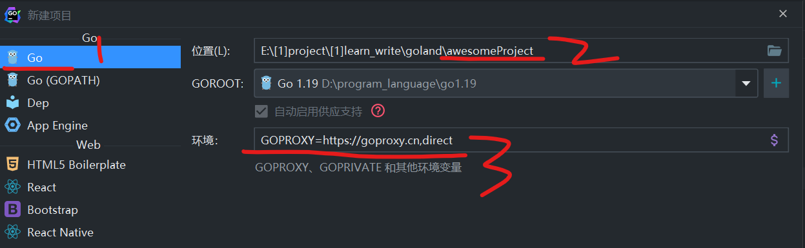
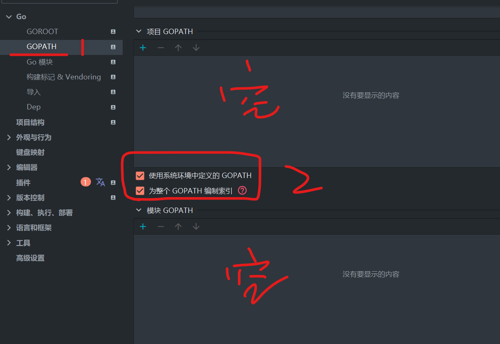
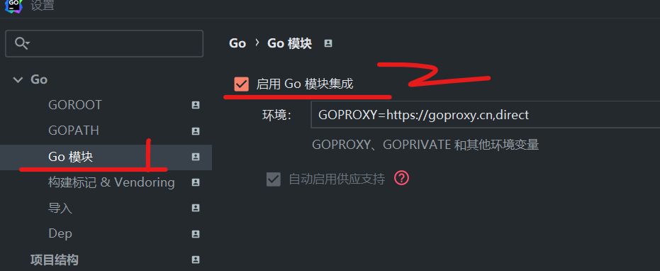

### go.mod 配置 Gin 开发环境

> 安装 GO1.19 完毕后，前两步和旧版一致，都需要在环境变量里面配置好 GOROOT 和 GOPATH 以及配置代理

<br>

#### 本地环境变量

添加两个 `用户变量`

1. GOROOT（根目录）：选择 go 根目录下的 bin 文件夹
2. GOPATH（工作目录）：随便选一个文件夹，go get 下载的内容都会存在里面，故外部模块都从这个文件夹调用；决定不要和 GOROOT 路径一致

<br>

再添加一个 `系统变量`

我们一般会看见系统变量默认有一个 path，如果没有就新建一个

在 path 变量底部追加一个值，该值和 GOROOT 值完全一致！

<br>

#### 配置代理

由于外网会墙掉，没法直接使用 go get 下载模块，所以打开命令行直接丢这两行进去运行即可配置好代理：

```sh
go env -w GO111MODULE=on
go env -w GOPROXY=https://goproxy.cn,direct
```

<br>

#### Goland 项目创建

goland2020.3 及以上 IDE，`默认创建的 go 项目` 就是使用 `gomod` 管理！  
goland2020.3 及以下的 IDE，创建项目时需要选择 `带小括号 vgo` 的才是 `gomod` 管理模式

<br>

下图为使用 goland2021.3 版本创建使用 gomod 管理的 go 项目：  
按照图中红色序号对应下面几步

1. 先选择第一个 Go 项目（第二个是使用旧的 GOPATH 创建的项目）
2. 修改项目名字，默认为 awesomeproject
3. 环境写上完整的代理路径！



<br>

创建完毕，goland 会自动在根目录下创建一个 `go.mod` 文件

打开设置页面，找到 `GO->GOPATH`  
把项目 GOPATH 和模块 GOPATH 全部删干净！  
然后勾选图中序号 2 所示的两个选项

> 此时全局 GOPATH 会存在一个我们安装 GO 时配置环境变量时的 GOPATH，这个不用管也删不掉，之后我们所有下载的外部模块都会保存在这个全局 GOPATH 里面而不是我们的项目里面！！！这是重点！！！



<br>

之后进入 `“GO 模块”`  
勾选 `“启用 GO 模块集成”`

这里的环境就是刚刚创建环境时我们填入的内容



<br>

#### 处理 go.mod

打开 goland 默认新建的 go.mod 文件，发现他只有一行，代表当前模块名字

为它添上两行，分别表示 go 版本，以及我们要使用的 GIN 框架

添加依赖的标准格式：`require 包名不带引号 版本号` （如果版本号不知道可以直接写 latest）

```
module ginmod

go 1.19

require github.com/gin-gonic/gin v1.8.2
```

<br>

此时直接打开命令行（在任意地方打开），输入该命令，把 GIN 框架安装到我们全局 GOPATH 下  
`go get -u github.com/gin-gonic/gin`

安装成功了？非常好！  
此时进入项目根目录（即 `go.mod` 所在目录），打开命令行，输入命令让 go 自动分析依赖：`go mod tidy`

等待一秒，若无报错，则整个环境配置就大功告成了！

<br>

### 测试一下

#### 新建文件

按照以下树状图创建对应文件

`ginmod` 是项目根目录， `.idea` 是 idea 项目自己创建的文件夹，不用管

```
─ginmod
    │  go.mod
    │  go.sum
    │
    ├─.idea
    │      .gitignore
    │      ginmod.iml
    │      modules.xml
    │      workspace.xml
    │
    └─src
        │  main.go
        │
        └─router
                R1.go
```

<br>

#### R1.go

写一个简单的单文件上传路由

```go
package router

import (
	"github.com/gin-gonic/gin"
	"net/http"
)

// 由于作者非常懒，内容就略过了，这里主要是为了测试不同包下方法导入
func SingleFileUpload(c *gin.Context) {
	c.JSON(http.StatusOK, gin.H{
		"status": "success",
	})
}
```

<br>

#### main.go

到我们的主方法啦，在 import 中导入指定包，取个别名，就可以愉快的使用对应的方法啦！

导入外部包的格式是（虽然 goland 会智能补全，但是还是建议了解一下）：  
module 名字即 go.mod 第一行的 module 后面跟着的名字  
之后按照相对路径直接走下去就好！  
`module名字/xx/xx`

```go
package main

import (
	router1 "ginmod/src/router"
	"github.com/gin-gonic/gin"
)

func main() {
	router := gin.Default()

    // 无参方法调用别加小括号，否则报错够你喝一壶
	router.GET("/shit", router1.SingleFileUpload)

	router.Run(":10086")
}
```

<br>

#### 开始测试

点击 main()方法左侧的小绿三角，稍等片刻即可运行服务

建议使用 postman 或者 apifox 进行模拟请求测试

<br>
