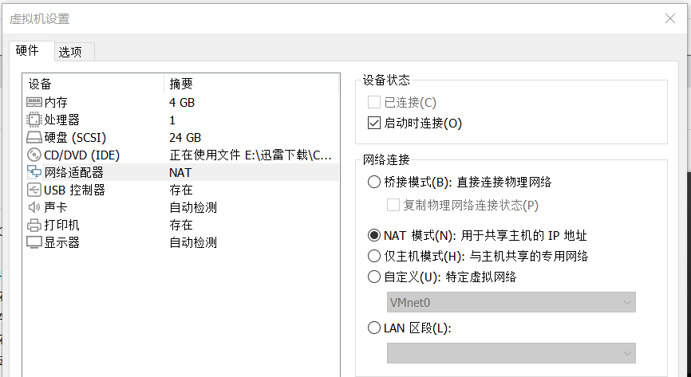
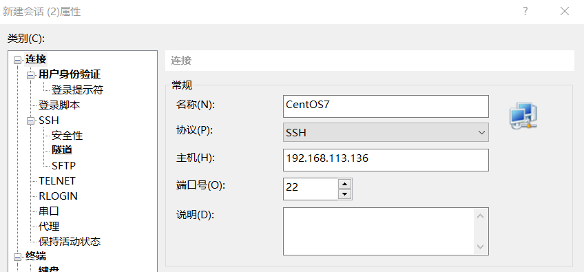
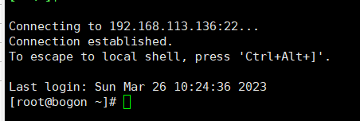

### Linux 配置 Go 环境

> 当前基于 Linux CentOS7

 

#### xshell+xftp

开启虚拟机，这里用的是 vmware  
准备好 CentOS7（安装教程请自行上网查找资料，这里就不占用篇幅介绍了）

打开虚拟机设置，配置网络适配器为 NAT 模式，此时与主机共用同一网段的 IP 地址，方便本地测试后端调用

进入系统，点击右上角，连接到无线网络；

打开终端，输入`ifconfig`查看当前 IP，我这边的 IP 为 192.168.113.136

 

打开 xshell

选择新建会话，输入主机名，端口默认 22 为 ssh，其余选项一律不改，直接确定

双击指定会话，建立 ssh，此时会叫你输入账户密码，照做即可；

当出现下图所示内容，就表示你成功连接到了虚拟机上的 centos

 

#### 安装 go

 

### 直接上传

> 我们可以在主机 windows 上编译出 linux 文件，并通过 xftp 上传至远程 linux 服务器，之后直接执行即可运行后端

 

#### 链接并上传

首先使用 xftp 连接到我们的远程服务器，这里使用的系统为 CentOS7

进入到你的 gin 后端根目录下，打开命令行，输入以下指令；  
这就可以临时设置当前 GO 编译为 linux 文件  
`set GOARCH=amd64`  
`set GOOS=linux`

一般的，我们的入口文件都是 main.go，故在根目录下执行此代码编译  
`go build main.go`

> 此时根目录下会生成一个没有后缀名的 main 文件，将其使用 xftp 上传到远程服务器（这里我使用虚拟机作为演示）

 

#### 启动测试

后端服务器端口我这边设置为 10086

 

#### 注意事项

编译时直接使用`set GOOS=linux`可以临时设置编译成 linux 文件，当我们重启电脑后此设置即失效；  
一般我们都是在 windows 上测试后端，最终才上传文件到 linux，故推荐使用此方法

如果想要永久设置的话，使用此代码：`go env -w GOOS=linux`

 
