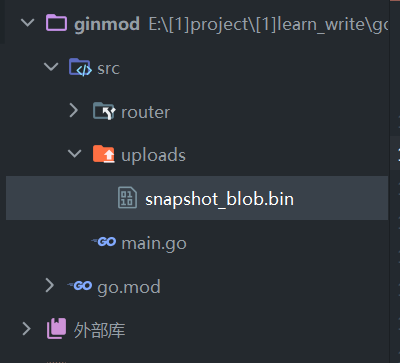

### 首次测试

#### 新建环境

老套路，新建的 go 项目会自带一个 go.mod，之后我们在根目录下新建三个主要文件夹：

1. bin 存放编译好的 exe
2. src 存放源代码
3. pkg 存放 go get 下载的模块

<br>

点击 goland 右上角小绿三角右侧的下拉列表，选择“编辑配置”

按下图配置  
名称任意取；  
运行种类必须选择目录；  
“目录”即选择新建的 src 包；  
“输出目录”即选择 bin 包；  
“工作目录”即根目录！！！


<br>

#### 第一个服务器

src 文件夹下新建文件 `main.go`

黏贴以下代码：

> 之后点击编译运行即可开启我们的服务器，服务器默认地址为 `localhost:8080`

```go
package main

import (
	"github.com/gin-gonic/gin"
)

func main() {
	// 获取默认路由
	router := gin.Default()

	// 设置路由path
	// func函数内的c表示上下文
	router.GET("/shit", func(c *gin.Context) {
		// 响应JSON字段
		c.JSON(200, gin.H{
			"name": "jack",
		})
	})

	// 服务运行的端口，注意写端口前要加一个冒号！
	router.Run(":12345")
}
```

<br>

### GET&POST

#### 最简 GET 请求

```go
router.GET("/shit", func(c *gin.Context) {
    c.JSON(200, gin.H{
        "name": "jack",
    })
})
```

<br>

#### RESTful 形式的 GET

如下代码，注意 path 里面的 name 前有一个冒号，表示它是一个参数（或者可以理解为一个占位符）

然后通过上下文获取 params

```go
router.GET("/user/:name", func(context *gin.Context) {
    // 获取:name位置的内容（即所谓的param）
    name := context.Param("name")
    // 返回值
    context.String(http.StatusOK, "hello %v", name)
})
```

<br>

#### Query 形式的 GET

如下代码请求格式：`/shit?a=123&b=456`

```go
router.GET("/shit", func(context *gin.Context) {
    // 带默认值的query
    a := context.DefaultQuery("a", "tom")
    // 不带默认值的query
    b := context.Query("b")
    context.String(http.StatusOK, "%v + %v", a, b)
})
```

<br>

#### Post

post 请求依然也有默认值和没默认值两个类型

```go
router.POST("/p", func(context *gin.Context) {
    name := context.DefaultPostForm("name", "jack")
    age := context.PostForm("age")
    context.JSON(http.StatusOK, gin.H{
        "name": name,
        "age":  age,
    })
})
```

<br>

### 参数绑定

#### ShouldBind

简要定义： `ShouldBind` 函数可以把你传入的任意类型数据（form-data、json、raw 等等）转换为依据指定结构体实例化的对象

首先准备一个结构体，用于保存将要接收到的数据  
反引号的作用举个例子：如果接收请求格式为 form，那么属性名就叫 name；如果格式为 json，则。。。以此类推

```go
type User struct {
	Name string `form:"name" json:"name"`
	Age  int    `form:"age" json:"age"`
}
```

<br>

shouldbind 使用过程解析：

1. 对上下文使用 ShouldBind 函数，可以取出任意类型的数据（form、json、raw 等）
2. ShouldBind 将解析好的数据存储到实例 u 中
3. 根据结果是否为 nil 来判断该过程成功与否

```go
func BindDemo(c *gin.Context) {
    // 首先定义结构体，用于存储接收到的请求
	var u User
    // go中变量均为值传递，所以此处使用&传入变量的真实地址来改变其值
	err := c.ShouldBind(&u)
    // ShouldBind成功取出返回nil，反之非nil，据此判断请求结果
	if err != nil {
		c.JSON(http.StatusBadRequest, gin.H{
			"error": err.Error(),
		})
	} else {
		fmt.Printf("%#v", u)
		c.JSON(http.StatusOK, gin.H{
			"status": "success",
		})
	}
}
```

<br>

> 完整代码展示

```go
import (
	"fmt"
	"github.com/gin-gonic/gin"
	"net/http"
)

type User struct {
	Name string `form:"name" json:"name"`
	Age  int    `form:"age" json:"age"`
}

func BindDemo(c *gin.Context) {
	var u User
	err := c.ShouldBind(&u)
	if err != nil {
		c.JSON(http.StatusBadRequest, gin.H{
			"error": err.Error(),
		})
	} else {
		fmt.Printf("%#v", u)
		c.JSON(http.StatusOK, gin.H{
			"status": "success",
		})
	}
}
```

<br>

####

<br>

### 文件操作

#### 单文件上传

当前文件结构如图所示，代码写在 main.go 里面，上传文件保存到 uploads 目录内



`SaveUploadedFile` 保存文件的默认起始位置为项目根目录，故 `./` 即表示项目根目录

```go
router.POST("/sf", func(context *gin.Context) {
	// 从POST中取出文件，key为file
	// 下划线实际上是一个err，但没有实际作用，故省略掉
	f, _ := context.FormFile("file")
	// 指定文件保存到后端的那一个文件夹下，使用相对路径
	context.SaveUploadedFile(f, "./src/uploads/"+f.Filename)
	// 上传完毕，返回文件信息
	context.JSON(http.StatusOK, gin.H{
		"answer": f,
	})
})
```

<br>

#### 返回前端指定文件

```go
router.POST("/sf", func(context *gin.Context) {
	// 保存前端传递的文件到uploads目录下
	f, _ := context.FormFile("file")
	context.SaveUploadedFile(f, "./src/uploads/"+f.Filename)

	// 在响应头中插入文件
	context.Writer.Header().Add("Content-Disposition", fmt.Sprintf("attachment; filename=%s", f.Filename))
	// 响应文件流使用我们接收到的前端文件（注意路径！！！）
	context.File("./src/uploads/" + f.Filename)
})
```

<br>

#### 多文件上传

多文件上传需要使用 `MultipartForm` 方法，必须要进行错误处理

这里先通过响应 JSON 看一下取得的多文件结构是啥样的，请看以下代码

```go
router.POST("/mfu", func(context *gin.Context) {
	files, err := context.MultipartForm()
	if err != nil {
		context.JSON(http.StatusBadRequest, gin.H{
			"error": err.Error(),
		})
	} else {
		context.JSON(http.StatusOK, gin.H{
			"answer": files,
		})
	}
})
```

使用 postman 发送两张图片进去，这是响应 JSON：

不难发现，仅需取出 file 属性就可以得到上传文件的详细信息了

```json
{
  "answer": {
    "Value": {},
    "File": {
      "file": [
        {
          "Filename": "cyber1.png",
          "Header": {
            "Content-Disposition": [
              "form-data; name=\"file\"; filename=\"cyber1.png\""
            ],
            "Content-Type": ["image/png"]
          },
          "Size": 101324
        },
        {
          "Filename": "cyber2.png",
          "Header": {
            "Content-Disposition": [
              "form-data; name=\"file\"; filename=\"cyber2.png\""
            ],
            "Content-Type": ["image/png"]
          },
          "Size": 91928
        }
      ]
    }
  }
}
```

<br>

完整代码

```go
router.POST("/mfu", func(context *gin.Context) {
	data, err := context.MultipartForm()
	if err != nil {
		context.JSON(http.StatusBadRequest, gin.H{
			"error": err.Error(),
		})
	} else {
		// 取出所有文件
		files := data.File["file"]
		// foreach循环保存，同时进行是否可以保存的判断
		for _, file := range files {
			err := context.SaveUploadedFile(file, "./src/uploads/"+file.Filename)
			if err != nil {
				return
			}
		}
		// 保存完毕响应success
		context.JSON(http.StatusOK, gin.H{
			"status": "success saved",
		})
	}
})
```

<br>
