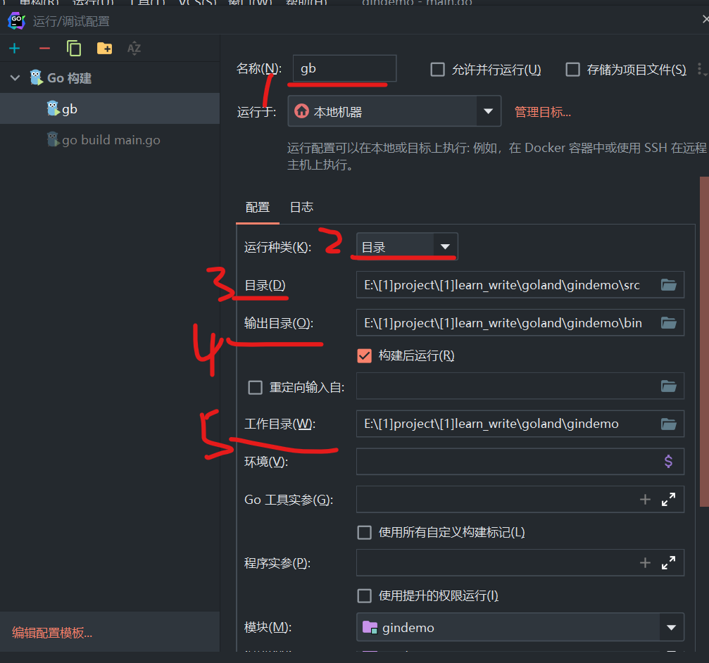

### 首次测试

#### 新建环境

老套路，新建的 go 项目会自带一个 go.mod，之后我们在根目录下新建三个主要文件夹：

1. bin 存放编译好的 exe
2. src 存放源代码
3. pkg 存放 go get 下载的模块

<br>

点击 goland 右上角小绿三角右侧的下拉列表，选择“编辑配置”

按下图配置  
名称任意取；  
运行种类必须选择目录；  
“目录”即选择新建的 src 包；  
“输出目录”即选择 bin 包；  
“工作目录”即根目录！！！



<br>

#### 第一个服务器

src 文件夹下新建文件 `main.go`

黏贴以下代码：

> 之后点击编译运行即可开启我们的服务器，服务器默认地址为 `localhost:8080`

```go
package main

import (
	"github.com/gin-gonic/gin"
)

func main() {
	// 获取默认路由
	router := gin.Default()

	// 设置路由path
	// func函数内的c表示上下文
	router.GET("/shit", func(c *gin.Context) {
		// 响应JSON字段
		c.JSON(200, gin.H{
			"name": "jack",
		})
	})

	// 服务运行的端口，注意写端口前要加一个冒号！
	router.Run(":12345")
}
```

<br>

### 多种请求
