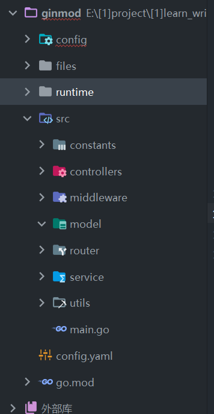

### 标准项目结构

`config` 初始化 config  
`files` 初始化 protobuf  
`runtime` 静态文件夹，存储输出的 logs 以及图片文档保存

`src/constants` 常量文件  
`src/controllers` 控制层  
`src/service` 服务层  
`src/middleware` 中间件  
`src/model` 实体层  
`src/router` 路由  
`src/utils` 工具类

`main.go` 主入口

 
