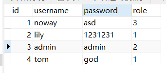

### 文件结构

> 本文章将使用到上一节创建的 CommonService 接口，用于测试连接数据库状况，当然您也可以自制简单接口作为测试，不会影响整体工作流程！

下方树状图为最终项目结构

文件夹 api 与 service 助力数据库查询请求

`initialize/gorm.go` 初始化 GORM  
`initialize/gorm_mysql.go` 执行 MySQL 数据库对应的初始化过程

`user.go` 一个实体类

```
│  config.yaml
│  go.mod
│  go.sum
│  main.go
│
├─api
│  │  enter.go
│  │
│  ├─example
│  └─system
│          api_common.go
│          enter.go
│
├─config
│      config.go
│      db_list.go
│      gorm_mysql.go
│      jwt.go
│      local.go
│      system.go
│
├─core
│      constant.go
│      server.go
│      viper.go
│
├─global
│      global.go
│
├─initialize
│  │  gorm.go
│  │  gorm_mysql.go
│  │  router.go
│  │
│  └─internal
│          gorm.go
│
├─model
│      user.go
│
├─router
│  │  enter.go
│  │
│  ├─example
│  └─system
│          enter.go
│          sys_common.go
│
└─service

```

<br>

之后回到项目根目录，打开命令行，输入指令安装 MySQL 驱动：  
`go get -u gorm.io/driver/mysql`

<br>

### 数据库准备

这是我本地使用的数据库参数：
`username:root`  
`password:123456`  
`dbname:golang`

这是数据库“golang”中的数据表 user 的数据，注意到有四个属性



<br>

来到 go 项目中，根据上述参数，打开 `config.yaml`，添加 mysql 配置  
（这里为了便于大家操作，省去了源码中的注册 zap 的部分）

同时添加 `system` 对象，内含一个 `db-type` 属性，用来定义我们希望后端链接的数据库类型

```yaml
system:
  db-type: "mysql"

mysql:
  path: "localhost"
  port: "3306"
  config: ""
  db-name: "golang"
  username: "root"
  password: "123456"
  max-idle-conns: 10
  max-open-conns: 100
```

<br>

### 配置文件处理

> 由于我们为 config.yaml 添加了新的配置项，所以需要按照我们之前文章所属，为其配置指定的结构！

<br>

#### config.go

> 打开（如果你跟随上上节文章）或者新建文件 config/config.go

在主 config 入口添加 mysql 属性

```go
type Server struct {
	...

	Mysql Mysql `mapstructure:"mysql" json:"mysql" yaml:"mysql"`
}
```

<br>

#### db_list.go

> 新建文件 config/db_list.go

由于我们有可能需要支持多种类型的数据库（比如 PostgreSQL），所以最佳解决办法就是创建一个通用的数据库参数结构体

`DSNProvider` 接口用来给 GORM 提供 `DSN`

```go
type DSNProvider interface {
	Dsn() string
}

type GeneralDB struct {
	Path         string `mapstructure:"path" json:"path" yaml:"path"`                               // 服务器地址:端口
	Port         string `mapstructure:"port" json:"port" yaml:"port"`                               //:端口
	Config       string `mapstructure:"config" json:"config" yaml:"config"`                         // 高级配置
	Dbname       string `mapstructure:"db-name" json:"db-name" yaml:"db-name"`                      // 数据库名
	Username     string `mapstructure:"username" json:"username" yaml:"username"`                   // 数据库用户名
	Password     string `mapstructure:"password" json:"password" yaml:"password"`                   // 数据库密码
	Prefix       string `mapstructure:"prefix" json:"prefix" yaml:"prefix"`                         //全局表前缀，单独定义TableName则不生效
	Singular     bool   `mapstructure:"singular" json:"singular" yaml:"singular"`                   //是否开启全局禁用复数，true表示开启
	Engine       string `mapstructure:"engine" json:"engine" yaml:"engine" default:"InnoDB"`        //数据库引擎，默认InnoDB
	MaxIdleConns int    `mapstructure:"max-idle-conns" json:"max-idle-conns" yaml:"max-idle-conns"` // 空闲中的最大连接数
	MaxOpenConns int    `mapstructure:"max-open-conns" json:"max-open-conns" yaml:"max-open-conns"` // 打开到数据库的最大连接数
}
```

<br>

#### gorm_mysql.go

> 新建文件 gorm_mysql.go

在这里定义 mysql 结构体，直接使用通用数据库参数结构体 GeneralDB 即可

然后于此实现接口 `DSNProvider` ，构造 `DSN`

```go
type Mysql struct {
	GeneralDB `yaml:",inline" mapstructure:",squash"`
}

func (m *Mysql) Dsn() string {
	return m.Username + ":" + m.Password + "@tcp(" + m.Path + ":" + m.Port + ")/" + m.Dbname + "?" + m.Config
}
```

<br>

#### system.go

> 打开文件 config/system.go

老样子，为 db_type 配置对应结构体内容

```go
type System struct {
	DbType string `mapstructure:"db-type" json:"db-type" yaml:"db-type"`
}
```

<br>

### 初始化数据库

#### gorm.go

> 新建文件 initialize/gorm.go

此处的逻辑很简单，即通过全局变量获取 db_type 属性，得知开发者想要用那种数据库；  
由于我们只会用到 MySQL，故这里的判断就都启动 mysql 了

`GormMysql` 目前处于飘红状态，因为还没有定义，下面我们将为其定义初始化 MySQL 的方法

```go
import (
	"ginlogin/global"
	"gorm.io/gorm"
)

func Gorm() *gorm.DB {
	switch global.G_CONFIG.System.DbType {
	case "mysql":
		return GormMysql()
	default:
		return GormMysql()
	}
}
```

<br>

#### gorm_mysql.go

> 新建文件 initialize/gorm_mysql.go

具体通过 GORM 链接 mysql 的过程相信大家也很熟悉，这里就不多费口舌了，直接看注释吧！

```go
import (
	"fmt"
	"ginlogin/global"
	"gorm.io/driver/mysql"
	"gorm.io/gorm"
)

// 初始化mysql方法，返回一个gorm.DB引用
func GormMysql() *gorm.DB {

    // 第一步
    // 全局变量获取config中定义的mysql参数
    // 判断如果不急于数据库名，直接返回nil表示初始化数据库失败
	info := global.G_CONFIG.Mysql
	if info.Dbname == "" {
		return nil
	}

    // 第二步
    // 构造mysqlConfig
	mysqlConfig := mysql.Config{
		DSN:                       info.Dsn(),
		DefaultStringSize:         191,
		SkipInitializeWithVersion: false,
	}

    // 第三步
    // gorm.Open连接到数据库，并处理错误
	if db, err := gorm.Open(mysql.New(mysqlConfig)); err != nil {
		fmt.Println("完蛋，连接不上数据库！！！")
		return nil
	} else {
        // 如果成功链接，设置好连接池啥的，就可以返回db了
		db.InstanceSet("gorm:table_options", "ENGINE="+info.Engine)
		sqlDB, _ := db.DB()
		sqlDB.SetMaxIdleConns(info.MaxIdleConns)
		sqlDB.SetMaxOpenConns(info.MaxOpenConns)
		return db
	}
}
```

<br>

#### 开始初始化

哎？这还没完，你还要调用初始化方法！

打开 main.go，添加如下代码，调用 GORM 初始化方法

```go
func main() {

	// 初始化数据库DB
	global.G_DB = initialize.Gorm()

    ...
}
```

> 此处关于整合 mysql 的部分已经完结了，下面将是测试数据库的内容，您可以直接略过

<br>

### 测试数据库

#### 定义实体类 User

> 新建文件 model/user.go

根据开头所述 user 表，故可定义如下实体类

```go
type User struct {
	Id       int    `json:"id"`
	Username string `json:"username"`
	Password string `json:"password"`
	Role     int    `json:"role"`
}

// 显式指定表名
func (User) TableName() string {
	return "user"
}
```

<br>

#### service

> 打开文件 service/system/service_common.go

service 层内简单实现了查询整张表的功能，并作了错误处理

```go
type CommonService struct{}

func (s *CommonService) CreateApi(c *gin.Context) (err error) {

    // 调用Find方法查询表，将查询成功与否的结果存到res变量
	var userList []model.User
	res := global.G_DB.Find(&userList)

    // 判断res是否出现了错误
	if errors.Is(res.Error, gorm.ErrRecordNotFound) {
		return errors.New("找不到这个元素")
	}

    // 如果没错，那就返回数据
	c.JSON(http.StatusOK, gin.H{
		"data": userList,
	})

    // 给api层传递一个error
	return res.Error
}
```

<br>

#### api

> 打开文件 api/system/api_common.go

很简单，调用 service，然后在 `api` 中处理错误并返回 `JSON` 数据（这一步也可以直接全部写在 `service` 层里，此时就可以把该 api 层看做是 `springboot` 中的 `controller` 层了！）

```go
import (
	"github.com/gin-gonic/gin"
	"net/http"
)

type CommonApi struct{}

func (s *CommonApi) CreateApi(c *gin.Context) {
	err := commonService.CreateApi(c)
	if err != nil {
		c.JSON(http.StatusBadRequest, gin.H{
			"status": err.Error(),
		})
	}
}
```

<br>

#### 开始测试！

万事俱备，只欠东风，打开你的 postman|apifox|apipost，请求以下看看结果吧！

<br>
