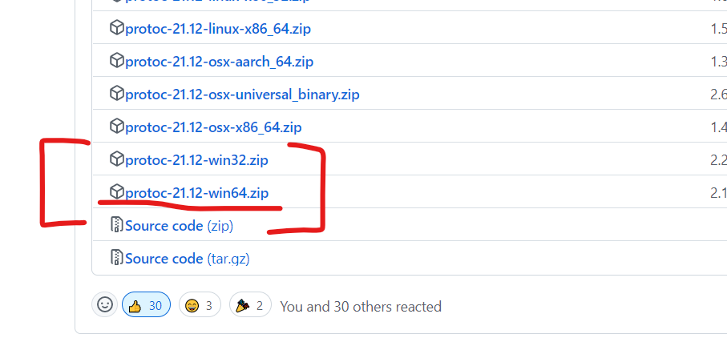
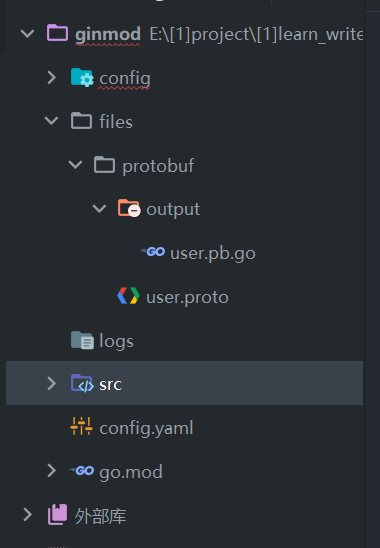

### 简介

protobuf 是一种高性能的数据传输方式，他比 xml 与 json 快 N 倍；

下面我们将使用 gin 框架下配置 protobuf

<br>

### 快速配置与使用

#### 安装

下载 protoc 编译器：[github 官网下载](https://github.com/protocolbuffers/protobuf/releases)

我下载的是最新的 21.12 版本，点击“show all 28 assets”，在最底部找到 windows 版本，因为我的电脑是 64 位的，所以选择 win64



<br>

下载得到的压缩包，在 bin 内找到 `protoc.exe`

直接把他丢到 `go 根目录下的 bin 文件夹`（因为我们之前配置环境变量时已经指定了该文件夹，就不需要再为了 protoc.exe 指定一个新的文件夹）

<br>

安装 protoc-gen-go（这里使用的是老版本的，新版本的使用 google 源，这里为了快速上手就不演示了）  
`go get github.com/golang/protobuf/protoc-gen-go`

下载完毕后来到我们的 `$GOPATH`，打开 bin 文件夹，把里面刚刚生成的 `protoc-gen-go.exe` 也丢到 go 根目录下的 bin 文件夹内

<br>

无论你使用什么 IDE，都建议安装一个 protobuf 插件，它能自动识别 proto 文件并提供代码补全；

如果你用的是 goland，推荐安装插件：`Protobuf`  
如果你用的是 vscode，推荐安装插件：`vscode-proto3`

<br>

> 这还不算最恶心的，后面更恶心，请别反胃，慢慢看

<br>

#### 文件结构

这是我在 goland 中单独创建的一个基于 gin 框架的项目，下面是对应文件以及文件夹的作用解释：

1. config 配置文件夹，此次文章用不到
2. files/protobuf 存储 proto 文件的地方
3. files/protobuf/output 存储编译后的 proto 文件的地方
4. src 里面有 main.go 文件



<br>

#### 编写 user.proto

按照文件结构所述，新建文件：files/protobuf/user.proto

```go
syntax = "proto3";

option go_package = "./output;service";

package service;

message Person {
    string name = 1;
    int32 age = 2;
    string email = 3;
}
```

<br>

`syntax` 表示当前使用的 proto 版本

`option go_package` 用于指定输出文件夹以及包名；  
格式为 "path;package_name"  
输出路径起始点为当前文件所在文件夹，所以 ./output 实际就是指 files/protobuf/output 文件夹  
包名可以随意指定，但不要和你项目内的包名重合！

`package` 定义包名，这里的包名和 option go_package 字段定义的包名需要保持一致！

`message` 定义结构体

> 定义的结构体格式为： 类型 名称 = 序号  
> 大小写不敏感，且定义的值只是表示序号，而不代表后续我们取出来的就是这些值！！！

<br>

#### 编译输出

进入到 `user.proto 所在文件夹` 并打开命令行（特别特别特别要注意这里打开命令行的位置，不然相对路径搞错了无法编译可别怪我。。。）

生成指令语句格式：`proto --go_out=编译后文件保存位置 proto文件或proto文件所在文件夹`

所以我们不难得出生成语句：`proto --go_out=./ user.proto`  
表示在当前文件夹下生成编译后文件，并且使用到的 proto 文件为 user.proto

<br>

编译完毕，自动创建 output 文件夹，文件夹内生成了一个 user.pb.go 文件

<br>

#### 正式测试

累了不想打字了，自己看注释；

原理部分将会在后续的不远时间内进行补全呜呜呜呜；

```go
func main() {
	router := gin.Default()

    // 1. 序列化过程
    // 实例化结构体
    // 注意这里的包名为我们在proto中定义的！
    // 使用&进行引用
	person := &service.Person{
		Name:  "what the???",
		Age:   10238,
		Email: "no way!",
	}

    // Marshal对结构体执行序列化
	bt, _ := proto.Marshal(person)
	fmt.Printf("%v\n", bt)

    // 2. 反序列化过程
    // 先实例化一个空的结构体
    // Unmarshal反序列化，参数一为序列化的数据，参数二为存储反序列化结果的变量
	unperson := &service.Person{}
	proto.Unmarshal(bt, unperson)

    // 反序列化后得到的结构体可以直接调用对应方法
    // 方法名可以去 user.pb.go 文件内查看
	fmt.Printf("otherArticle.GetAid(): %v\n", unperson.GetName())

	router.Run(":10001")
}
```

<br>
