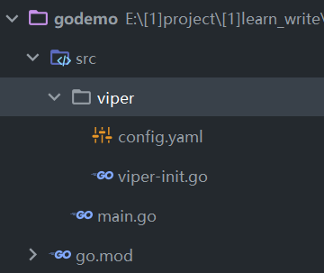
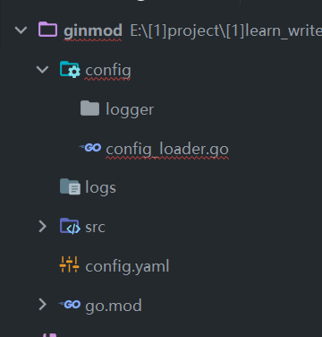

### 快速上手

命令行下安装 viper：`go get github.com/spf13/viper`

<br>

这是完成后的文件结构图：

`config.yaml` 配置主文件，可以使用任意后缀指定格式，这里以 yaml 做示范  
`viper-init.go` 初始化 viper  
`main.go` 入口



<br>

**编写配置文件**

首先我们简单的在配置文件内瞎写一些内容（注意冒号后面保留一个空格，这是 yaml 规范！）

代码清单 `config.yaml`

```yaml
name: "tom"
password: 123456
```

<br>

**viper 初始化文件配置**

之后来到 viper 初始化文件内编写初始化内容

编写初始化方法 InitViper 之前务必指定一个结构体，它对应着我们配置文件内的所有属性  
这方便我们后期通过结构体获取对应属性

配置文件读取其实路径默认为项目根目录！！！

代码清单：`viper-init.go`

```go
package viper

import (
	"fmt"
	"github.com/spf13/viper"
	"log"
)

// 结构体，对应配置文件所有属性
type Config struct {
	// mapstructure表示配置文件内属性的名称
	// 而Name则是结构体中定义的名字！
	Name string `mapstructure:"name"`
	Password int `mapstructure:"password"`
}

// viper初始化代码，返回一个Config指针对象
func InitViper() *Config  {
	// 实例化空结构体
	cf := Config{}
	// 从指定路径读取配置文件
	viper.SetConfigFile("./src/viper/config.yaml")

	// 开始读配置文件，并处理错误情况
	err := viper.ReadInConfig()
	if err != nil{
		log.Fatal("找不到该文件！")
	}

	fmt.Println("成功初始化viper")

	// 返回地址
	return &cf
}
```

<br>

**入口文件**

最后直接在入口文件里面调用就好啦！

我这里随便写了最基础的 gin 环境，请注意 viper 初始化方法的执行位置必须在 service 层之前！  
你不初始化怎么获取到配置文件然后拿来用呢，对吧？

代码清单 main.go

```go
package main

import (
	"github.com/gin-gonic/gin"
	"godemo/src/viper"
)

func main() {
	router := gin.Default()

	// 切记初始化viper再调用！！！
	config := viper.InitViper()

	router.GET("/test", func(context *gin.Context) {
		context.JSON(200,gin.H{
			"name":config.Name,
		})
	})

	err := router.Run(":10086")
	if err != nil {
		return
	}
}
```

<br>

### 另一种配置方式

> 该配置方式省去了编写结构体的冗余步骤，比较方便

<br>

#### 文件结构

使用 config 文件夹下的 `config_loader.go` 读取配置文件 `config.yaml`



<br>

#### 读配置文件

我们首先随便在配置文件内写一些配置

配置文件 `config.yaml`

```yaml
port: 10001
desc: "hello viper"
```

<br>

然后编写我们初始化 viper 的代码（此操作会直接把配置文件和 viper 管理，之后在任意文件内都可以直接使用 viper 操纵配置，所以在这里我们不需要全局暴露 viper 对象）

`config/config_loader.go` 代码清单：

```go
package config

import (
	"fmt"
	"github.com/spf13/viper"
)

func ConfigurationInit() {
	viper.SetConfigName("config")   // 设置配置名称
	viper.SetConfigType("yaml")     // 设置配置类型
	viper.AddConfigPath("./")       // 从哪里开始查找配置文件
	err := viper.ReadInConfig()     // 读配置文件

    // 错误处理
	if err != nil {
        // 如果读不出来，直接中断程序
		panic(fmt.Errorf("read config err=%s", err))
	} else {
        // 读到了，就输出其中的一段文字
		fmt.Println(viper.GetString("desc"))
	}
}
```

<br>

好啦！我们就已经把配置文件挂载到全局对象 viper 上面去了，是不是很简单？

最后一步，来到 main.go ，直接使用 viper 全局对象通过配置的 key 获取其 value 即可

```go
func main() {
	router := gin.Default()

	config.ConfigurationInit()  // 初始化config

	fmt.Println(viper.GetString("desc")) // 获取配置文件指定key的value并打印出来

	router.Run(":10001")
}
```

<br>
