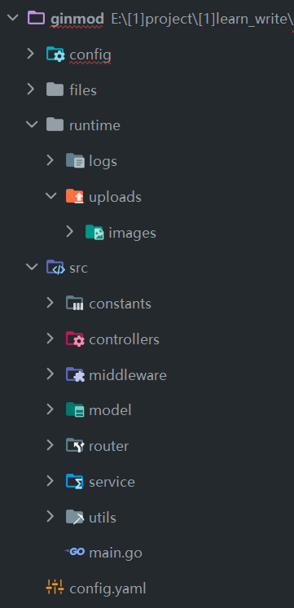

### 前言

> 参考文献：https://blog.csdn.net/heian_99/article/details/122447855

案例目的：实现前端上传图片并显示，后端保存图片；

技术：elementplus、axios、vue3、vite、gin

实现原理：

1. 前端请求对应后端接口，以 POST 方法在表单添加图片数据并上传
2. 后端接收到请求，保存图片到静态文件夹内
3. 后端返回给前端静态文件夹内图片的完整 URL
4. 前端获取 URL，使用动态绑定更新 img 标签的 src 属性，实现图片显示

<br>

### 后端

#### 项目结构图



`config` 配置文件读取模块初始化+logger 初始化  
`files` 配置 protobuf（当前案例不涉及）  
`runtime` 静态文件夹  
`src/constants` 常量文件夹  
`config.yaml` 配置文件

<br>

#### 初始化配置文件

根目录新建文件 `config.yaml`

port 后端端口  
static-mainurl 静态文件夹路径  
image-save-path 图片保存目录  
image-allow-extentions 图片类型校验时可通过的类型  
logs-path 日志文件输出位置

```yaml
port: ":10001"
mainurl: "http://localhost:10001"
static-mainurl: "http://localhost:10001/static"

image-save-path: "./runtime/uploads/images"
image-max-size: 5
image-allow-extentions: [".jpg", ".png", ".jpeg", ".gif"]

logs-path: "./runtime/logs/logger.json"
```

<br>

新建代码文件执行 config 初始化： `config/config_loader.go`

这里需要使用 viper 包，快速上手入门教程请查看我之前介绍的文章或者对应资料，这里因篇幅原因不录入

```go
package config

import (
	"fmt"
	"github.com/spf13/viper"
)

func ConfigurationInit() {
	viper.SetConfigName("config")	// 配置文件名字
	viper.SetConfigType("yaml")		// 配置文件后缀
	viper.AddConfigPath("./")		// 配置文件所在相对路径，路径起始点为项目根目录
	err := viper.ReadInConfig()		// 读入配置
	if err != nil {
		panic(fmt.Errorf("read config err=%s", err))
	} else {
		fmt.Println(viper.GetString("desc"))
	}
}
```

#### 跨域

由于前端请求后端接口时的 referer 中端口不一致，后端会因其跨域而直接拦截，导致前端无法请求后端接口；

需要自行编写跨域中间件来阻止跨域拦截；  
新建跨域中间件 `middleware/cors.go`

```go
package middleware

import (
	"fmt"
	"github.com/gin-gonic/gin"
)

func CORSSetting() gin.HandlerFunc {
	return func(context *gin.Context) {
		fmt.Println("已配置跨域!")

		// 允许 Origin 字段中的域发送请求
		context.Writer.Header().Add("Access-Control-Allow-Origin", "*")
		// 设置预验请求有效期为 86400 秒
		context.Writer.Header().Set("Access-Control-Max-Age", "86400")
		// 设置允许请求的方法
		context.Writer.Header().Set("Access-Control-Allow-Methods", "POST, GET, OPTIONS, PUT, DELETE, UPDATE, PATCH")
		// 设置允许请求的 Header
		context.Writer.Header().Set("Access-Control-Allow-Headers", "Content-Type, Content-Length, Referer, User-Agent")
		// 设置拿到除基本字段外的其他字段，如上面的Apitoken, 这里通过引用Access-Control-Expose-Headers，进行配置，效果是一样的。
		context.Writer.Header().Set("Access-Control-Expose-Headers", "Content-Length, Access-Control-Allow-Headers")
		// 配置是否可以带认证信息
		context.Writer.Header().Set("Access-Control-Allow-Credentials", "true")
		// OPTIONS请求返回200
		if context.Request.Method == "OPTIONS" {
			context.JSON(200, context.Request.Header)
			context.Abort()
		} else {
			context.Next()
		}
	}
}
```

<br>

#### 主路由

为便于管理，直接把主路由抽离出来单个配置；

新建代码：`src/router/main_router.go`

```go
package router

import (
	"ginmod/src/controllers"
	"github.com/gin-gonic/gin"
)

func MainRouterInit(engine *gin.Engine) {
    // 新路由组，默认path为/uploads
	uploadsRouter := engine.Group("/uploads")
	{
        // 导入的controller，请看下一节
		uploadsRouter.POST("/image", controllers.UploadSingleImage)
	}
}
```

<br>

#### 常量

针对经常使用到的常量，比如响应码与响应文本等内容，我们有必要单独抽离并指定一个文档

响应码 `src/constants/code.go`

```go
package constants

const (
	SUCCESS  = 200
	REDIRECT = 300
	FAILED   = 400
	ERROR    = 500

	ERROR_UPLOAD_SAVE_IMAGE = 1001
	ERROR_UPLOAD_TYPE_IMAGE = 1002
)
```

<br>

响应文本 `src/constants/message.go`

```go
package constants

const (
	SUCCESS  = 200
	REDIRECT = 300
	FAILED   = 400
	ERROR    = 500

	ERROR_UPLOAD_SAVE_IMAGE = 1001
	ERROR_UPLOAD_TYPE_IMAGE = 1002
)
```

<br>

#### Controller

写过 springboot 或者熟悉后端结构的话，可能会比较好理解 controller 的意义；  
这里编写一个上传文件的专用 controller

新建代码 `src/controller/upload_controller.go`

```go
package controllers

import (
	"ginmod/src/service"
	"github.com/gin-gonic/gin"
)

func UploadSingleImage(ctx *gin.Context) {
    // 再次细分，业务交给service层处理
	service.UploadSingleImageService(ctx)
}
```

<br>

#### Service

具体业务需要给 Service 层进行细节处理

但首先我们需要编写一个基础 service，里面包含我们最常用的 response 结构体，可帮助我们快速返回指定内容而无需重复编写

代码清单：`src/service/base_service.go`

```go
package service

import "github.com/gin-gonic/gin"

// 代码很简单，就是一个JSON返回
// 包含啷个参数，一个code以及一个数据msg
func BasicResponseService(ctx *gin.Context, codeId int, msg string) {
	ctx.JSON(codeId, gin.H{
		"code": codeId,
		"msg":  msg,
	})
}
```

<br>

紧接着就是咱们的主业务逻辑处理，即上传相关 service

代码清单：`src/service/upload_service.go`

```go
package service

import (
	"ginmod/src/constants"
	"github.com/gin-gonic/gin"
	"github.com/spf13/viper"
	"net/http"
	"os"
	"path"
	"strings"
)

func UploadSingleImageService(ctx *gin.Context) {
	img, err := ctx.FormFile("file")
	if err != nil {
		BasicResponseService(
			ctx,
			http.StatusBadRequest,
			constants.GetMessage(constants.ERROR_UPLOAD_SAVE_IMAGE))
		return
	}

	suffix := strings.ToLower(path.Ext(img.Filename))
	if allowSuffix := ".jpg.png.jpeg.gif"; !strings.Contains(allowSuffix, suffix) {
		BasicResponseService(
			ctx,
			http.StatusBadRequest,
			constants.GetMessage(constants.ERROR_UPLOAD_TYPE_IMAGE))
		return
	}

	filePath := viper.GetString("image-save-path")
	_, err2 := os.Stat(filePath + "/single")
	if err2 != nil {
		os.Mkdir(filePath+"/single", os.ModePerm)
	}

	fileName := filePath + "/single/demo.jpg"
	ctx.SaveUploadedFile(img, fileName)
	BasicResponseService(
		ctx,
		http.StatusOK,
		viper.GetString("static-mainurl")+"/uploads/images/single/demo.jpg")
}
```

<br>

### 前端

#### template

> 这一部分参考 elementplus 中的 https://element-plus.gitee.io/zh-CN/component/upload.html

由于我们不需要实现多余的功能，主体就是一个上传按钮，点击后即可向后端发送图片文件；

```html
<template>
  <!-- 外层盒子 -->
  <div class="uploadpic-container">
    <!-- 表单组件，无实际作用，仅是为了限制上传组件的位置 -->
    <el-form class="upform">
      <!-- 上传组件 -->
      <!-- action表示请求的URL，此过程为内置的axios请求POST -->
      <!-- show-fie-list表示上传成功后是否显示文件名在上传组件的下面 -->
      <el-upload
        class="uppic"
        action="http://localhost:10001/uploads/image"
        show-file-list="false"
        :on-success="handleAvatarSuccess"
        :before-upload="beforeAvatarUpload"
      >
        <!-- 显示图片以及添加图标的地方 -->
        <!-- 条件渲染，当存在图片URL时渲染图片，否则渲染添加图标 -->
        
        <el-icon v-else class="avatar-uploader-icon">
          <!-- 使用elementplus自带的图标库中的图标 -->
          <Plus />
        </el-icon>
      </el-upload>
    </el-form>
  </div>
</template>
```

<br>

#### javascript

此处用到了 pinia 指定外部 store，该 store 的内容请看下一节代码；

`handleAvatarSuccess` 以及 `beforeAvatarUpload` 均为摘抄 elementplus 中预先给定的点击响应代码，只是对其逻辑判定做出了些许修改而已

特别注意更新 imageUrl 时代码尾部的 `"?" + Math.random()`  
这是因为我们后端写死了上传的图片只会保存在固定的位置，且名字就叫做 demo.jpg；  
这就导致了生成的图床 URL 是固定的，而前端单纯地更新 ref 是无法更新图片缓存的，所以我们需要每次都在 URL 的后面生成随机数，来表示这是不同的请求，从而清除缓存，使得每次显示的图片都能立即更新！

```js
import { ref } from "vue";
import { ElMessage } from "element-plus";
import { Plus } from "@element-plus/icons-vue";
import fileStore from "../store/file-store.js";

// 图片URL，动态绑定到img标签，显示图片
const imageUrl = ref("");
// 外部store
const store = fileStore();

// 1. 图片POST成功后拿到的response的处理
const handleAvatarSuccess = (response, uploadFile) => {
  // 建议先log一下，看看response组成，再调出对应内容
  console.log(response);
  // 响应体中获取图床URL，修改imageUrl的值，尾部添加随机数是为了清除缓存
  imageUrl.value = response.msg + "?" + Math.random();
};

// 2. POST请求前需要执行的验证操作
const beforeAvatarUpload = (rawFile) => {
  // 从外部store中取得允许通过的图片类型
  const imageTypes = store.$state.imageTypes;
  // 多当前文件类型不等于图片类型时，拒绝POST
  // 文件大小大于2MB时，也拒绝POST
  if (!imageTypes.includes(rawFile.type.toString())) {
    ElMessage.error("别搞小动作，只能上传图片");
    return false;
  } else if (rawFile.size / 1024 / 1024 > 2) {
    ElMessage.error("文件大小不可超过2MB");
    return false;
  }
  return true;
};
```

<br>

#### less

样式表，没什么好说的

```less
.uploadpic-container {
  width: 100%;
  height: 100%;
  display: flex;
  justify-content: center;
  align-items: center;

  .upform {
    width: 80%;
    height: 80%;
    border-radius: 8px;
    background-color: white;

    .uppic {
      width: 200px;
      margin: 20px;
      border-bottom: 6px solid lightskyblue;
      cursor: pointer;
      position: relative;
      overflow: hidden;

      transition: 0.3s ease;

      &:hover {
        background-color: lightskyblue;
        box-shadow: 0 0 20px 0.1px lightgray;
      }

      .avatar {
        width: 200px;
        height: 200px;
        background-color: lightskyblue;
      }

      .avatar-uploader-icon {
        width: 200px;
        height: 200px;
      }
    }
  }
}
```

<br>

### END

> 下期文章将会说明如何处理多图上传，以及 gin 下对多图的文件结构管理处理方式
