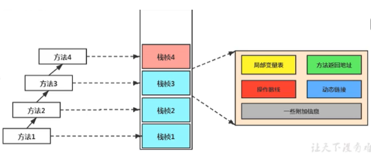

## JVM 第一部分：内存与垃圾回收

 

### JVM 与 Java 体系结构

 

#### 虚拟机与 Java 虚拟机

系统虚拟机：完全是对物理计算机的仿真，提供了一个可运行完整操作系统的软件平台  
Java 虚拟机：它专门为执行单个计算机程序而设计

Java 技术的核心就是 Java 虚拟机（JVM，Java Virtual Machine）

Java 编译器输入的指令流基本上是一种基于 `栈的指令集架构`

**栈式架构**的特点：使用零地址指令方式分配，指令集更小，不需要硬件支持，可移植性更好  
**寄存器架构**的特点：完全依赖硬件，可移植性差，往往都以一地址指令、二地址指令和三地址指令为主

 

#### JVM 生命周期

虚拟机退出的情况

- 程序正常执行结束
- 程序在执行过程中遇到了异常或错误而异常终止
- 由于操作系统用现错误而导致 Java 虚拟机进程终止
- 某线程调用 Runtime 类或 system 类的 exit 方法，或 Runtime 类的 halt 方法，并且 Java 安全管理器也允许这次 exit 或 halt 操作。
- 除此之外，JNI（Java Native Interface）规范描述了用 JNI Invocation API 来加载或卸载 Java 虚拟机时，Java 虚拟机的退出情况。

 

### 类加载子系统

 

#### 内存结构

 

#### 类加载器

**类加载器子系统作用**

- 类加载器子系统负责从文件系统或者网络中加载 Class 文件
- ClassLoader 只负责 class 文件的加载，至于它是否可以运行，则由 Execution Engine 决定
- 加载的类信息存放于一块称为方法区的内存空间

**加载阶段**

1. 通过一个类的全限定名获取定义此类的二进制字节流
2. 将这个字节流所代表的静态存储结构转化为方法区的运行时数据结构
3. 在内存中生成一个代表这个类的 java.lang.Class 对象，作为方法区这个类的各种数据的访问入口

**链接阶段**

1. 验证：确保 Class 文件的字节流中包含信息符合当前虚拟机要求
2. 准备：为类变量分配内存并且设置该类变量的默认初始值，不会为实例变量分配初始化
3. 解析：将常量池内的符号引用转换为直接引用的过程

**初始化阶段**

- 初始化阶段就是执行类构造器方法`<clinit>()`的过程
- 构造器方法中指令按语句在源文件中出现的顺序执行

 

#### 类加载器分类

JVM 支持两种类型的类加载器 。分别为`引导类加载器（Bootstrap ClassLoader）`和`自定义类加载器（User-Defined ClassLoader）`。

 

虚拟机自带的加载器

1. 启动类加载器（引导类加载器，Bootstrap ClassLoader）：用来加载 Java 的核心库，加载扩展类和应用程序类加载器，并指定为他们的父类加载器
2. 扩展类加载器（Extension ClassLoader）：派生于 ClassLoader 类
3. 应用程序类加载器（系统类加载器，App ClassLoader）：负责加载环境变量 classpath 或系统属性 java.class.path 指定路径下的类库，Java 应用的类都是由它来完成加载

> ClassLoader 类是一个抽象类，其后所有的类加载器都继承自 ClassLoader

 

#### 双亲委派

Java 虚拟机对 class 文件采用的是按需加载的方式  
而且加载某个类的 class 文件时，Java 虚拟机采用的是双亲委派模式，即把请求交由父类处理，它是一种任务委派模式

**工作原理**

- 如果一个类加载器收到了类加载请求，它并不会自己先去加载，而是把这个请求委托给父类的加载器去执行；
- 如果父类加载器还存在其父类加载器，则进一步向上委托，依次递归，请求最终将到达顶层的启动类加载器；
- 如果父类加载器可以完成类加载任务，就成功返回，倘若父类加载器无法完成此加载任务，子加载器才会尝试自己去加载，这就是双亲委派模式。

 

**沙箱安全机制**

自定义 String 类，但是在加载自定义 String 类的时候会率先使用引导类加载器加载，而引导类加载器在加载的过程中会先加载 jdk 自带的文件`（rt.jar 包中 java\lang\String.class）`，报错信息说没有 main 方法，就是因为加载的是 rt.jar 包中的 string 类。这样可以保证对 java 核心源代码的保护，这就是沙箱安全机制。

 

#### 其余

**如何判断两个 class 对象是否相同**

- 类的完整类名必须一致，包括包名。
- 加载这个类的 ClassLoader（指 ClassLoader 实例对象）必须相同。

Java 程序对类的使用方式分为：主动使用和被动使用

 

### 运行时数据区及程序计数器

 

#### 运行时数据区

线程私有与共享分异

- 每个线程：独立包括程序计数器、栈、本地栈。
- 线程间共享：堆、堆外内存（永久代或元空间、代码缓存）

每个 JVM 只有一个 Runtime 实例。即为运行时环境

 

Hotspot JVM 里，每个线程都与操作系统的本地线程直接映射

当一个 Java 线程准备好执行以后，此时一个操作系统的本地线程也同时创建。Java 线程执行终止后，本地线程也会回收。

虚拟机线程：这种线程的操作是需要 JVM 达到安全点才会出现。

 

#### 程序计数器(PC 寄存器)

`PC 寄存器`用来存储指向下一条指令的地址，也即将要执行的指令代码

每个线程都有它自己的程序计数器，是线程私有的，生命周期与线程的生命周期保持一致（为了能够准确地记录各个线程正在执行的当前字节码指令地址）

每个线程在创建后，都会产生自己的程序计数器和栈帧  
任何时间一个线程都只有一个方法在执行，也就是所谓的当前方法

PC 寄存器唯一一个在 Java 虚拟机规范中没有规定任何 OutofMemoryError 情况的区域

 

### 虚拟机栈

 

#### 虚拟机栈特点

栈是运行时的单位，而堆是存储的单位

每个线程在创建时都会创建一个虚拟机栈，其内部保存一个个的栈帧（Stack Frame），对应着一次次的 Java 方法调用，是线程私有的。

生命周期和线程一致

对于栈来说不存在垃圾回收问题（栈存在溢出的情况）

栈中可能出现的异常

- 如果线程请求分配的栈容量超过 Java 虚拟机栈允许的最大容量，Java 虚拟机将会抛出一个 StackOverflowError 异常
- 尝试扩展的时候无法申请到足够的内存，或者在创建新的线程时没有足够的内存去创建对应的虚拟机栈，抛出一个 OutOfMemoryError 异常

 

#### 栈存储单位

每个线程都有自己的栈，栈中的数据都是以栈帧（Stack Frame）的格式存在

栈帧的压栈和出栈，遵循`“先进后出”/“后进先出”`原则。

Java 方法有两种返回函数的方式，一种是正常的函数返回，使用 return 指令；另外一种是抛出异常。不管使用哪种方式，都会导致栈帧被弹出。

栈帧中存储的两个关键元素

- 局部变量表（Local Variables）
- 操作数栈（operand Stack）（或表达式栈）

 

#### 局部变量表

1. 定义为一个数字数组，主要用于存储方法参数和定义在方法体内的局部变量
2. 局部变量表线程的私有数据，因此不存在数据安全问题
3. 局部变量表所需的容量大小是在编译期确定下来的
4. 方法嵌套调用的次数由栈的大小决定
5. 局部变量表中的变量只在当前方法调用中有效

类变量表有两次初始化的机会  
第一次是在“准备阶段”，执行系统初始化，对类变量设置零值  
另一次则是在“初始化”阶段，赋予程序员在代码中定义的初始值。

> 局部变量表中的变量也是重要的垃圾回收根节点，只要被局部变量表中直接或间接引用的对象都不会被回收

 

#### 操作数栈

操作数栈，在方法执行过程中，根据字节码指令，往栈中写入数据或提取数据，即入栈（push）和 出栈（pop）

操作数栈，主要用于保存计算过程的中间结果，同时作为计算过程中变量临时的存储空间

如果被调用的方法带有返回值的话，其返回值将会被压入当前栈帧的操作数栈中

Java 虚拟机的解释引擎是基于栈的执行引擎，其中的栈指的就是操作数栈

> HotSpot JVM 的栈顶缓存技术（Top Of Stack Cashing）技术：将栈顶元素全部缓存在物理 CPU 的寄存器中，以此降低对内存的读/写次数，提升执行引擎的执行效率

 

#### 动态链接（Dynamic Linking）

每一个栈帧内部都包含一个指向运行时常量池中该栈帧所属方法的引用

动态链接的作用就是为了将这些符号引用转换为调用方法的直接引用

 

#### 方法调用

当一个字节码文件被装载进 JVM 内部时，如果被调用的目标方法在编译期可知，且运行期保持不变时，这种情况下将调用方法的符号引用转换为直接引用的过程称之为`静态链接`

如果被调用的方法在编译期无法被确定下来，只能够在程序运行期将调用的方法的符号转换为直接引用，由于这种引用转换过程具备动态性，因此也被称之为`动态链接`

动态、静态链接分别对应的方法的绑定机制为：早期绑定（Early Binding）和晚期绑定（Late Binding）

如果方法在编译期就确定了具体的调用版本，这个版本在运行时是不可变的。这样的方法称为`非虚方法`

静态方法、私有方法、final 方法、实例构造器、父类方法都是非虚方法。其他方法称为`虚方法`

 

为了提高性能，JVM 采用在类的方法区建立一个虚方法表 （virtual method table）（非虚方法不会出现在表中）来实现。使用索引表来代替查找。

每个类中都有一个虚方法表，表中存放着各个方法的实际入口。

虚方法表会在类加载的链接阶段被创建并开始初始化

 

#### 方法返回地址（return address）

`方法正常退出`时，调用者的 pc 计数器的值作为返回地址，即调用该方法的指令的下一条指令的地址。  
`通过异常退出`的，返回地址是要通过异常表来确定，栈帧中一般不会保存这部分信息。

方法执行过程中，抛出异常时的异常处理，存储在一个异常处理表

> 正常完成出口和异常完成出口的区别在于：通过异常完成出口退出的不会给他的上层调用者产生任何的返回值。

 

不同数据区存在 error 和 gc 的情况对照表

 

### 本地方法接口和本地方法栈

 

**本地方法**

一个 `Native Method` 是一个 Java 调用非 Java 代码的接囗

 

**为什么使用 Native Method？**

有时 Java 应用需要与 Java 外面的环境交互  
通过使用本地方法，我们得以用 Java 实现了 jre 的与底层系统的交互

 

**本地方法栈**

Java 虚拟机栈于管理 Java 方法的调用，而本地方法栈用于管理本地方法的调用。

本地方法栈，也是线程私有的。  
允许被实现成固定或者是可动态扩展的内存大小。

当某个线程调用一个本地方法时，它就进入了一个全新的并且不再受虚拟机限制的世界  
并不是所有的 JVM 都支持本地方法

 

### 堆
