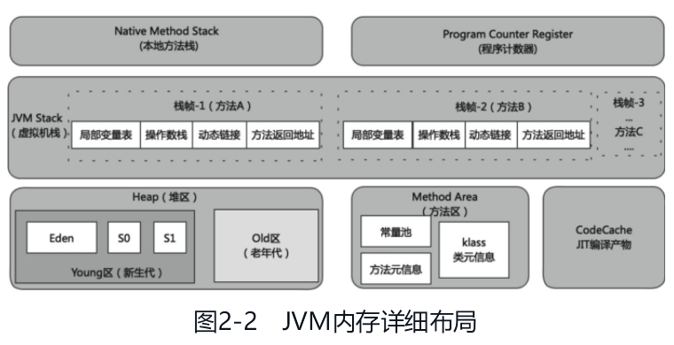
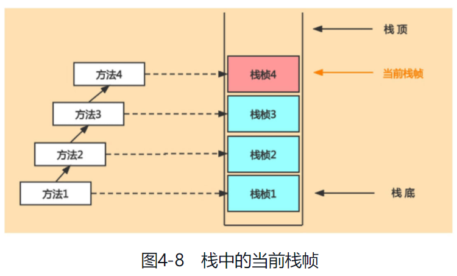

## 第 2 章　运行时数据区及线程概述

 

### 运行时数据区概述

单个线程私有以及多个线程共享：

1. 线程私有的区域包括程序计数器(Program Counter Register,PC Register)、虚拟机栈(Virtual Machine Stack,VMS)和本地方法栈(Native Method Stack,NMS)
2. 线程间共享的区域包括堆区(Heap)、方法区(Method Area)

 

Java 中存在一个类 Runtime，他使用单例模式，当多个线程访问该对象时，只有一个实例供线程访问，这就是线程共享。

 

### 线程

`HotSpot` 虚拟机中，每个线程都与操作系统的本地线程直接映射

操作系统负责将线程调度到任何一个可用的中央处理器(Central Processing Unit,CPU)上。一旦本地线程初始化成功，它就会调用 Java 线程中的 run()方法。  
方法正常执行完成之后，Java 线程和本地线程都会被回收，并释放相应的资源

若执行 run 出现未捕获异常，先导致 Java 线程终止，当且仅当 Java 应用内只要一个守护线程时，JVM 紧接着也被终止

常见的守护线程

- 垃圾回收线程：这种线程对在 JVM 里不同种类的垃圾收集行为提供了支持。
- 编译线程：这种线程在运行时会将字节码编译成本地代码。
- 手动创建守护线程：在调用 start()方法前调用 setDaemon(true)可以将线程标记为守护线程。

 

## 第 3 章　程序计数器

 

### 程序计数器介绍

JVM 中的程序计数器英文全称是 `Program Counter Register(PCR)`

字节码解释器工作时就是通过改变这个计数器的值来选取下一条需要执行的字节码指令，它是程序控制流的指示器

线程正在执行的是一个 Java 方法，这个计数器记录的是正在执行的虚拟机字节码指令的地址；  
如果正在执行的是本地(Native)方法，这个计数器值则应为空(Undefined)

 

### 程序计数器举例说明

计算`3-4`的流程

1. 执行引擎会在程序计数器存储 5 的位置读取相应的操作指令
2. 执行引擎操作 JVM 的局部变量表、操作数栈进行存、取、加、减等运算操作
3. 将字节码指令翻译成相应的机器指令
4. 让对应的 CPU 进行运算

 

### 程序计数器常见问题

程序计数器为什么会被设定为线程私有？  
因为多个程序在 CPU 上需要按照一定时间片轮流运行的，而一个线程对应一个程序计数器就不会出现相互干扰的情况

 

## 第 4 章　虚拟机栈

 

### 虚拟机栈概述

Java 设计为基于栈架构的，可以跨平台，指令集小，但同时性能也比较低

Java 虚拟机栈(Java Virtual Machine Stack)  
每个线程在创建时都会创建一个虚拟机栈，其内部由许多栈帧(Stack Frame)构成，每个栈帧对应着一个 Java 方法的调用

栈是线程私有的，虚拟机栈的生命周期和线程一致

虚拟机栈有如下几个特点。

1. 栈是一种快速有效的分配存储方式，访问速度仅次于程序计数器。
2. 对于栈来说不存在垃圾回收问题，但存在内存溢出。
3. 栈是先进后出的，每个方法执行，伴随着压栈操作；方法执行结束后，伴随着出栈操作

 

Java 虚拟机规范允许虚拟机栈的大小是可动态扩展的或者是固定不变的（但 HotSpot 架构下不允许动态扩展）

采用固定大小的 Java 虚拟机栈，若请求分配容量溢出了，会抛出 StackOverflowError 异常

采用动态大小，若无法申请到足够内存，抛出一个 OutOfMemoryError（OOM，内存溢出）异常

 

### 栈的存储单位

在一条活动线程中，一个时间点上只会有一个活动的栈帧，即只有当前正在执行的方法的栈帧（栈顶栈帧）是有效的，这个栈帧被称为当前栈帧

 

不同线程中所包含的栈帧是不允许存在相互引用的，即不可能在一个栈帧之中引用另外一个线程的栈帧

每个栈帧中存储的信息：

- 局部变量表(Local Variables)。
- 操作数栈(Operand Stack)（或表达式栈）。
- 动态链接(Dynamic Linking)（或指向运行时常量池的方法引用）。
- 方法返回地址(Return Address)（或方法正常退出或异常退出的定义）。
- 一些附加信息。

 

### 局部变量表

局部变量表定义为一个数字数组，主要用于存储方法参数和定义在方法体内的局部变量  
对于基本数据类型的变量，则直接存储它的值，对于引用类型的变量，则存的是指向对象的引用。

局部变量表所需的容量大小是在编译期确定下来的

方法嵌套调用的次数由栈的大小决定。一般来说，栈越大，方法嵌套调用次数越多。

局部变量表中的变量只在当前方法调用中有效。

 

局部变量表最基本的存储单元是 `slot（变量槽）`

JVM 会为局部变量表中的每一个 slot 都分配一个访问索引

当一个实例方法被调用的时候，他的方法参数等局部变量都会按照顺序被复制到局部变量表中的每一个 slot 上  
此时 this 指向 slot 的 index 为 0

栈帧中的局部变量表中的 slot 是可以重用的

局部变量表不存在系统初始化的过程，这意味着一旦定义了局部变量则必须手动初始化，否则无法使用

只要被局部变量表中直接或间接引用的对象都不会被回收

 

### 操作数栈

操作数栈也是栈帧中重要的内容之一，它主要用于保存计算过程的中间结果，同时作为计算过程中变量临时的存储空间。

操作数栈在方法执行过程中，根据字节码指令往栈中写入数据或提取数据

操作数栈都会拥有一个明确的栈深度用于存储数值，并且只允许以压入弹出的方式操作栈元素，而不能通过索引操作

 

### 栈顶缓存技术

JVM 基本都是基于栈式架构的虚拟机，此外还有一种架构是基于寄存器的

`栈顶缓存(Top-of-Stack Cashing,ToS)` 技术，就是当一个栈的栈顶或栈顶附近元素被频繁访问，就会将栈顶或栈顶附近的元素缓存到物理 CPU 的寄存器中，将原本应该在内存中的读、写操作分别变成了寄存器中的读、写操作，从而降低对内存的读、写次数，提升执行引擎的执行效率

 

### 动态链接

每一个栈帧内部都包含一个指向运行时常量池中该栈帧所属方法的引用

Java 源文件被编译成字节码文件时，所有的变量和方法引用都作为符号引用(Symbolic Reference)保存在 class 文件的常量池里

动态链接的目的就是在 JVM 加载了字节码文件，将类数据加载到内存以后，当前栈帧能够清楚记录此方法的来源

 

### 方法的调用

#### 方法调用的分类

方法的绑定机制有两种，分别是静态链接和动态链接

1. 静态链接（早期绑定）：当一个字节码文件被装载进 JVM 内部时，如果被调用的目标方法在编译期可知，且运行期保持不变时，将调用方法的符号引用转换为直接引用的过程
2. 动态链接（晚期绑定）：被调用的方法在编译器无法确定，只能在程序运行期将调用方法的符号引用转换为直接引用的过程

 

#### 虚方法与非虚方法

静态链接的方法一般为非虚方法；  
除去非虚方法的都是虚方法；

一般来说，静态方法、私有方法、final 方法、实例构造器、父类方法都是非虚方法

 

#### invokedynamic 指令

Java 是一个静态类型语言

Lambda 表达式的引入使得 Java 在一定程度上具备了动态类型语言的特点

 

#### 虚方法表

为加快在类的方法元数据中搜索合适的目标方法的速度，为此引入虚方法表

每个类中都有一个虚方法表，表中存放着各个方法的实际入口

虚方法表会在类加载的链接阶段被创建并开始初始化

 

### 方法返回地址
