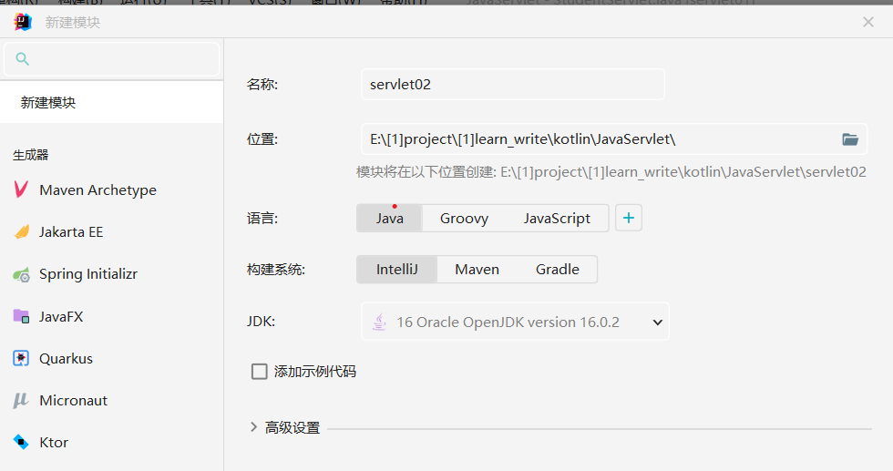
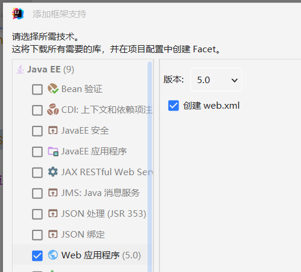
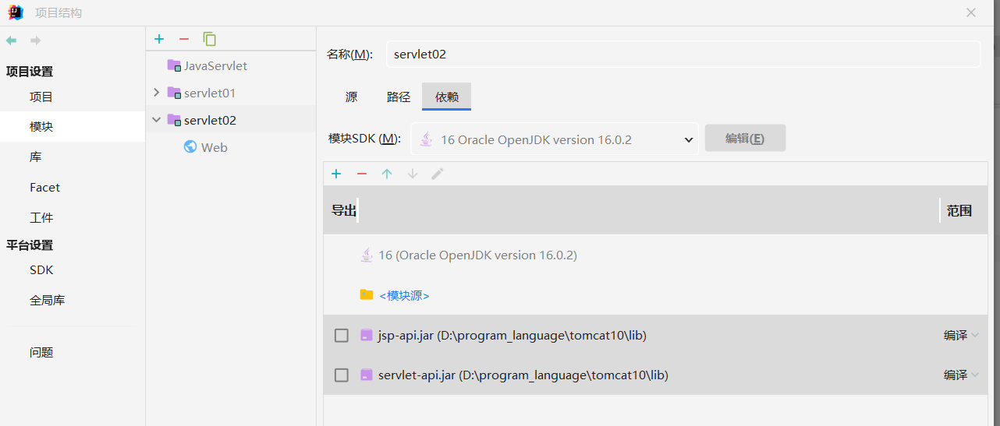
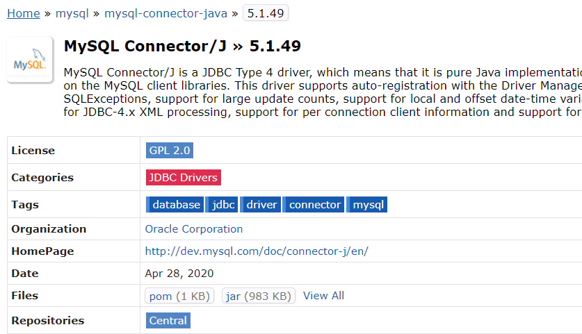
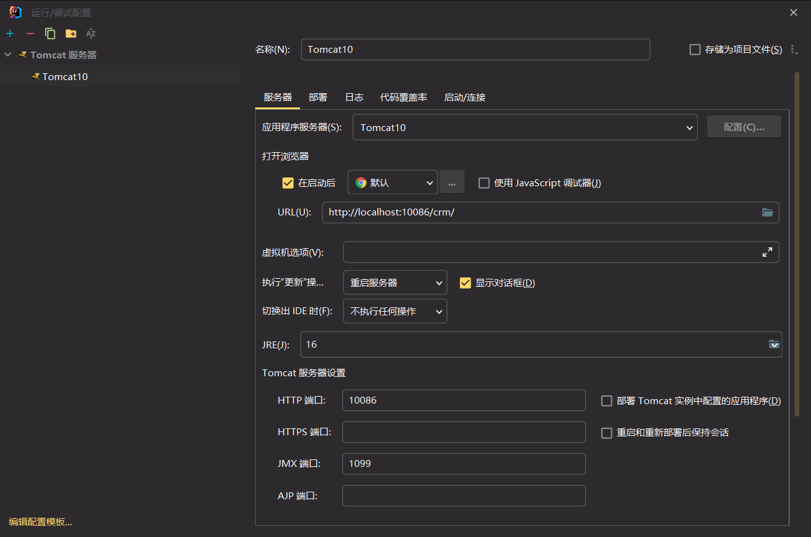
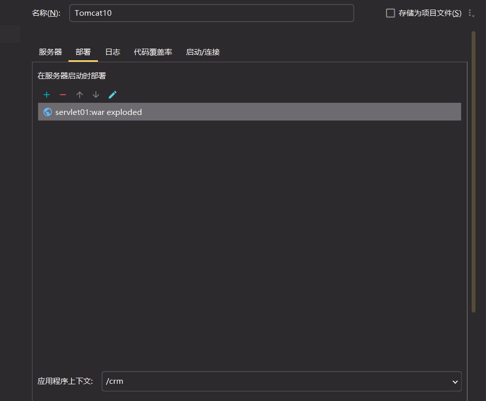
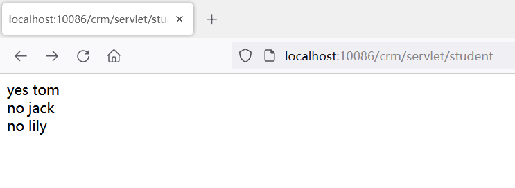

### 配置 servlet 环境

#### 创建项目

首先创建一个空项目！！！注意是空项目！！！

点击 文件->新建->新模块 ，新建一个名称为 servlet02 的模块（注意该模块的生成位置应该在我们刚刚新建的空项目下面！！！）



<br>

之后右键点击新模块 servlet02，选择 `“添加框架支持”`

勾选 “web 应用程序” ，之后直接点击完成即可自动生成 webapp 框架；



<br>

#### 引入外部 jar

文件 -> 项目结构

模块 -> servlet02 -> 依赖 -> 点击加号，并选择第一个项目

找到 tomcat 根目录下的 lib 文件夹，选择 `jsp-api.jar` 和 `servlet-api.jar` 两个包并导入！



<br>

#### 安装 mysql-connector

前往 maven 中心仓库，搜索 mysql-connector；  
或者直接前往此地址：https://mvnrepository.com/artifact/mysql/mysql-connector-java

因为我使用的是 mysql5.7 版本，所以我们找到仓库内的 5.1.x 中最新的那一个版本，下载其 jar 包就好了（5.1.x 版本兼容 5.7）



下载完毕后直接把该 jar 包，粘贴到 tomcat 根目录下的 lib 文件夹里面！

<br>

#### 编写 servlet 文件

下面就是标准的 JDBC 操作了，请您直接看注释，一个个解释太累了

```java
package com.zhiyiyi.javaweb.servlet;

import jakarta.servlet.*;

import java.io.IOException;
import java.io.PrintWriter;
import java.sql.*;

public class StudentServlet implements Servlet {
    @Override
    public void init(ServletConfig servletConfig) throws ServletException {

    }

    @Override
    public ServletConfig getServletConfig() {
        return null;
    }

    @Override
    public void service(ServletRequest request, ServletResponse response) throws ServletException, IOException {
        // 设置请求头类型
        response.setContentType("text/html");
        // 设置输出
        PrintWriter printWriter = response.getWriter();

        // 为三件套分配内存空间
        Connection conn = null;
        PreparedStatement ps = null;
        ResultSet rs = null;

        try {
            // 反射获取jdbc驱动
            Class.forName("com.mysql.jdbc.Driver");

            // 传入你的mysql数据库名称、用户名、密码
            String url = "jdbc:mysql://localhost:3306/jakarta";
            String user = "root";
            String password = "123456";

            // 链接数据库
            conn = DriverManager.getConnection(url, user, password);

            // 编写查询语句并执行，使用resultset取回查询结果
            String sql = "select no, name from std1";
            ps = conn.prepareStatement(sql);
            rs = ps.executeQuery();

            // 打印从数据库中取回的结果
            while (rs.next()) {
                String no = rs.getString("no");
                String name = rs.getString("name");
                printWriter.println(no + " " + name + "<br>");
            }

        // 一些错误处理
        } catch (ClassNotFoundException | SQLException e) {
            throw new RuntimeException(e);
        } finally {
            if (rs != null) {
                try {
                    rs.close();
                } catch (SQLException e) {
                    e.printStackTrace();
                }
            }
            if (ps != null) {
                try {
                    ps.close();
                } catch (SQLException e) {
                    e.printStackTrace();
                }
            }
            if (conn != null) {
                try {
                    conn.close();
                } catch (SQLException e) {
                    e.printStackTrace();
                }
            }
        }
    }

    @Override
    public String getServletInfo() {
        return null;
    }

    @Override
    public void destroy() {

    }
}
```

<br>

#### 编写 student.html 文件

我们生成的 webapp 模板默认是自带一个 index.jsp 的，目前用不到，先删掉；

在同样的位置新建一个 student.html 文件，输入以下代码；

这里使用了一个链接指向了我们刚刚编写的 servlet；

```html
<html>
  <head>
    <meta charset="UTF-8" />
    <title>student servlet</title>
  </head>
  <body>
    <a href="/crm/servlet/student">student list</a>
  </body>
</html>
```

<br>

#### 修改 web.xml 文件

因为我们添加了新的 servlet，所以需要在 web.xml 文件中进行注册；

打开 `\web\WEB-INF\web.xml` 文件

输入以下内容：

1. servlet 注册主体
2. servlet-name 可以随便取，表示该 servlet 的名称
3. servlet-class 你需要注册的 servlet 文件所在位置
4. servlet-mapping 映射表，里面的 servlet-name 必须要和 servlet 中注册的名称完全一致
5. url-pattern 我们在浏览器中访问该 servlet 的 url

```xml
<?xml version="1.0" encoding="UTF-8"?>
<web-app xmlns="http://xmlns.jcp.org/xml/ns/javaee"
         xmlns:xsi="http://www.w3.org/2001/XMLSchema-instance"
         xsi:schemaLocation="http://xmlns.jcp.org/xml/ns/javaee http://xmlns.jcp.org/xml/ns/javaee/web-app_4_0.xsd"
         version="4.0">

    <servlet>
        <servlet-name>studentServlet</servlet-name>
        <servlet-class>com.zhiyiyi.javaweb.servlet.StudentServlet</servlet-class>
    </servlet>
    <servlet-mapping>
        <servlet-name>studentServlet</servlet-name>
        <url-pattern>/servlet/student</url-pattern>
    </servlet-mapping>
</web-app>
```

<br>

#### 配置 tomcat 服务器

点击 idea 右上角绿色小三角左边的下拉列表，选择“添加配置”

弹出窗口点击加号 -> tomcat 服务器 -> 本地

然后按照下图所示填充内容

> 注意：由于我的电脑端口被占用，所以我修改了 http 端口为 10086，事实上这一项我们保持默认不用管就可以了！



<br>

再次进入“部署”栏目，点击加号添加工件，然后设置应用程序上下文为/crm 即可；

这里的 `/crm` 对应我们之前的 `student.html` 链接里的/crm

/crm 表示项目的目录



<br>

#### 运行并查看服务器

一切配置完毕，点击绿色按钮开始构建 tomcat 服务器；

此时因为我们勾选了服务器一启动就打开浏览器的选项，但我们发现刚刚打开的浏览器 404 报错；

别着急，只是路径对不上，我们将 url 改为我们设置的 herf 路径即可访问到 mysql 提取的数据了！！！



<br>
