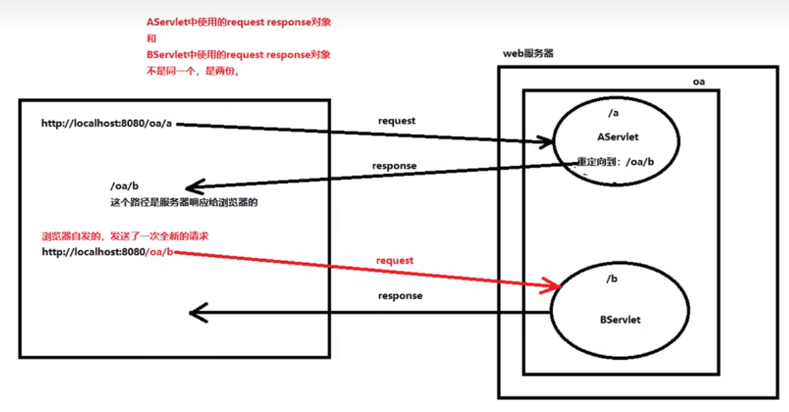

### 转发与重定向

 

#### web 中资源跳转的两种方式

转发和重定向；

 

#### 转发与重定向区别

> 假设当前项目名为 `07`，该项目存在一个 servlet，其路径为 `/save`

转发代码：  
`req.getRequestDispatcher("/save").forward(req, resp);`

重定向代码：  
`resp.sendRedirect("06/save");`

 

转发路径不需要添加项目名，且无论转发了多少次，都在同一个 reques 中；  
重定向需要添加项目名；

 

转发是一次请求，转发过后浏览器地址栏中`地址不变`；  
重定向是二次请求，重定向之后浏览器地址栏中地址变成`重定向后的地址`；

 

转发由 web 服务器完成，即受 tomcat 控制；  
重定向由浏览器控制；

 
