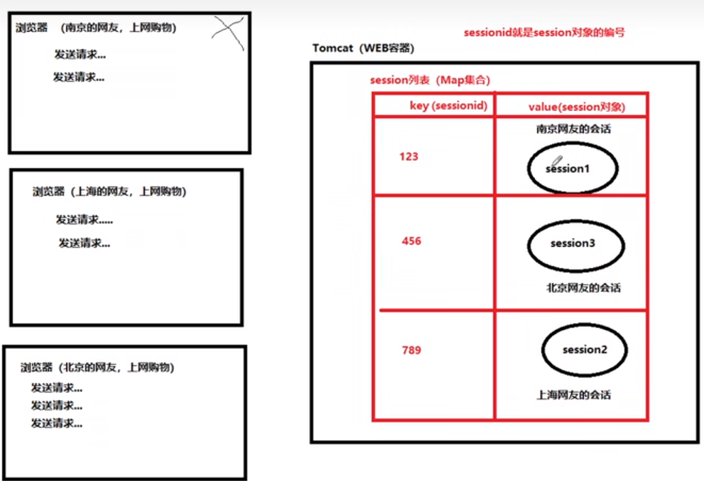

### Session 原理解析



#### session 基本特性

1. session 对象存储于服务器端
2. 一个 session 对象对应一个会话！
3. 一次会话中可以有多个请求

<br>

#### session 获取方式

使用 getSession()方法从浏览器中获取 session 对象，如果没有的话就自行创建一个

<br>

#### session 实现原理

tomcat 中有一个 session 集合，他是一个映射表；  
key 为 sessionid；  
value 为 session 对象；

<br>

用户首次请求：

1. 服务器创建新的 session 对象与对应的 sessionid
2. 服务器发送二者给浏览器
3. 浏览器拿到二者后存储到缓存中去

<br>

用户二次请求：
直接拿取浏览器中存储的 sessionid 并发送给服务器进行验证，验证完毕后返回信息

<br>

#### 会话结束

关闭浏览器后，浏览器中存储的 sessionid 消失，会话结束

<br>

### servlet 中设置 session

#### 基本配置

`session-config` 配置一个 session；

1. session-timeout 表示 session 超时时间，单位是分钟
2.

```xml
<?xml version="1.0" encoding="UTF-8"?>
<web-app xmlns="https://jakarta.ee/xml/ns/jakartaee"
         xmlns:xsi="http://www.w3.org/2001/XMLSchema-instance"
         xsi:schemaLocation="https://jakarta.ee/xml/ns/jakartaee https://jakarta.ee/xml/ns/jakartaee/web-app_5_0.xsd"
         version="5.0">

    <session-config>
        <session-timeout>30</session-timeout>
    </session-config>

</web-app>
```

<br>

#### 三大域对象

1. request 请求域：HttpServletRequest
2. session 会话域：HttpSession
3. application 应用域；ServletContext

<br>

### Cookie

> cookie 有生命周期，如果小于或等于 0 了，就会销毁该 cookie

<br>

#### 发送 cookie

请注意 cookie 的路径问题：

1. 如果我们按照如下代码设置了路径，那么当我们请求路径包含/jsp/cookie 的时候就会自动把本地 cookie 捆绑发给服务器！
2. 如果没有设置路径，那仅当我们请求该 servlet 所在路径时才会发出 cookie

```java
public class DemoServlet extends HttpServlet {
    @Override
    protected void doGet(HttpServletRequest req, HttpServletResponse resp) throws ServletException, IOException {
        // 实例化cookie对象
        Cookie cookie = new Cookie("name", "jack");
        // 设置生命周期
        cookie.setMaxAge(100);
        // 设置cookie路径
        cookie.setPath("/jsp/cookie");

        // 把cookie添加到响应头中
        resp.addCookie(cookie);
    }
}
```

<br>

#### 获取 cookie

可以在 servlet 中使用 getCookies 的方法获取请求中携带的所有 cookie

```java
public class DemoServlet extends HttpServlet {
    @Override
    protected void doGet(HttpServletRequest req, HttpServletResponse resp) throws ServletException, IOException {
        Cookie[] cookies = req.getCookies();
        for (Cookie cookie : cookies) {
            System.out.println(cookie.getName());
            System.out.println(cookie.getValue());
        }
    }
}
```

<br>
