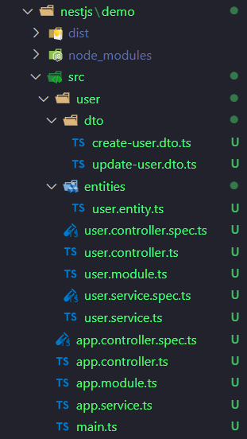

### 安装

> 建议直接看官方中文文档，这里面说的很详细，本文章是为了体验量子学习法的同学准备的，大佬勿喷  
> 官方文档：https://nestjs.bootcss.com/

<br>

全局安装 nestjs  
`npm i -g @nestjs/cli`

随便找一个文件夹，创建新工程  
`nest new project-name`

<br>

首次创建需要 npm 下载对应包，需要一段时间

nestjs 默认使用 ts，如果需要 js 则请另行下载对应包（这里不赘述，请看官网）

<br>

### 基本使用

#### 常用指令

三件套创建指令（请在工程目录下执行）

```sh
nest g mo xxx 创建module
nest g co xxx 创建controller
nest g s xxx 创建service
```

<br>

一键自动生成完整 CRUD 结构：`nest g resource xxx`

现在我们使用 nest 生成一个 user 结构：`nest g resource user`  
下面是目前完整的目录结构：  


<br>

#### 链接 mysql

安装 mysql2 以及 typeorm 框架
