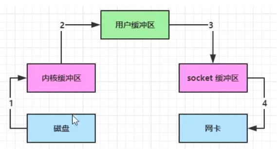
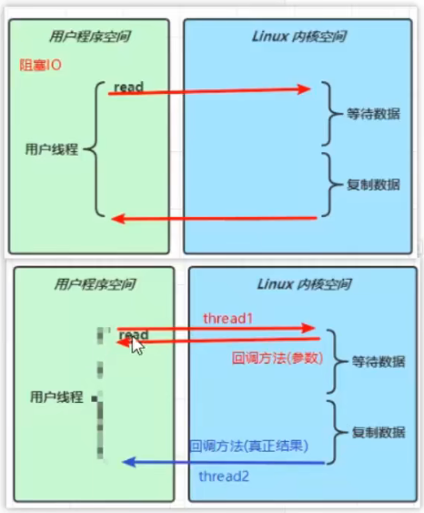

## NIO 基础

<br>

### 三大组件

#### Channel & Buffer

channel 有一点类似于 stream，它就是读写数据的**双向通道**，可以从 channel 将数据读入 buffer，也可以将 buffer 的数据写入 channel，而之前的 stream 要么是输入，要么是输出，channel 比 stream 更为底层

buffer 则用来缓冲读写数据

<br>

#### selector

selector 应该结合服务器设计板块来深入理解

常见的两个服务器设计模式为：多线程模式、线程池模式

下面我们要介绍的是 selector 设计模式


`selector` 的作用就是配合一个线程来管理多个 channel，获取这些 channel 上发生的事件，这些 channel 工作在非阻塞模式下，不会让线程吊死在一个 channel 上。适合连接数特别多，但流量低的场景（low traffic）

调用 selector 的 `select()` 会阻塞直到 `channel` 发生了读写就绪事件，这些事件发生，select 方法就会返回这些事件交给 thread 来处理

<br>

### ByteBuffer

#### FileChannel 读写测试

`FileChannel` 来读取文件内容

```java
@Slf4j
public class ChannelDemo1 {
    public static void main(String[] args) {
        try (RandomAccessFile file = new RandomAccessFile("helloword/data.txt", "rw")) {
            // 配置文件操作隧道
            FileChannel channel = file.getChannel();
            // 配置读取缓冲区
            ByteBuffer buffer = ByteBuffer.allocate(10);
            do {
                // 向 buffer 写入
                int len = channel.read(buffer);
                log.debug("读到字节数：{}", len);
                if (len == -1) {
                    break;
                }
                // 切换 buffer 读模式
                buffer.flip();
                while(buffer.hasRemaining()) {
                    log.debug("{}", (char)buffer.get());
                }
                // 切换 buffer 写模式
                buffer.clear();
            } while (true);
        } catch (IOException e) {
            e.printStackTrace();
        }
    }
}
```

ByteBuffer 正确使用姿势

1. 向 buffer 写入数据，例如调用 channel.read(buffer)
2. 调用 flip() 切换至**读模式**
3. 从 buffer 读取数据，例如调用 buffer.get()
4. 调用 clear() 或 compact() 切换至**写模式**
5. 重复 1~4 步骤

<br>

#### ByteBuffer 常见方法

**分配空间**

可以使用 allocate 方法为 ByteBuffer 分配空间，其它 buffer 类也有该方法

```java
Bytebuffer buf = ByteBuffer.allocate(16);
```

**向 buffer 写入数据**

有两种办法

- 调用 channel 的 read 方法
- 调用 buffer 自己的 put 方法

```java
int readBytes = channel.read(buf);
```

和

```java
buf.put((byte)127);
```

**从 buffer 读取数据**

同样有两种办法

- 调用 channel 的 write 方法
- 调用 buffer 自己的 get 方法

```java
int writeBytes = channel.write(buf);
```

和

```java
byte b = buf.get();
```

get 方法会让 position 读指针向后走，如果想重复读取数据

- 可以调用 rewind 方法将 position 重新置为 0
- 或者调用 get(int i) 方法获取索引 i 的内容，它不会移动读指针

**mark 和 reset**

mark 是在读取时，做一个标记，即使 position 改变，只要调用 reset 就能回到 mark 的位置

> **注意**
>
> rewind 和 flip 都会清除 mark 位置

**字符串与 ByteBuffer 互转**

```java
ByteBuffer buffer1 = StandardCharsets.UTF_8.encode("你好");
ByteBuffer buffer2 = Charset.forName("utf-8").encode("你好");

debug(buffer1);
debug(buffer2);

CharBuffer buffer3 = StandardCharsets.UTF_8.decode(buffer1);
System.out.println(buffer3.getClass());
System.out.println(buffer3.toString());
```

<br>

### 文件编程

#### 读

不能直接打开 FileChannel，必须通过 FileInputStream、FileOutputStream 或者 RandomAccessFile 来获取 FileChannel，它们都有 getChannel 方法

- 通过 FileInputStream 获取的 channel 只能读
- 通过 FileOutputStream 获取的 channel 只能写
- 通过 RandomAccessFile 是否能读写根据构造 RandomAccessFile 时的读写模式决定

<br>

channel 必须关闭，不过调用了 FileInputStream、FileOutputStream 或者 RandomAccessFile 的 close 方法会间接地调用 channel 的 close 方法

操作系统出于性能的考虑，会将数据缓存，不是立刻写入磁盘。可以调用 force(true) 方法将文件内容和元数据（文件的权限等信息）立刻写入磁盘

<br>

#### FileChannel 案例

两个 Channel 传输数据

```java
String FROM = "helloword/data.txt";
String TO = "helloword/to.txt";
long start = System.nanoTime();
try (FileChannel from = new FileInputStream(FROM).getChannel();
     FileChannel to = new FileOutputStream(TO).getChannel();
    ) {
    from.transferTo(0, from.size(), to);
} catch (IOException e) {
    e.printStackTrace();
}
long end = System.nanoTime();
System.out.println("transferTo 用时：" + (end - start) / 1000_000.0);
```

超过 2g 大小的文件传输，分片传输

```java
public class TestFileChannelTransferTo {
    public static void main(String[] args) {
        try (
                FileChannel from = new FileInputStream("data.txt").getChannel();
                FileChannel to = new FileOutputStream("to.txt").getChannel();
        ) {
            // 效率高，底层会利用操作系统的零拷贝进行优化
            long size = from.size();
            // left 变量代表还剩余多少字节
            for (long left = size; left > 0; ) {
                System.out.println("position:" + (size - left) + " left:" + left);
                left -= from.transferTo((size - left), left, to);
            }
        } catch (IOException e) {
            e.printStackTrace();
        }
    }
}
```

<br>

#### Path

jdk7 引入了 `Path` 和 `Paths` 类

- Path 用来表示文件路径
- Paths 是工具类，用来获取 Path 实例
- 如果文件已存在，会抛异常 FileAlreadyExistsException

```java
Path source = Paths.get("1.txt"); // 相对路径 使用 user.dir 环境变量来定位 1.txt

Path source = Paths.get("d:\\1.txt"); // 绝对路径 代表了  d:\1.txt

Path source = Paths.get("d:/1.txt"); // 绝对路径 同样代表了  d:\1.txt

Path projects = Paths.get("d:\\data", "projects"); // 代表了  d:\data\projects
```

<br>

几个常用的路径操作案例

遍历目录文件

```java
public static void main(String[] args) throws IOException {
    Path path = Paths.get("C:\\Program Files\\Java\\jdk1.8.0_91");
    AtomicInteger dirCount = new AtomicInteger();
    AtomicInteger fileCount = new AtomicInteger();
    Files.walkFileTree(path, new SimpleFileVisitor<Path>(){
        @Override
        public FileVisitResult preVisitDirectory(Path dir, BasicFileAttributes attrs)
            throws IOException {
            System.out.println(dir);
            dirCount.incrementAndGet();
            return super.preVisitDirectory(dir, attrs);
        }

        @Override
        public FileVisitResult visitFile(Path file, BasicFileAttributes attrs)
            throws IOException {
            System.out.println(file);
            fileCount.incrementAndGet();
            return super.visitFile(file, attrs);
        }
    });
    System.out.println(dirCount); // 133
    System.out.println(fileCount); // 1479
}
```

统计 jar 的数目

```java
Path path = Paths.get("C:\\Program Files\\Java\\jdk1.8.0_91");
AtomicInteger fileCount = new AtomicInteger();
Files.walkFileTree(path, new SimpleFileVisitor<Path>(){
    @Override
    public FileVisitResult visitFile(Path file, BasicFileAttributes attrs)
        throws IOException {
        if (file.toFile().getName().endsWith(".jar")) {
            fileCount.incrementAndGet();
        }
        return super.visitFile(file, attrs);
    }
});
System.out.println(fileCount); // 724
```

删除多级目录

```java
Path path = Paths.get("d:\\a");
Files.walkFileTree(path, new SimpleFileVisitor<Path>(){
    @Override
    public FileVisitResult visitFile(Path file, BasicFileAttributes attrs)
        throws IOException {
        Files.delete(file);
        return super.visitFile(file, attrs);
    }

    @Override
    public FileVisitResult postVisitDirectory(Path dir, IOException exc)
        throws IOException {
        Files.delete(dir);
        return super.postVisitDirectory(dir, exc);
    }
});
```

<br>

### 网络编程

#### 阻塞

阻塞模式下，相关方法都会导致线程暂停

- `ServerSocketChannel.accept` 会在没有连接建立时让线程暂停
- `SocketChannel.read` 会在没有数据可读时让线程暂停
- 阻塞的表现其实就是线程暂停了，暂停期间不会占用 cpu，但线程相当于闲置
- 单线程下，阻塞方法之间相互影响，几乎不能正常工作，需要多线程支持

<br>

#### 非阻塞

非阻塞模式下，相关方法都会不会让线程暂停

- 在 `ServerSocketChannel.accept` 在没有连接建立时，会返回 null，继续运行
- `SocketChannel.read` 在没有数据可读时，会返回 0，但线程不必阻塞，可以去执行其它 SocketChannel 的 read 或是去执行 ServerSocketChannel.accept
- 写数据时，线程只是等待数据写入 Channel 即可，无需等 Channel 通过网络把数据发送出去
- 阻塞模式下，即使没有连接建立，和可读数据，线程仍然在不断运行，白白浪费了 cpu

非阻塞模式下的服务器端

```java
// 使用 nio 来理解非阻塞模式, 单线程
// 0. ByteBuffer
ByteBuffer buffer = ByteBuffer.allocate(16);
// 1. 创建了服务器
ServerSocketChannel ssc = ServerSocketChannel.open();
ssc.configureBlocking(false); // 非阻塞模式
// 2. 绑定监听端口
ssc.bind(new InetSocketAddress(8080));
// 3. 连接集合
List<SocketChannel> channels = new ArrayList<>();
while (true) {
    // 4. accept 建立与客户端连接， SocketChannel 用来与客户端之间通信
    SocketChannel sc = ssc.accept(); // 非阻塞，线程还会继续运行，如果没有连接建立，但sc是null
    if (sc != null) {
        log.debug("connected... {}", sc);
        sc.configureBlocking(false); // 非阻塞模式
        channels.add(sc);
    }
    for (SocketChannel channel : channels) {
        // 5. 接收客户端发送的数据
        int read = channel.read(buffer);// 非阻塞，线程仍然会继续运行，如果没有读到数据，read 返回 0
        if (read > 0) {
            buffer.flip();
            debugRead(buffer);
            buffer.clear();
            log.debug("after read...{}", channel);
        }
    }
}
```

<br>

#### 多路复用

`Selector` 能够保证

- 有可连接事件时才去连接
- 有可读事件才去读取
- 有可写事件才去写入
- 限于网络传输能力，Channel 未必时时可写，一旦 Channel 可写，会触发 Selector 的可写事件

<br>

`绑定 Channel 事件` 也称之为注册事件，绑定的事件 selector 才会关心

```java
channel.configureBlocking(false);
SelectionKey key = channel.register(selector, 绑定事件);
```

- channel 必须工作在非阻塞模式
- FileChannel 没有非阻塞模式，因此不能配合 selector 一起使用
- 绑定的事件类型可以有
  - connect - 客户端连接成功时触发
  - accept - 服务器端成功接受连接时触发
  - read - 数据可读入时触发，有因为接收能力弱，数据暂不能读入的情况
  - write - 数据可写出时触发，有因为发送能力弱，数据暂不能写出的情况

<br>

#### 处理 read 事件

> 事件发生后，要么处理，要么取消（cancel），不能什么都不做，否则下次该事件仍会触发，这是因为 nio 底层使用的是水平触发

```java
@Slf4j
public class ChannelDemo6 {
    public static void main(String[] args) {
        try (ServerSocketChannel channel = ServerSocketChannel.open()) {
            channel.bind(new InetSocketAddress(8080));
            System.out.println(channel);
            Selector selector = Selector.open();

            // 设置channel为非阻塞模式
            channel.configureBlocking(false);
            // 绑定channel事件
            channel.register(selector, SelectionKey.OP_ACCEPT);

            while (true) {
                int count = selector.select();
//                int count = selector.selectNow();
                log.debug("select count: {}", count);
//                if(count <= 0) {
//                    continue;
//                }

                // 获取所有事件
                Set<SelectionKey> keys = selector.selectedKeys();

                // 遍历所有事件，逐一处理
                Iterator<SelectionKey> iter = keys.iterator();
                while (iter.hasNext()) {
                    SelectionKey key = iter.next();
                    // 判断事件类型
                    if (key.isAcceptable()) {
                        ServerSocketChannel c = (ServerSocketChannel) key.channel();
                        // 必须处理
                        SocketChannel sc = c.accept();
                        sc.configureBlocking(false);
                        sc.register(selector, SelectionKey.OP_READ);
                        log.debug("连接已建立: {}", sc);
                    } else if (key.isReadable()) {
                        SocketChannel sc = (SocketChannel) key.channel();
                        ByteBuffer buffer = ByteBuffer.allocate(128);
                        int read = sc.read(buffer);
                        if(read == -1) {
                            key.cancel();
                            sc.close();
                        } else {
                            buffer.flip();
                            debug(buffer);
                        }
                    }

                    // 处理完毕，必须将事件移除
                    // 否则下次触发ssckey上的read事件，就会爆空指针异常
                    iter.remove();
                }
            }
        } catch (IOException e) {
            e.printStackTrace();
        }
    }
}
```

<br>

如何处理消息的边界范围？

1. 一种思路是固定消息长度，数据包大小一样，服务器按预定长度读取，缺点是浪费带宽
2. 另一种思路是按分隔符拆分，缺点是效率低
3. TLV 格式，即 Type 类型、Length 长度、Value 数据，类型和长度已知的情况下，就可以方便获取消息大小，分配合适的 buffer，缺点是 buffer 需要提前分配，如果内容过大，则影响 server 吞吐量

- Http 1.1 是 TLV 格式
- Http 2.0 是 LTV 格式

<br>

如何智能的分配 bytebuffer？

- 一种思路是首先分配一个较小的 buffer，例如 4k，如果发现数据不够，再分配 8k 的 buffer，将 4k buffer 内容拷贝至 8k buffer
- 另一种思路是用多个数组组成 buffer，一个数组不够，把多出来的内容写入新的数组

> 因为 Channel 与 ByteBuffer 是一对一的关系，故需要为每个 channel 维护一个独立的 ByteBuffer，所以需要使用上述两种方式来解决这个问题

<br>

#### 处理 write 事件

- 非阻塞模式下，无法保证把 buffer 中所有数据都写入 channel，因此需要追踪 write 方法的返回值（代表实际写入字节数）
- 用 selector 监听所有 channel 的可写事件，每个 channel 都需要一个 key 来跟踪 buffer，但这样又会导致占用内存过多，就有两阶段策略
  - 当消息处理器第一次写入消息时，才将 channel 注册到 selector 上
  - selector 检查 channel 上的可写事件，如果所有的数据写完了，就取消 channel 的注册
  - 如果不取消，会每次可写均会触发 write 事件

<br>

#### 多线程优化

充分利用多核 CPU 来进行优化

- 单线程配一个选择器，专门处理 accept 事件
- 创建 cpu 核心数的线程，每个线程配一个选择器，轮流处理 read 事件

<br>

### NIO && BIO

#### stream 与 channel 区别

- stream 不会自动缓冲数据，channel 会利用系统提供的发送缓冲区、接收缓冲区（更为底层）
- stream 仅支持阻塞 API，channel 同时支持阻塞、非阻塞 API，网络 channel 可配合 selector 实现多路复用
- 二者均为全双工，即读写可以同时进行

<br>

同步：线程自己去获取结果（一个线程）  
异步：线程自己不去获取结果，而是由其它线程送结果（至少两个线程）

当调用一次 channel.read 或 stream.read 后，会切换至操作系统内核态来完成真正数据读取，而读取又分为两个阶段，分别为：

- 等待数据阶段
- 复制数据阶段

<br>

#### 标准 IO



1. java 本身并不具备 IO 读写能力，因此 read 方法调用后，要从 java 程序的**用户态**切换至**内核态**，去调用操作系统（Kernel）的读能力，将数据读入**内核缓冲区**。这期间用户线程阻塞，操作系统使用 DMA（Direct Memory Access）来实现文件读，其间也不会使用 cpu

2. 从**内核态**切换回**用户态**，将数据从**内核缓冲区**读入**用户缓冲区**（即 byte[] buf），这期间 cpu 会参与拷贝，无法利用 DMA

3. 调用 write 方法，这时将数据从**用户缓冲区**（byte[] buf）写入 **socket 缓冲区**，cpu 会参与拷贝

4. 接下来要向网卡写数据，这项能力 java 又不具备，因此又得从**用户态**切换至**内核态**，调用操作系统的写能力，使用 DMA 将 **socket 缓冲区**的数据写入网卡，不会使用 cpu

<br>

#### NIO 优化

> 零拷贝，并不是真正无拷贝，而是在不会拷贝重复数据到 jvm 内存中

DirectByteBuf 优化

- DirectByteBuf 将堆外内存映射到 jvm 内存中来直接访问使用
- 这块内存不受 jvm 垃圾回收的影响，因此内存地址固定，有助于 IO 读写
- java 中的 DirectByteBuf 对象仅维护了此内存的虚引用
- 减少了一次数据拷贝，用户态与内核态的切换次数没有减少

<br>

### AIO



AIO 用来解决数据复制阶段的阻塞问题

- 同步意味着，在进行读写操作时，线程需要等待结果，还是相当于闲置
- 异步意味着，在进行读写操作时，线程不必等待结果，而是将来由操作系统来通过回调方式由另外的线程来获得结果

<br>

```java
@Slf4j
public class AioDemo1 {
    public static void main(String[] args) throws IOException {
        try{
            AsynchronousFileChannel s =
                AsynchronousFileChannel.open(
                	Paths.get("1.txt"), StandardOpenOption.READ);
            ByteBuffer buffer = ByteBuffer.allocate(2);
            log.debug("begin...");
            s.read(buffer, 0, null, new CompletionHandler<Integer, ByteBuffer>() {
                @Override
                public void completed(Integer result, ByteBuffer attachment) {
                    log.debug("read completed...{}", result);
                    buffer.flip();
                    debug(buffer);
                }

                @Override
                public void failed(Throwable exc, ByteBuffer attachment) {
                    log.debug("read failed...");
                }
            });

        } catch (IOException e) {
            e.printStackTrace();
        }
        log.debug("do other things...");
        System.in.read();
    }
}
```

> 默认文件 AIO 使用的线程都是守护线程，所以最后要执行 `System.in.read()` 以避免守护线程意外结束

<br>

## Netty 入门

<br>

### HelloWorld

#### 服务器端

代码清单：`/test/netty/HelloServer.java`

```java
public class HelloServer {
    public static void main(String[] args) {
        new ServerBootstrap()  // 创建ServerBootstrap实例，用于配置和启动服务器
                .group(new NioEventLoopGroup())  // 1. 创建boss线程组，用于接受客户端连接请求
                .channel(NioServerSocketChannel.class)  // 2. 指定服务端的Channel类型为NioServerSocketChannel
                .childHandler(new ChannelInitializer<NioSocketChannel>() {  // 3. 配置客户端连接的处理器
                    protected void initChannel(NioSocketChannel ch) {
                        ch.pipeline().addLast(new StringDecoder());  // 5. 添加StringDecoder，用于将接收到的ByteBuf解码为String
                        ch.pipeline().addLast(new SimpleChannelInboundHandler<String>() {  // 6. 添加自定义的SimpleChannelInboundHandler，用于处理String类型的消息
                            @Override
                            protected void channelRead0(ChannelHandlerContext ctx, String msg) {
                                System.out.println(msg);  // 在控制台输出接收到的消息
                            }
                        });
                    }
                })
                .bind(8080);  // 4. 绑定服务器端口为8080
    }
}
```

代码解读

- 1 处，创建 NioEventLoopGroup，可以简单理解为 `线程池 + Selector`
- 2 处，选择服务 Scoket 实现类，其中 NioServerSocketChannel 表示基于 NIO 的服务器端实现
- 3 处，为啥方法叫 childHandler，是接下来添加的处理器都是给 SocketChannel 用的，而不是给 ServerSocketChannel。ChannelInitializer 处理器（仅执行一次），它的作用是待客户端 SocketChannel 建立连接后，执行 initChannel 以便添加更多的处理器
- 4 处，ServerSocketChannel 绑定的监听端口
- 5 处，SocketChannel 的处理器，解码 ByteBuf => String
- 6 处，SocketChannel 的业务处理器，使用上一个处理器的处理结果

<br>

#### 客户端

代码清单：`/test/netty/HelloClient.java`

```java
public class HelloClient {
    public static void main(String[] args) throws InterruptedException {
        new Bootstrap()  // 创建Bootstrap实例，用于配置和启动客户端
                .group(new NioEventLoopGroup())  // 1. 创建线程组，用于处理I/O操作
                .channel(NioSocketChannel.class)  // 2. 指定客户端的Channel类型为NioSocketChannel
                .handler(new ChannelInitializer<Channel>() {  // 3. 配置客户端的处理器
                    @Override
                    protected void initChannel(Channel ch) {
                        ch.pipeline().addLast(new StringEncoder());  // 8. 添加StringEncoder，用于将String编码为ByteBuf
                    }
                })
                .connect("127.0.0.1", 8080)  // 4. 连接服务器的IP地址和端口号
                .sync()  // 5. 等待连接成功
                .channel()  // 6. 获取连接成功的Channel对象
                .writeAndFlush(new Date() + ": hello world!");  // 7. 向服务器发送消息
    }
}
```

代码解读

- 1 处，创建 NioEventLoopGroup，同 Server
- 2 处，选择客户 Socket 实现类，NioSocketChannel 表示基于 NIO 的客户端实现
- 3 处，添加 SocketChannel 的处理器，ChannelInitializer 处理器（仅执行一次），它的作用是待客户端 SocketChannel 建立连接后，执行 initChannel 以便添加更多的处理器
- 4 处，指定要连接的服务器和端口
- 5 处，Netty 中很多方法都是异步的，如 connect，这时需要使用 sync 方法等待 connect 建立连接完毕
- 6 处，获取 channel 对象，它即为通道抽象，可以进行数据读写操作
- 7 处，写入消息并清空缓冲区
- 8 处，消息会经过通道 handler 处理，这里是将 String => ByteBuf 发出
- 数据经过网络传输，到达服务器端，服务器端 5 和 6 处的 handler 先后被触发，走完一个流程

<br>

#### 上述流程人话解释

- channel 为数据的通道
- msg 为不断流动的数据，他会被 pipeline 处理
- handler 为数据的处理工序
- 工序有多道，合在一起就是 pipeline，pipeline 负责发布事件传播给每个 handler；handler 随意选择事件进行处理
- eventLoop 理解为处理数据的工人
- 工人可以管理多个 channel 的 io 操作，并且一旦工人负责了某个 channel，就要负责到底（绑定）
- 工人按照 pipeline 顺序，依次按照 handler 的规划（代码）处理数据，可以为每道工序指定不同的工人

<br>

### 组件入门

#### EventLoop

`EventLoop` 本质是一个单线程执行器（同时维护了一个 Selector），里面有 run 方法处理 Channel 上源源不断的 io 事件

`EventLoopGroup` 是一组 EventLoop，Channel 一般会调用 EventLoopGroup 的 register 方法来绑定其中一个 EventLoop，后续这个 Channel 上的 io 事件都由此 EventLoop 来处理（保证了 io 事件处理时的线程安全）

请看下面这个简单的 `EventLoopGroup` 示例

```java
public class EventGroupSingle {
    public static void main(String[] args) {
        EventLoopGroup loopGroup = new NioEventLoopGroup(2);  // 创建一个包含两个线程的事件循环组

        loopGroup.next().submit(() -> {
            try {
                Thread.sleep(1000);  // 使当前线程休眠1秒钟
            } catch (Exception e) {
                e.printStackTrace();
            }
            System.out.println("this thread is running now");  // 输出线程执行信息
        });

        loopGroup.next().scheduleAtFixedRate(() -> {
            System.out.println("2 seconds");  // 每隔2秒输出一条消息
        }, 0, 2, TimeUnit.SECONDS);  // 初始延迟为0秒，之后每隔2秒执行一次任务

        System.out.println("over");  // 输出 "over"
    }
}
```

<br>

**io 处理**

> boss 只负责 ServerSocketChannel 上的 accept 事件  
> worker 只负责 socketChannel 上的读写

`group` 内设置一个 `boss` 和两个 `worker` ，它们均使用 NIO 事件循环组  
其中没连接一个新的客户端，其中的一个 worker 就会与该 channel 执行绑定，直到该 channel 关闭后，下一个新客户端链接了就会派出另一个 worker 受理该 channel

所以两个 worker 之间对 channel 一对一绑定，且轮流交换处理各自的 channel

其他代码请看注释，基本一样，都是接收客户端传来的数据然后输出

```java
new ServerBootstrap()  // 创建ServerBootstrap实例，用于配置和启动服务器
    .group(new NioEventLoopGroup(1), new NioEventLoopGroup(2))  // 1. 创建boss线程组和worker线程组，boss线程组包含1个线程，worker线程组包含2个线程

    .channel(NioServerSocketChannel.class)  // 2. 指定服务端的Channel类型为NioServerSocketChannel
    .childHandler(new ChannelInitializer<NioSocketChannel>() {  // 3. 配置客户端连接的处理器
        @Override
        protected void initChannel(NioSocketChannel ch) {
            ch.pipeline().addLast(new ChannelInboundHandlerAdapter() {  // 4. 添加ChannelInboundHandlerAdapter，用于处理接收到的消息
                @Override
                public void channelRead(ChannelHandlerContext ctx, Object msg) {
                    ByteBuf byteBuf = msg instanceof ByteBuf ? ((ByteBuf) msg) : null;  // 判断接收到的消息是否为ByteBuf类型
                    if (byteBuf != null) {
                        byte[] buf = new byte[16];
                        ByteBuf len = byteBuf.readBytes(buf, 0, byteBuf.readableBytes());  // 读取ByteBuf中的数据到buf数组
                        log.debug(new String(buf));  // 输出读取到的数据
                    }
                }
            });
        }
    })
    .bind(8080)  // 5. 绑定服务器端口为8080，启动服务器，开始监听客户端的连接请求
    .sync();  // 阻塞等待服务器启动完成
```

<br>

**handler 换人**

`Handler` 换人是为了避免在当前线程中执行耗时的操作和确保多线程环境下的线程安全

当 Handler 的事件循环与当前事件循环不在同一个线程中时，需要将要执行的代码切换到下一个事件循环的线程中执行，即执行 Handler 换人

执行 handler 换人的简要代码：

```java
static void invokeChannelRead(final AbstractChannelHandlerContext next, Object msg) {
    final Object m = next.pipeline.touch(ObjectUtil.checkNotNull(msg, "msg"), next);
    // 下一个 handler 的事件循环是否与当前的事件循环是同一个线程
    EventExecutor executor = next.executor();

    // 是，直接调用
    if (executor.inEventLoop()) {
        next.invokeChannelRead(m);
    }
    // 不是，将要执行的代码作为任务提交给下一个事件循环处理（换人）
    else {
        executor.execute(new Runnable() {
            @Override
            public void run() {
                next.invokeChannelRead(m);
            }
        });
    }
}
```

> NioEventLoop 一样可以处理普通任务（使用 execute），或者执行定时任务

<br>

#### Channel

channel 的主要作用

- `close()` 可以用来关闭 channel
- `closeFuture()` 用来处理 channel 的关闭
  - sync 方法作用是同步等待 channel 关闭
  - 而 addListener 方法是异步等待 channel 关闭
- `pipeline()` 方法添加处理器
- `write()` 方法将数据写入
- `writeAndFlush()` 方法将数据写入并刷出

<br>

**ChannelFuture**

`Bootstrap` 返回的是 `ChannelFuture` 对象，它的作用是利用 channel() 方法来获取 Channel 对象

connect 方法是异步的，意味着不等连接建立，方法执行就返回了。因此 channelFuture 对象中不能【立刻】获得到正确的 Channel 对象

而下方代码中的 `ChannelFutureListener` 会在连接建立时被调用（其中 operationComplete 方法），此时就可以拿到正确的 channel 对象了

```java
ChannelFuture channelFuture = new Bootstrap()
    .group(new NioEventLoopGroup())
    .channel(NioSocketChannel.class)
    .handler(new ChannelInitializer<Channel>() {
        @Override
        protected void initChannel(Channel ch) {
            ch.pipeline().addLast(new StringEncoder());
        }
    })
    .connect("127.0.0.1", 8080);
System.out.println(channelFuture.channel()); // 1

channelFuture.addListener((ChannelFutureListener) future -> {
    System.out.println(future.channel()); // 2
});
```

<br>

**CloseFuture**

用于监听处理 channel 关闭后应该执行的操作

```java
@Slf4j
public class CloseFutureClient {
    public static void main(String[] args) throws InterruptedException {
        NioEventLoopGroup group new NioEventLoopGroup();
        ChannelFuture channelFuture = new Bootstrap()
                .group(group)
                .channel(NioSocketChannel.class)
                .handler(new ChannelInitializer<NioSocketChannel>() {
                    @Override // 在连接建立后被调用
                    protected void initChannel(NioSocketChannel ch) throws Exception {
                        ch.pipeline().addLast(new LoggingHandler(LogLevel.DEBUG));
                        ch.pipeline().addLast(new StringEncoder());
                    }
                })
                .connect(new InetSocketAddress("localhost", 8080));
        Channel channel = channelFuture.sync().channel();
        log.debug("{}", channel);
        new Thread(()->{
            Scanner scanner = new Scanner(System.in);
            while (true) {
                String line = scanner.nextLine();
                if ("q".equals(line)) {
                    channel.close(); // close 异步操作 1s 之后
//                    log.debug("处理关闭之后的操作"); // 不能在这里善后
                    break;
                }
                channel.writeAndFlush(line);
            }
        }, "input").start();

        // 获取 CloseFuture 对象， 1) 同步处理关闭， 2) 异步处理关闭
        ChannelFuture closeFuture = channel.closeFuture();
        /*log.debug("waiting close...");
        closeFuture.sync();
        log.debug("处理关闭之后的操作");*/
        closeFuture.addListener(new ChannelFutureListener() {
            @Override
            public void operationComplete(ChannelFuture future) throws Exception {
                log.debug("处理关闭之后的操作");
                group.shutdownGracefully();
            }
        });
    }
}
```

<br>

#### Future & Promise

netty 中的 Future 与 jdk 中的 Future 同名，但是是两个接口，netty 的 Future 继承自 jdk 的 Future，而 Promise 又对 netty Future 进行了扩展

- `jdk Future` 只能同步等待任务结束（或成功、或失败）才能得到结果
- `netty Future` 可以同步等待任务结束得到结果，也可以异步方式得到结果，但都是要等任务结束
- `netty Promise` 不仅有 netty Future 的功能，而且脱离了任务独立存在，只作为两个线程间传递结果的容器

| 功能/名称    | jdk Future                     | netty Future                                                    | Promise      |
| ------------ | ------------------------------ | --------------------------------------------------------------- | ------------ |
| cancel       | 取消任务                       | -                                                               | -            |
| isCanceled   | 任务是否取消                   | -                                                               | -            |
| isDone       | 任务是否完成，不能区分成功失败 | -                                                               | -            |
| get          | 获取任务结果，阻塞等待         | -                                                               | -            |
| getNow       | -                              | 获取任务结果，非阻塞，还未产生结果时返回 null                   | -            |
| await        | -                              | 等待任务结束，如果任务失败，不会抛异常，而是通过 isSuccess 判断 | -            |
| sync         | -                              | 等待任务结束，如果任务失败，抛出异常                            | -            |
| isSuccess    | -                              | 判断任务是否成功                                                | -            |
| cause        | -                              | 获取失败信息，非阻塞，如果没有失败，返回 null                   | -            |
| addLinstener | -                              | 添加回调，异步接收结果                                          | -            |
| setSuccess   | -                              | -                                                               | 设置成功结果 |
| setFailure   | -                              | -                                                               | 设置失败结果 |

<br>

**jdk future**

> future 接口最重要的一个作用就是：异步计算，Future 允许你提交一个任务（Callable 或 Runnable）并在后台进行异步计算。它提供了一种将任务提交给执行器（Executor）或线程池进行处理的方式，而不需要等待计算完成。

一个最简单的展示 JDK 原生 future 的案例

```java
public class TestJdkFuture {
    public static void main(String[] args) throws ExecutionException, InterruptedException {
        ExecutorService service = Executors.newFixedThreadPool(2);
        Future<Integer> future = service.submit(new Callable<Integer>() {
            @Override
            public Integer call() throws Exception {
                Thread.sleep(1000);
                return 1000;
            }
        });
        System.out.println(future.get());
    }
}
```

<br>

**netty future**

```java
public class TestNettyFuture {
    public static void main(String[] args) throws ExecutionException, InterruptedException {
        NioEventLoopGroup group = new NioEventLoopGroup();
        EventLoop loop = group.next();

        // 定义一个基于NIO的future对象
        Future<Integer> future = loop.submit(new Callable<Integer>() {
            @Override
            public Integer call() throws Exception {
                Thread.sleep(1000);
                return 12031;
            }
        });

        // 添加future监听器，用于处理计算完毕后需要执行的事件
        future.addListener(new GenericFutureListener<Future<? super Integer>>() {
            @Override
            public void operationComplete(Future<? super Integer> future) throws Exception {
                System.out.println("任务完成啦！" + future.getNow());
            }
        });
    }
}
```

<br>

**netty promise**

```java
public class TestNettyPromise {
    public static void main(String[] args) throws ExecutionException, InterruptedException {
        EventLoop loop = new NioEventLoopGroup().next(); // 创建一个事件循环实例
        DefaultPromise<Integer> promise = new DefaultPromise<>(loop); // 创建一个DefaultPromise，并关联到事件循环

        new Thread(() -> {
            try {
                Thread.sleep(1000); // 模拟一个耗时操作，暂停当前线程1秒钟
            } catch (Exception e) {
                e.printStackTrace();
            }
            promise.setSuccess(123); // 设置Promise的结果为成功，并设置结果值为123
        }).start();

        System.out.println("结果是：" + promise.get()); // 获取Promise的结果，如果结果还未完成，则会阻塞等待，直到结果完成后返回结果值
    }
}
```

<br>

#### Handler & Pipeline

`ChannelHandler` 用来处理 `Channel` 上的各种事件，分为入站、出站两种。所有 ChannelHandler 被连成一串，就是 `Pipeline`

- 入站处理器通常是 `ChannelInboundHandlerAdapter` 的子类，主要用来读取客户端数据，写回结果
- 出站处理器通常是 `ChannelOutboundHandlerAdapter` 的子类，主要对写回结果进行加工

下面代码展示了两个输出适配器的操作

ChannelInboundHandlerAdapter 是按照 addLast 的`顺序`执行的  
ChannelOutboundHandlerAdapter 是按照 addLast 的`逆序`执行的

```java
public class TestChannelHandler {
    public static void main(String[] args) throws InterruptedException {
        ChannelFuture channelFuture = new ServerBootstrap()
                .group(new NioEventLoopGroup())
                .channel(NioServerSocketChannel.class)
                .childHandler(new ChannelInitializer<NioSocketChannel>() {
                    @Override
                    protected void initChannel(NioSocketChannel ch) throws Exception {
                        ch.pipeline().addLast(new ChannelInboundHandlerAdapter() {
                            @Override
                            public void channelRead(ChannelHandlerContext ctx, Object msg) throws Exception {
                                System.out.println(1);
                                ctx.fireChannelRead(msg);
                            }
                        });
                        ch.pipeline().addLast(new ChannelInboundHandlerAdapter() {
                            @Override
                            public void channelRead(ChannelHandlerContext ctx, Object msg) throws Exception {
                                System.out.println(2);
                                ctx.fireChannelRead(msg);
                            }
                        });

                        ch.pipeline().addLast(new ChannelOutboundHandlerAdapter() {
                            @Override
                            public void write(ChannelHandlerContext ctx, Object msg, ChannelPromise promise) throws Exception {
                                System.out.println(3);
                                ctx.write(msg, promise);
                            }
                        });
                        ch.pipeline().addLast(new ChannelOutboundHandlerAdapter() {
                            @Override
                            public void write(ChannelHandlerContext ctx, Object msg, ChannelPromise promise) throws Exception {
                                System.out.println(4);
                                ctx.write(msg, promise);
                            }
                        });
                    }

                }).bind(8083);
    }
}
```

<br>

#### ByteBuf

ByteBuf 分配内存的两种办法：（直接内存、堆内存）

- 直接内存创建和销毁的代价昂贵，但读写性能高（少一次内存复制），适合配合池化功能一起用
- 直接内存对 GC 压力小，因为这部分内存不受 JVM 垃圾回收的管理，但也要注意及时主动释放

池化的最大意义在于可以重用 ByteBuf，优点有

- 没有池化，则每次都得创建新的 ByteBuf 实例，这个操作对直接内存代价昂贵，就算是堆内存，也会增加 GC 压力
- 有了池化，则可以重用池中 ByteBuf 实例，并且采用了与 jemalloc 类似的内存分配算法提升分配效率
- 高并发时，池化功能更节约内存，减少内存溢出的可能

<br>

ByteBuf 的扩容规则是

- 如何写入后数据大小未超过 512，则选择下一个 16 的整数倍，例如写入后大小为 12 ，则扩容后 capacity 是 16
- 如果写入后数据大小超过 512，则选择下一个 2^n，例如写入后大小为 513，则扩容后 capacity 是 2^10=1024（2^9=512 已经不够了）
- 扩容不能超过 max capacity 会报错

<br>

由于 Netty 中有堆外内存的 ByteBuf 实现，堆外内存最好是手动来释放，而不是等 GC 垃圾回收。

- UnpooledHeapByteBuf 使用的是 JVM 内存，只需等 GC 回收内存即可
- UnpooledDirectByteBuf 使用的就是直接内存了，需要特殊的方法来回收内存
- PooledByteBuf 和它的子类使用了池化机制，需要更复杂的规则来回收内存

Netty 这里采用了引用计数法来控制回收内存，每个 ByteBuf 都实现了 ReferenceCounted 接口

- 每个 ByteBuf 对象的初始计数为 1
- 调用 release 方法计数减 1，如果计数为 0，ByteBuf 内存被回收
- 调用 retain 方法计数加 1，表示调用者没用完之前，其它 handler 即使调用了 release 也不会造成回收
- 当计数为 0 时，底层内存会被回收，这时即使 ByteBuf 对象还在，其各个方法均无法正常使用

<br>

切片后的 ByteBuf 并没有发生内存复制，还是使用原始 ByteBuf 的内存，这是`零拷贝`的体现之一

调用 slice 进行切片，无参 slice 是从原始 ByteBuf 的 read index 到 write index 之间的内容进行切片，切片后的 max capacity 被固定为这个区间的大小，因此不能追加 write

```java
ByteBuf slice = origin.slice();
System.out.println(ByteBufUtil.prettyHexDump(slice));
// slice.writeByte(5); 如果执行，会报 IndexOutOfBoundsException 异常
```

<br>

`CompositeByteBuf` ：零拷贝的体现之一，可以将多个 ByteBuf 合并为一个逻辑上的 ByteBuf，避免拷贝

```java
ByteBuf buf3 = ByteBufAllocator.DEFAULT
    .buffer(buf1.readableBytes()+buf2.readableBytes());
buf3.writeBytes(buf1);
buf3.writeBytes(buf2);
System.out.println(ByteBufUtil.prettyHexDump(buf3));
```

<br>

### 双向通信

实现一个 echo server

编写 server

```java
new ServerBootstrap()
    .group(new NioEventLoopGroup())
    .channel(NioServerSocketChannel.class)
    .childHandler(new ChannelInitializer<NioSocketChannel>() {
        @Override
        protected void initChannel(NioSocketChannel ch) {
            ch.pipeline().addLast(new ChannelInboundHandlerAdapter(){
                @Override
                public void channelRead(ChannelHandlerContext ctx, Object msg) {
                    ByteBuf buffer = (ByteBuf) msg;
                    System.out.println(buffer.toString(Charset.defaultCharset()));

                    // 建议使用 ctx.alloc() 创建 ByteBuf
                    ByteBuf response = ctx.alloc().buffer();
                    response.writeBytes(buffer);
                    ctx.writeAndFlush(response);

                    // 思考：需要释放 buffer 吗
                    // 思考：需要释放 response 吗
                }
            });
        }
    }).bind(8080);
```

编写 client

```java
NioEventLoopGroup group = new NioEventLoopGroup();
Channel channel = new Bootstrap()
    .group(group)
    .channel(NioSocketChannel.class)
    .handler(new ChannelInitializer<NioSocketChannel>() {
        @Override
        protected void initChannel(NioSocketChannel ch) throws Exception {
            ch.pipeline().addLast(new StringEncoder());
            ch.pipeline().addLast(new ChannelInboundHandlerAdapter() {
                @Override
                public void channelRead(ChannelHandlerContext ctx, Object msg) {
                    ByteBuf buffer = (ByteBuf) msg;
                    System.out.println(buffer.toString(Charset.defaultCharset()));

                    // 思考：需要释放 buffer 吗
                }
            });
        }
    }).connect("127.0.0.1", 8080).sync().channel();

channel.closeFuture().addListener(future -> {
    group.shutdownGracefully();
});

new Thread(() -> {
    Scanner scanner = new Scanner(System.in);
    while (true) {
        String line = scanner.nextLine();
        if ("q".equals(line)) {
            channel.close();
            break;
        }
        channel.writeAndFlush(line);
    }
}).start();
```

<br>

## Netty 进阶

<br>

### 粘包和半包区别

`粘包`

- 现象，发送 abc def，接收 abcdef
- 原因
  - 应用层：接收方 ByteBuf 设置太大（Netty 默认 1024）
  - 滑动窗口：假设发送方 256 bytes 表示一个完整报文，但由于接收方处理不及时且窗口大小足够大，这 256 bytes 字节就会缓冲在接收方的滑动窗口中，当滑动窗口中缓冲了多个报文就会粘包
  - Nagle 算法：会造成粘包

`半包`

- 现象，发送 abcdef，接收 abc def
- 原因

  - 应用层：接收方 ByteBuf 小于实际发送数据量
  - 滑动窗口：假设接收方的窗口只剩了 128 bytes，发送方的报文大小是 256 bytes，这时放不下了，只能先发送前 128 bytes，等待 ack 后才能发送剩余部分，这就造成了半包
  - MSS 限制：当发送的数据超过 MSS 限制后，会将数据切分发送，就会造成半包

<br>

#### MSS 简述

链路层对一次能够发送的最大数据有限制，这个限制称之为 `MTU（maximum transmission unit）`，不同的链路设备的 MTU 值也有所不同

`MSS` 是最大段长度（maximum segment size），它是 MTU 刨去 tcp 头和 ip 头后剩余能够作为数据传输的字节数

> - ipv4 tcp 头占用 20 bytes，ip 头占用 20 bytes，因此以太网 MSS 的值为 1500 - 40 = 1460
> - TCP 在传递大量数据时，会按照 MSS 大小将数据进行分割发送
> - MSS 的值在三次握手时通知对方自己 MSS 的值，然后在两者之间选择一个小值作为 MSS

<br>

### 协议设计与解析
