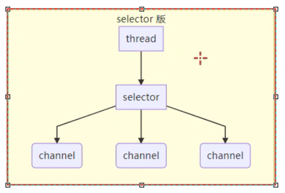

## NIO 基础

<br>

### 三大组件

#### Channel & Buffer

channel 有一点类似于 stream，它就是读写数据的**双向通道**，可以从 channel 将数据读入 buffer，也可以将 buffer 的数据写入 channel，而之前的 stream 要么是输入，要么是输出，channel 比 stream 更为底层

buffer 则用来缓冲读写数据

<br>

#### selector

selector 应该结合服务器设计板块来深入理解

常见的两个服务器设计模式为：多线程模式、线程池模式

下面我们要介绍的是 selector 设计模式



`selector` 的作用就是配合一个线程来管理多个 channel，获取这些 channel 上发生的事件，这些 channel 工作在非阻塞模式下，不会让线程吊死在一个 channel 上。适合连接数特别多，但流量低的场景（low traffic）

调用 selector 的 `select()` 会阻塞直到 `channel` 发生了读写就绪事件，这些事件发生，select 方法就会返回这些事件交给 thread 来处理

<br>

### ByteBuffer

#### FileChannel 读写测试

`FileChannel` 来读取文件内容

```java
@Slf4j
public class ChannelDemo1 {
    public static void main(String[] args) {
        try (RandomAccessFile file = new RandomAccessFile("helloword/data.txt", "rw")) {
            // 配置文件操作隧道
            FileChannel channel = file.getChannel();
            // 配置读取缓冲区
            ByteBuffer buffer = ByteBuffer.allocate(10);
            do {
                // 向 buffer 写入
                int len = channel.read(buffer);
                log.debug("读到字节数：{}", len);
                if (len == -1) {
                    break;
                }
                // 切换 buffer 读模式
                buffer.flip();
                while(buffer.hasRemaining()) {
                    log.debug("{}", (char)buffer.get());
                }
                // 切换 buffer 写模式
                buffer.clear();
            } while (true);
        } catch (IOException e) {
            e.printStackTrace();
        }
    }
}
```

ByteBuffer 正确使用姿势

1. 向 buffer 写入数据，例如调用 channel.read(buffer)
2. 调用 flip() 切换至**读模式**
3. 从 buffer 读取数据，例如调用 buffer.get()
4. 调用 clear() 或 compact() 切换至**写模式**
5. 重复 1~4 步骤

<br>

#### ByteBuffer 常见方法

**分配空间**

可以使用 allocate 方法为 ByteBuffer 分配空间，其它 buffer 类也有该方法

```java
Bytebuffer buf = ByteBuffer.allocate(16);
```

**向 buffer 写入数据**

有两种办法

- 调用 channel 的 read 方法
- 调用 buffer 自己的 put 方法

```java
int readBytes = channel.read(buf);
```

和

```java
buf.put((byte)127);
```

**从 buffer 读取数据**

同样有两种办法

- 调用 channel 的 write 方法
- 调用 buffer 自己的 get 方法

```java
int writeBytes = channel.write(buf);
```

和

```java
byte b = buf.get();
```

get 方法会让 position 读指针向后走，如果想重复读取数据

- 可以调用 rewind 方法将 position 重新置为 0
- 或者调用 get(int i) 方法获取索引 i 的内容，它不会移动读指针

**mark 和 reset**

mark 是在读取时，做一个标记，即使 position 改变，只要调用 reset 就能回到 mark 的位置

> **注意**
>
> rewind 和 flip 都会清除 mark 位置

**字符串与 ByteBuffer 互转**

```java
ByteBuffer buffer1 = StandardCharsets.UTF_8.encode("你好");
ByteBuffer buffer2 = Charset.forName("utf-8").encode("你好");

debug(buffer1);
debug(buffer2);

CharBuffer buffer3 = StandardCharsets.UTF_8.decode(buffer1);
System.out.println(buffer3.getClass());
System.out.println(buffer3.toString());
```

<br>

### 文件编程

#### 读

不能直接打开 FileChannel，必须通过 FileInputStream、FileOutputStream 或者 RandomAccessFile 来获取 FileChannel，它们都有 getChannel 方法

- 通过 FileInputStream 获取的 channel 只能读
- 通过 FileOutputStream 获取的 channel 只能写
- 通过 RandomAccessFile 是否能读写根据构造 RandomAccessFile 时的读写模式决定

<br>

channel 必须关闭，不过调用了 FileInputStream、FileOutputStream 或者 RandomAccessFile 的 close 方法会间接地调用 channel 的 close 方法

操作系统出于性能的考虑，会将数据缓存，不是立刻写入磁盘。可以调用 force(true) 方法将文件内容和元数据（文件的权限等信息）立刻写入磁盘

<br>

#### FileChannel 案例

两个 Channel 传输数据

```java
String FROM = "helloword/data.txt";
String TO = "helloword/to.txt";
long start = System.nanoTime();
try (FileChannel from = new FileInputStream(FROM).getChannel();
     FileChannel to = new FileOutputStream(TO).getChannel();
    ) {
    from.transferTo(0, from.size(), to);
} catch (IOException e) {
    e.printStackTrace();
}
long end = System.nanoTime();
System.out.println("transferTo 用时：" + (end - start) / 1000_000.0);
```

超过 2g 大小的文件传输，分片传输

```java
public class TestFileChannelTransferTo {
    public static void main(String[] args) {
        try (
                FileChannel from = new FileInputStream("data.txt").getChannel();
                FileChannel to = new FileOutputStream("to.txt").getChannel();
        ) {
            // 效率高，底层会利用操作系统的零拷贝进行优化
            long size = from.size();
            // left 变量代表还剩余多少字节
            for (long left = size; left > 0; ) {
                System.out.println("position:" + (size - left) + " left:" + left);
                left -= from.transferTo((size - left), left, to);
            }
        } catch (IOException e) {
            e.printStackTrace();
        }
    }
}
```

<br>

#### Path

jdk7 引入了 `Path` 和 `Paths` 类

- Path 用来表示文件路径
- Paths 是工具类，用来获取 Path 实例
- 如果文件已存在，会抛异常 FileAlreadyExistsException

```java
Path source = Paths.get("1.txt"); // 相对路径 使用 user.dir 环境变量来定位 1.txt

Path source = Paths.get("d:\\1.txt"); // 绝对路径 代表了  d:\1.txt

Path source = Paths.get("d:/1.txt"); // 绝对路径 同样代表了  d:\1.txt

Path projects = Paths.get("d:\\data", "projects"); // 代表了  d:\data\projects
```

<br>

几个常用的路径操作案例

遍历目录文件

```java
public static void main(String[] args) throws IOException {
    Path path = Paths.get("C:\\Program Files\\Java\\jdk1.8.0_91");
    AtomicInteger dirCount = new AtomicInteger();
    AtomicInteger fileCount = new AtomicInteger();
    Files.walkFileTree(path, new SimpleFileVisitor<Path>(){
        @Override
        public FileVisitResult preVisitDirectory(Path dir, BasicFileAttributes attrs)
            throws IOException {
            System.out.println(dir);
            dirCount.incrementAndGet();
            return super.preVisitDirectory(dir, attrs);
        }

        @Override
        public FileVisitResult visitFile(Path file, BasicFileAttributes attrs)
            throws IOException {
            System.out.println(file);
            fileCount.incrementAndGet();
            return super.visitFile(file, attrs);
        }
    });
    System.out.println(dirCount); // 133
    System.out.println(fileCount); // 1479
}
```

统计 jar 的数目

```java
Path path = Paths.get("C:\\Program Files\\Java\\jdk1.8.0_91");
AtomicInteger fileCount = new AtomicInteger();
Files.walkFileTree(path, new SimpleFileVisitor<Path>(){
    @Override
    public FileVisitResult visitFile(Path file, BasicFileAttributes attrs)
        throws IOException {
        if (file.toFile().getName().endsWith(".jar")) {
            fileCount.incrementAndGet();
        }
        return super.visitFile(file, attrs);
    }
});
System.out.println(fileCount); // 724
```

删除多级目录

```java
Path path = Paths.get("d:\\a");
Files.walkFileTree(path, new SimpleFileVisitor<Path>(){
    @Override
    public FileVisitResult visitFile(Path file, BasicFileAttributes attrs)
        throws IOException {
        Files.delete(file);
        return super.visitFile(file, attrs);
    }

    @Override
    public FileVisitResult postVisitDirectory(Path dir, IOException exc)
        throws IOException {
        Files.delete(dir);
        return super.postVisitDirectory(dir, exc);
    }
});
```

<br>

### 网络编程

#### 阻塞

阻塞模式下，相关方法都会导致线程暂停

- `ServerSocketChannel.accept` 会在没有连接建立时让线程暂停
- `SocketChannel.read` 会在没有数据可读时让线程暂停
- 阻塞的表现其实就是线程暂停了，暂停期间不会占用 cpu，但线程相当于闲置
- 单线程下，阻塞方法之间相互影响，几乎不能正常工作，需要多线程支持

<br>

#### 非阻塞

非阻塞模式下，相关方法都会不会让线程暂停

- 在 `ServerSocketChannel.accept` 在没有连接建立时，会返回 null，继续运行
- `SocketChannel.read` 在没有数据可读时，会返回 0，但线程不必阻塞，可以去执行其它 SocketChannel 的 read 或是去执行 ServerSocketChannel.accept
- 写数据时，线程只是等待数据写入 Channel 即可，无需等 Channel 通过网络把数据发送出去
- 阻塞模式下，即使没有连接建立，和可读数据，线程仍然在不断运行，白白浪费了 cpu

非阻塞模式下的服务器端

```java
// 使用 nio 来理解非阻塞模式, 单线程
// 0. ByteBuffer
ByteBuffer buffer = ByteBuffer.allocate(16);
// 1. 创建了服务器
ServerSocketChannel ssc = ServerSocketChannel.open();
ssc.configureBlocking(false); // 非阻塞模式
// 2. 绑定监听端口
ssc.bind(new InetSocketAddress(8080));
// 3. 连接集合
List<SocketChannel> channels = new ArrayList<>();
while (true) {
    // 4. accept 建立与客户端连接， SocketChannel 用来与客户端之间通信
    SocketChannel sc = ssc.accept(); // 非阻塞，线程还会继续运行，如果没有连接建立，但sc是null
    if (sc != null) {
        log.debug("connected... {}", sc);
        sc.configureBlocking(false); // 非阻塞模式
        channels.add(sc);
    }
    for (SocketChannel channel : channels) {
        // 5. 接收客户端发送的数据
        int read = channel.read(buffer);// 非阻塞，线程仍然会继续运行，如果没有读到数据，read 返回 0
        if (read > 0) {
            buffer.flip();
            debugRead(buffer);
            buffer.clear();
            log.debug("after read...{}", channel);
        }
    }
}
```

<br>

#### 多路复用

`Selector` 能够保证

- 有可连接事件时才去连接
- 有可读事件才去读取
- 有可写事件才去写入
- 限于网络传输能力，Channel 未必时时可写，一旦 Channel 可写，会触发 Selector 的可写事件

<br>

`绑定 Channel 事件` 也称之为注册事件，绑定的事件 selector 才会关心

```java
channel.configureBlocking(false);
SelectionKey key = channel.register(selector, 绑定事件);
```

- channel 必须工作在非阻塞模式
- FileChannel 没有非阻塞模式，因此不能配合 selector 一起使用
- 绑定的事件类型可以有
  - connect - 客户端连接成功时触发
  - accept - 服务器端成功接受连接时触发
  - read - 数据可读入时触发，有因为接收能力弱，数据暂不能读入的情况
  - write - 数据可写出时触发，有因为发送能力弱，数据暂不能写出的情况

<br>

#### 处理 read 事件

> 事件发生后，要么处理，要么取消（cancel），不能什么都不做，否则下次该事件仍会触发，这是因为 nio 底层使用的是水平触发

```java
@Slf4j
public class ChannelDemo6 {
    public static void main(String[] args) {
        try (ServerSocketChannel channel = ServerSocketChannel.open()) {
            channel.bind(new InetSocketAddress(8080));
            System.out.println(channel);
            Selector selector = Selector.open();

            // 设置channel为非阻塞模式
            channel.configureBlocking(false);
            // 绑定channel事件
            channel.register(selector, SelectionKey.OP_ACCEPT);

            while (true) {
                int count = selector.select();
//                int count = selector.selectNow();
                log.debug("select count: {}", count);
//                if(count <= 0) {
//                    continue;
//                }

                // 获取所有事件
                Set<SelectionKey> keys = selector.selectedKeys();

                // 遍历所有事件，逐一处理
                Iterator<SelectionKey> iter = keys.iterator();
                while (iter.hasNext()) {
                    SelectionKey key = iter.next();
                    // 判断事件类型
                    if (key.isAcceptable()) {
                        ServerSocketChannel c = (ServerSocketChannel) key.channel();
                        // 必须处理
                        SocketChannel sc = c.accept();
                        sc.configureBlocking(false);
                        sc.register(selector, SelectionKey.OP_READ);
                        log.debug("连接已建立: {}", sc);
                    } else if (key.isReadable()) {
                        SocketChannel sc = (SocketChannel) key.channel();
                        ByteBuffer buffer = ByteBuffer.allocate(128);
                        int read = sc.read(buffer);
                        if(read == -1) {
                            key.cancel();
                            sc.close();
                        } else {
                            buffer.flip();
                            debug(buffer);
                        }
                    }

                    // 处理完毕，必须将事件移除
                    // 否则下次触发ssckey上的read事件，就会爆空指针异常
                    iter.remove();
                }
            }
        } catch (IOException e) {
            e.printStackTrace();
        }
    }
}
```

<br>

如何处理消息的边界范围？

1. 一种思路是固定消息长度，数据包大小一样，服务器按预定长度读取，缺点是浪费带宽
2. 另一种思路是按分隔符拆分，缺点是效率低
3. TLV 格式，即 Type 类型、Length 长度、Value 数据，类型和长度已知的情况下，就可以方便获取消息大小，分配合适的 buffer，缺点是 buffer 需要提前分配，如果内容过大，则影响 server 吞吐量

- Http 1.1 是 TLV 格式
- Http 2.0 是 LTV 格式

<br>

如何智能的分配 bytebuffer？

- 一种思路是首先分配一个较小的 buffer，例如 4k，如果发现数据不够，再分配 8k 的 buffer，将 4k buffer 内容拷贝至 8k buffer
- 另一种思路是用多个数组组成 buffer，一个数组不够，把多出来的内容写入新的数组

> 因为 Channel 与 ByteBuffer 是一对一的关系，故需要为每个 channel 维护一个独立的 ByteBuffer，所以需要使用上述两种方式来解决这个问题

<br>

#### 处理 write 事件

<br>

### NIO && BIO
