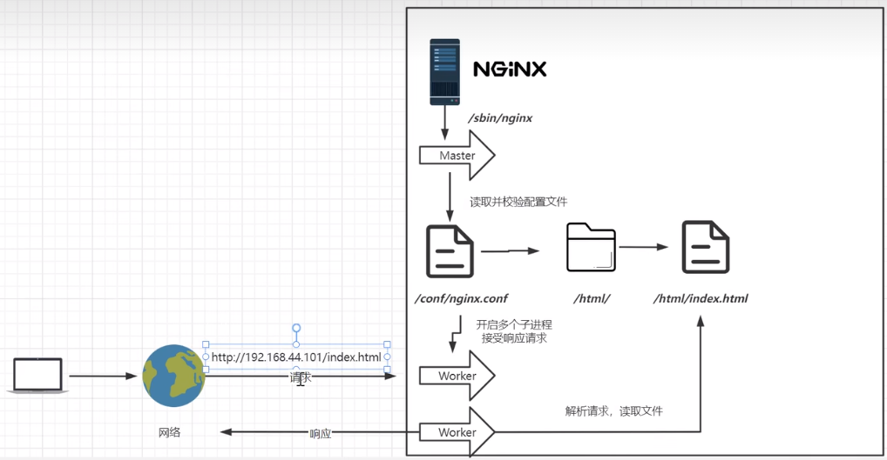
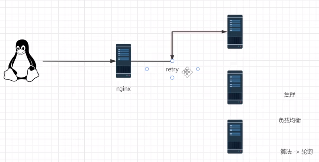

## 安装

参考文献：[CSDN 解读](https://blog.csdn.net/qq_40036754/article/details/102463099?ops_request_misc=%257B%2522request%255Fid%2522%253A%2522169404814116800185814545%2522%252C%2522scm%2522%253A%252220140713.130102334..%2522%257D&request_id=169404814116800185814545&biz_id=0&utm_medium=distribute.pc_search_result.none-task-blog-2~all~top_positive~default-1-102463099-null-null.142^v93^chatsearchT3_1&utm_term=nginx&spm=1018.2226.3001.4187)

<br>

安装环境：centos7

需要安装的依赖：pcre、zlib、openssl

所有依赖安装完毕后，才可以安装 nginx

<br>

## 基础知识

<br>

### nginx 架构



<br>

### Nginx.conf

配置文件位置：`usr/local/nginx/conf/nginx.conf`

下面是你刚刚创建 nginx 服务器时默认使用的配置文件

我已经把所有的额外注释删掉了，只保留对对应配置项的详细解释

```conf
worker_processes 1;  # worker进程的数量，通常设置为CPU核心的数量

events {
    worker_connections 1024;  # 每个worker进程能够同时处理的最大连接数
}

http {
    include mime.types;  # 包含mime.types文件，用于定义MIME类型
    default_type application/octet-stream;  # 默认的MIME类型，如果无法确定文件类型，则使用该类型

    sendfile on;  # 启用sendfile，提高文件传输效率

    keepalive_timeout 65;  # 客户端与服务器之间的保持连接的超时时间

    server {
        listen 8848;  # 监听的端口号
        server_name localhost;  # 服务器的域名

        location / {
            root html;  # 请求的根目录
            index index.html index.htm;  # 默认的索引文件
        }

        error_page 500 502 503 504 /50x.html;  # 定义错误页面的路径和状态码
        location = /50x.html {
            root html;  # 错误页面的根目录
        }
    }
}
```

<br>

#### sendfile

`sendfile` 配置项用于启用或禁用 Nginx 服务器在传输文件时使用操作系统提供的高效文件传输机制。

当 `sendfile` 设置为 on 时，Nginx 将尽可能地使用操作系统提供的 sendfile()系统调用来直接传输文件内容，而不需要将文件数据从内核缓冲区复制到用户空间再发送。

sendfile 适用于大文件的传输，特别是静态文件（对于小文件作用不明显）

<br>

### 虚拟主机与域名

#### 两台虚拟主机

conf 文件内我们可以直接使用两个 server，分别使用不同的端口，此时就拥有了两台虚拟主机，分别指向不同的页面

```conf
...


http {
    ...

    # 虚拟主机1，端口8848
    server {
        listen       8848;
        server_name  localhost;

        location / {
            # 这里表示对应网页文件的位置
            root   www/www;
            index  index.html index.htm;
        }

        error_page   500 502 503 504  /50x.html;
        location = /50x.html {
            root   www/www;
        }
    }

    # 虚拟主机2，端口8849
    server {
        listen       8849;
        server_name  localhost;

        location / {
            root   www/vod;
            index  index.html index.htm;
        }

        error_page   500 502 503 504  /50x.html;
        location = /50x.html {
            root   www/vod;
        }
    }
}
```

`root` 后面跟着的是对应网页文件所在的文件夹，特别注意路径开头不可以加斜杠！否则就表示从根目录开始计算了！

在 `usr/local/nginx` 目录下新建文件夹`www`  
`www`下再新建两个文件夹 `www` `vod`  
然后依次在这两个文件夹内放入 `index.html` 以及 `50x.html` 即可

<br>

#### ServerName 匹配规定

> 当存在多个虚拟主机时，哪一个 server 写在前面，就会先匹配那一个虚拟主机的 server_name

对于 server 配置组下的 server_name 配置项，存在一下四种配置方式

1. 完整匹配：即直接写明完整的主机 URL

`server_name: www.asd.com`

2. 通配符匹配

`server_name: *.asd.com`

3. 通配符结尾匹配

`server_name: *.asd.*`

4. 正则匹配

`server_name: ~^[0-9]+\.asd\.com$`

<br>

### 反向代理与负载均衡

#### 什么是负载均衡



nginx 通过算法轮询（retry）每一台服务器，当发现其中的一台挂掉后立即切换到另一台，实现负载均衡

<br>

#### 配置反向代理

仅需在 location 下设置 proxy_pass 字段即可将当前路径代理到对应的服务器上

下方代码展示了代理到百度官网

```conf
server {
    listen       8848;
    server_name  localhost;

    location / {
        proxy_pass http://www.baidu.com/
    }

    error_page   500 502 503 504  /50x.html;
    location = /50x.html {
        root   www/www;
    }
}
```

如果代理服务器没有添加 `www` 前缀，那么访问时会直接重定向到该服务器并改变当前 URL

TIPS:由于我们还没有配置 SSL 证书，故不可以代理`https`类型的服务器

<br>

#### 配置负载均衡

负载均衡指依据一定的算法，让 nginx 代理的后端服务器来回切换，从而使用户不会每次都访问到同一个后端服务器

首先需要使用 upstream 设置一个后端服务器组，用户将会按照轮询的方式依次访问这些服务器  
定义格式为 `upstream [name]`

```conf
# 在这里配置负载均衡指向的主机
upstream server_group{
    server 192.168.113.144:8850;
    server 192.168.113.144:8849;
}
```

紧接着在 `proxy_pass` 配置项里面嵌入负载均衡组，这样子就简单的实现了基于轮询（默认模式）的负载均衡

所谓轮询，即用户每次访问 nginx 时，都会自动按照我们定义的顺序依次访问所有服务器（比如按照我们这里写的代码，就是先代理 8850 端口后再代理 8849 端口，然后循环）

```conf
# 实现负载均衡的主机
server {
    listen       8848;
    server_name  localhost;

    location / {
        # 在这里修改URL，指向负载均衡后端服务器组
        proxy_pass http://server_group/;
    }

    error_page   500 502 503 504  /50x.html;
    location = /50x.html {
        root   www/www;
    }
}
```

我们使用了两个额外的虚拟主机作为负载均衡演示，所以完整的 conf 配置如下  
（对应的网页文件请自行添加哦）

```conf
http {
    include       mime.types;
    default_type  application/octet-stream;

    sendfile        on;

    keepalive_timeout  65;

    # 在这里配置负载均衡指向的主机
    upstream server_group{
        server 192.168.113.144:8850;
        server 192.168.113.144:8849;
    }

    # 实现负载均衡的主机
    server {
        listen       8848;
        server_name  localhost;

        location / {
            proxy_pass http://server_group/;
        }

        error_page   500 502 503 504  /50x.html;
        location = /50x.html {
            root   www/www;
        }
    }

    # 用于负载均衡而额外定义的两个虚拟主机
    server {
        listen       8849;
        server_name  localhost;

        location / {
            root   www/vod;
            index  index.html index.htm;
        }

        error_page   500 502 503 504  /50x.html;
        location = /50x.html {
            root   www/vod;
        }
    }
    server {
        listen       8850;
        server_name  localhost;

        location / {
            root   www/shit;
            index  index.html index.htm;
        }

        error_page   500 502 503 504  /50x.html;
        location = /50x.html {
            root   www/shit;
        }
    }
}
```

<br>

#### 带权重的负载均衡

我们可以为后端服务器组加上权重，以提高用户重定向到该服务器的概率

直接在服务器定义末尾使用 `weight` 字段设置权重值

```conf
upstream server_group{
    server 192.168.113.144:8850 weight=12;
    server 192.168.113.144:8849 weight=1;
}
```

<br>

#### 负载均衡状态

| 状态码       | 含义                                    |
| ------------ | --------------------------------------- |
| down         | 当前的 server 暂时不参与负载均衡        |
| backup       | 预留的备份服务器                        |
| max_fails    | 允许请求失败的次数                      |
| fail_timeout | 经过 max_fails 次失败后，服务暂停的时间 |
| max_conns    | 限制最大的接收连接数                    |

和设置权重差不多，按照下方代码的形式来配置状态码

```conf
upstream server_group{
    server 192.168.113.144:8850 down;
    server 192.168.113.144:8849 backup;
}
```

<br>

#### ip_hash && url_hash

`ip_hash` 是一种负载均衡算法，用于在分布式系统中将客户端请求均匀地分发到多个后端服务器上。该算法可以将同一 IP 地址的请求始终发送到同一台后端服务器上，以确保与特定客户端的会话持续在同一服务器上进行处理。

当使用 ip_hash 算法时，负载均衡器会检查客户端的 IP 地址，并使用哈希函数将该 IP 地址映射到后端服务器的一个特定位置。

<br>

`url_hash` 算法，负载均衡器会检查请求的 URL，并使用哈希函数将 URL 映射到后端服务器的一个特定位置。这样，对于相同的 URL，无论来自哪个客户端，都会将请求发送到同一台后端服务器上。

<br>

### 动静分离

#### 什么事 nginx 动静分离

对于`静态资源`：在反向代理服务器中存储，如图片、css 等固定文件；  
对于`动态资源`：转发给 tomcat 处理，如 jsp 等动态脚本；

简言之：静态资源 nginx 处理，动态资源由 nginx 转发给后端服务器处理

nginx 处理静态资源的效率远高于 tomcat 等后端服务器

<br>

#### location 正则

使用 location 中的正则，来实现页面的动静分离

nginx 中的正则符号

```
^ ：匹配输入字符串的起始位置
$ ：匹配输入字符串的结束位置
* ：匹配前面的字符零次或多次。如“ol*”能匹配“o”及“ol”、“oll”
+ ：匹配前面的字符一次或多次。如“ol+”能匹配“ol”及“oll”、“olll”，但不能匹配“o”
? ：匹配前面的字符零次或一次，例如“do(es)?”能匹配“do”或者“does”，”?”等效于”{0,1}”
. ：匹配除“\n”之外的任何单个字符，若要匹配包括“\n”在内的任意字符，请使用诸如“[.\n]”之类的模式
\ ：将后面接着的字符标记为一个特殊字符或一个原义字符或一个向后引用。如“\n”匹配一个换行符，而“\$”则匹配“$”
\d ：匹配纯数字
{n} ：重复 n 次
{n,} ：重复 n 次或更多次
{n,m} ：重复 n 到 m 次
[] ：定义匹配的字符范围
[c] ：匹配单个字符 c
[a-z] ：匹配 a-z 小写字母的任意一个
[a-zA-Z0-9] ：匹配所有大小写字母或数字
() ：表达式的开始和结束位置
| ：或运算符  //例(js|img|css)
```

location 正则模式下的可用符号

```
//location大致可以分为三类
精准匹配：location = /{}
一般匹配：location /{}
正则匹配：location ~/{}
//location常用的匹配规则：
= ：进行普通字符精确匹配，也就是完全匹配。
^~ ：表示前缀字符串匹配（不是正则匹配，需要使用字符串），如果匹配成功，则不再匹配其它 location。
~ ：区分大小写的匹配（需要使用正则表达式）。
~* ：不区分大小写的匹配（需要使用正则表达式）。
!~ ：区分大小写的匹配取非（需要使用正则表达式）。
!~* ：不区分大小写的匹配取非（需要使用正则表达式）。
//优先级
首先精确匹配 =
其次前缀匹配 ^~
其次是按文件中顺序的正则匹配 ~或~*
然后匹配不带任何修饰的前缀匹配
最后是交给 / 通用匹配
```

<br>

下面展示了使用 location 正则匹配具有三类后缀名文件的表达式

```conf
location ~* \.(php|jsp|asp)$ {
	【相关配置】
}
```

<br>

下面是 location 几乎所有常用状况下的书写方式案例

```
（1）location = / {}
=为精确匹配 / ，主机名后面不能带任何字符串，比如访问 / 和 /data，则 / 匹配，/data 不匹配
再比如 location = /abc，则只匹配/abc ，/abc/或 /abcd 不匹配。若 location /abc，则即匹配/abc 、/abcd/ 同时也匹配 /abc/。

（2）location / {}
因为所有的地址都以 / 开头，所以这条规则将匹配到所有请求 比如访问 / 和 /data, 则 / 匹配， /data 也匹配，
但若后面是正则表达式会和最长字符串优先匹配（最长匹配）

（3）location /documents/ {}
匹配任何以 /documents/ 开头的地址，匹配符合以后，还要继续往下搜索其它 location
只有其它 location 后面的正则表达式没有匹配到时，才会采用这一条

（4）location /documents/abc {}
匹配任何以 /documents/abc 开头的地址，匹配符合以后，还要继续往下搜索其它 location
只有其它 location 后面的正则表达式没有匹配到时，才会采用这一条

（5）location ^~ /images/ {}
匹配任何以 /images/ 开头的地址，匹配符合以后，停止往下搜索正则，采用这一条

（6）location ~\* \.(gif|jpg|jpeg)$ {}
匹配所有以 gif、jpg 或 jpeg 结尾的请求
然而，所有请求 /images/ 下的图片会被 location ^~ /images/ 处理，因为 ^~ 的优先级更高，所以到达不了这一条正则

（7）location /images/abc {}
最长字符匹配到 /images/abc，优先级最低，继续往下搜索其它 location，会发现 ^~ 和 ~ 存在

（8）location ~ /images/abc {}
匹配以/images/abc 开头的，优先级次之，只有去掉 location ^~ /images/ 才会采用这一条

（9）location /images/abc/1.html {}
匹配/images/abc/1.html 文件，如果和正则 ~ /images/abc/1.html 相比，正则优先级更高

```

<br>

#### 三种必填 location

这里表示一个 nginx 服务器常用设置的三个过滤，可以用于动静分离

```conf
# 由于官网访问频繁，添加此规则可以加速访问
location = / {
    proxy_pass http://127.0.0.1:8080/;
}

# 使用正则处理静态文件
location ^~ /static/ {
    root /webroot/static/;
}
location ~* \.(html|gif|jpg|jpeg|png|css|js|ico)$ {
    root /webroot/res/;
}

# 接口请求属于动态服务器，直接传输到后端服务器
location /api/ {
    proxy_pass http://127.0.0.1:3000/api/
}
```

<br>
